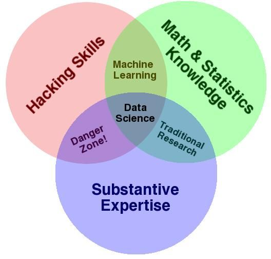
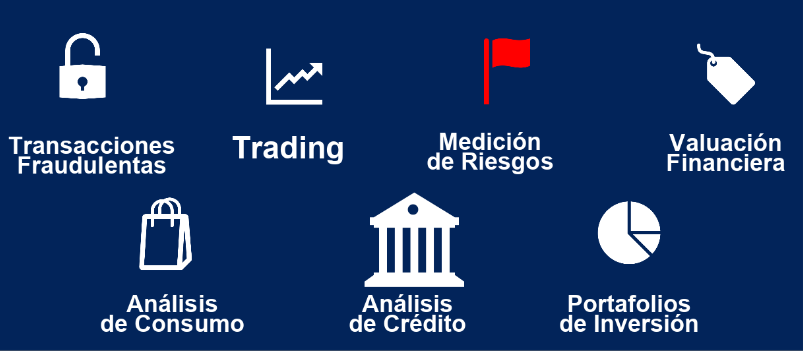
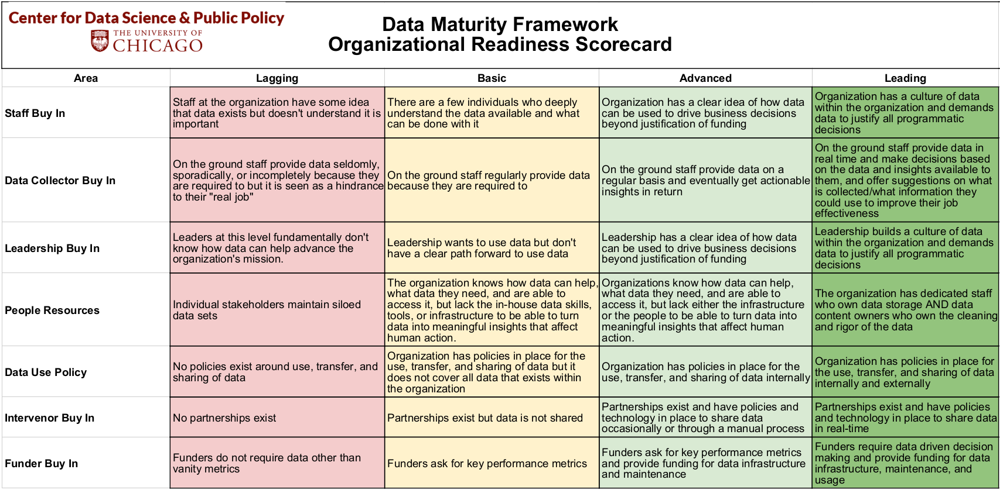
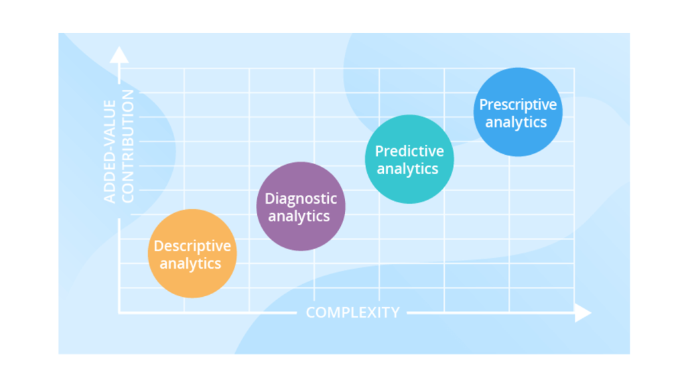

::: watermark

:::

# Introducción a Ciencia de Datos

## ¿Qué es Ciencia de Datos?

```{r echo=FALSE,fig.align='center', out.width='500pt', out.height='500pt'}
knitr::include_graphics("img/01-intro2ds/12_data-science-applications.jpeg")
```

### Definiendo conceptos: {.unnumbered}

**Estadística** Disciplina que recolecta, organiza, analiza e interpreta datos. Lo hace a través de una población muestral generando estadística descriptiva y estadística inferencial.

-   La [estadística descriptiva](), como su nombre lo indica, se encarga de describir datos y obtener conclusiones. Se utilizan números (media, mediana, moda, mínimo, máximo, etc) para analizar datos y llegar a conclusiones de acuerdo a ellos.

-   La [estadística inferencial]() argumenta o infiere sus resultados a partir de las muestras de una población. Se intenta conseguir información al utilizar un procedimiento ordenado en el manejo de los datos de la muestra.

-   La [estadística predictiva]() busca estimar valores y escenarios futuros más probables de ocurrir a partir de referencias históricas previas. Se suelen ocupar como apoyo características y factores áltamente asociados al fenómeno que se desea predecir.

```{r echo=FALSE,fig.align='center'}
knitr::include_graphics("img/01-intro2ds/01_muestra.jpg")
```

**Business Intelligence**: BI aprovecha el software y los servicios para transformar los datos en conocimientos prácticos que informan las decisiones empresariales estratégicas y tácticas de una organización. Las herramientas de BI acceden y analizan conjuntos de datos y presentan hallazgos analíticos en informes, resúmenes, tableros, gráficos, cuadros, -indicadores- o KPI's y mapas para proporcionar a los usuarios **inteligencia detallada sobre el estado del negocio**. BI esta enfocado en analizar la historia pasada para tomar decisiones hacia el futuro.

¿Qué características tiene un KPI?

-   Específicos
-   Continuos y periódicos
-   Objetivos
-   Cuantificables
-   Medibles
-   Realistas
-   Concisos
-   Coherentes
-   Relevantes

```{r echo=FALSE,fig.align='center'}
knitr::include_graphics("img/01-intro2ds/04_bi.png")
```

**Machine Learning**: Machine learning --aprendizaje de máquina-- es una **rama de la inteligencia artificial** que permite que las máquinas aprendan de los patrones existentes en los datos. Se usan métodos computacionales para aprender de datos con el fin de producir reglas para mejorar el desempeño en alguna tarea o toma de decisión. (Está enfocado en la programación de máquinas para aprender de los patrones existentes en datos principalmente estructurados y anticiparse al futuro)

```{r echo=FALSE,fig.align='center', out.width='600pt'}
knitr::include_graphics("img/01-intro2ds/02_ml.png")
```

```{r echo=FALSE,fig.align='center'}
knitr::include_graphics("img/01-intro2ds/03_supervisado_robo.png")
```

**Deep Learning**: El aprendizaje profundo es un subcampo del aprendizaje automático que se ocupa de los algoritmos **inspirados en la estructura y función del cerebro llamados redes neuronales artificiales.**

En *Deep Learning*, un modelo de computadora aprende a realizar tareas de clasificación directamente a partir de imágenes, texto o sonido. Los modelos de aprendizaje profundo pueden lograr una precisión de vanguardia, a veces superando el rendimiento a nivel humano. Los modelos se entrenan mediante el uso de un gran conjunto de datos etiquetados y arquitecturas de redes neuronales que contienen muchas capas. (Está enfocado en la programación de máquinas para el reconocimiento de imágenes y audio (datos no estructurados))

```{r echo=FALSE,fig.align='center'}
knitr::include_graphics("img/01-intro2ds/05_reconocimiento.png")
```

```{r echo=FALSE,fig.align='center'}
knitr::include_graphics("img/01-intro2ds/06_ml1.png")
```

**Big data** se refiere a los grandes y diversos conjuntos de información que crecen a un ritmo cada vez mayor. Abarca el volumen de información, la velocidad a la que se crea y recopila, y la variedad o alcance de los puntos de datos que se cubren. Los macrodatos a menudo provienen de la minería de datos y llegan en múltiples formatos.

```{r echo=FALSE,fig.align='center', out.width='600pt'}
knitr::include_graphics("img/01-intro2ds/07_big-data-8vs.jpg")
```

Es común que se confunda los conceptos de *Big Data* y *Big Compute*, como se mencionó, *Big Data* se refiere al procesamiento de conjuntos de datos que son más voluminosos y complejos que los tradicionales y *Big Compute* a herramientas y enfoques que utilizan una gran cantidad de recursos de CPU y memoria de forma coordinada para resolver problemas que usan algoritmos muy complejos.

```{r echo=FALSE,fig.align='center', out.width='600pt'}
knitr::include_graphics("img/01-intro2ds/07_bigdata.jpg")
```

Curiosidad: [Servidores en líquido para ser enfriados](https://www.xatakawindows.com/actualidad-en-redmond/servidores-liquido-hirviendo-esta-idea-microsoft-para-evitar-calentamiento-sus-equipos#:~:text=Con%20este%20sistema%2C%20el%20dispositivo,fr%C3%ADo%2C%20emplea%20uno%20en%20ebullici%C3%B3n.)

Curiosidad 2: [Centro de datos en el océano](https://www.bbc.com/mundo/noticias/2016/02/160202_microsoft_centro_datos_debajo_agua_mar_subamino_all)

</br> **Entonces, ¿qué NO es ciencia de datos?**

-   No es una tecnología
-   No es una herramienta
-   No es desarrollo de software
-   No es Business Intelligence\*
-   No es Big Data\*
-   No es Inteligencia Artificial\*
-   No es (solo) machine learning
-   No es (solo) deep learning
-   No es (solo) visualización
-   No es (solo) hacer modelos

## Objetivos

-   Los científicos de datos analizan qué preguntas necesitan respuesta y dónde encontrar los datos relacionados. Tienen conocimiento de negocio y habilidades analíticas, así como la capacidad de extraer, limpiar y presentar datos. Las empresas utilizan científicos de datos para obtener, administrar y analizar grandes cantidades de datos no estructurados. Luego, los resultados se sintetizan y comunican a las partes interesadas clave para impulsar la toma de decisiones estratégicas en la organización.

```{r echo=FALSE,fig.align='center', out.height='500pt', out.width='600pt'}

```

Fuente: [Blog post de Drew Conway](http://drewconway.com/zia/2013/3/26/the-data-science-venn-diagram)

Más sobre Conway: [Forbes 2016](https://www.forbes.com/sites/joshwolfe/2016/03/03/using-data-science-for-the-physical-world/?sh=614ac5b0150e)

## Requisitos

-   **Background científico:** Conocimientos generales de probabilidad, estadística, álgebra lineal, cálculo, geometría analítica, programación, conocimientos computacionales... etc

-   **Datos relevantes y suficientes:** Es indispensable saber si los datos con los que se trabajará son relevantes y suficientes, debemos evaluar qué preguntas podemos responder con los datos con los que contamos.

    -   **Suficiencia:** Los datos con los que trabajamos tienen que ser representativos de la población en general, necesitamos que las características representadas en la información sean suficientes para aproximar a la población objetivo.

    -   **Relevancia:** De igual manera los datos tienen que tener relevancia para la tarea que queremos resolver, por ejemplo, es probable que información sobre gusto en alimentos sea irrelevante para predecir número de hijos.

```{r echo=FALSE,fig.align='center'}
knitr::include_graphics("img/01-intro2ds/09_relevancia_suficiencia.png")
```

-   **Etiquetas:** Se necesita la intervención humana para etiquetar, clasificar e introducir los datos en el algoritmo.

```{r echo=FALSE,fig.align='center', out.height='400pt', out.width='600pt'}
knitr::include_graphics("img/01-intro2ds/10_etiquetas.png")
```

-   **Software:** Existen distintos lenguajes de programación para realizar ciencia de datos

```{r echo=FALSE,fig.align='center', out.height='300pt', out.width='600pt'}
knitr::include_graphics("img/01-intro2ds/11_lenguajes.png")
```

## Aplicaciones

Dependiendo de la industria en la que se quiera aplicar Machine Learning, podemos pensar en distintos enfoques, en la siguiente imagen se muestran algunos ejemplos:

```{r echo=FALSE, fig.align='center', out.height='300pt', out.width='600pt'}

```

Podemos pensar en una infinidad de aplicaciones comerciales basadas en el análisis de datos. Con la intención de estructurar las posibles aplicaciones, se ofrece a continuación una categorización que, aunque no es suficiente para englobar todos los posibles casos de uso, sí es sorprendente la cantidad de aplicaciones que abarca.

**1. Aplicaciones centradas en los clientes**

-   Incrementar beneficio al mejorar recomendaciones de productos
-   Up-selling
-   Cross-selling
-   Reducir tasas de cancelación y mejorar tasas de retención
-   Personalizar experiencia de usuario
-   Mejorar el marketing dirigido
-   Análisis de sentimientos
-   Personalización de productos o servicios

**2. Optimización de problemas**

-   Optimización de precios
-   Ubicación de nuevas sucursales
-   Maximización de ganancias mediante producción de materias primas
-   Construcción de portafolios de inversión

**3. Predicción de demanda**

-   Número futuro de clientes
-   Número esperado de viajes en avión / camión / bicis
-   Número de contagios por un virus (demanda médica / medicamentos / etc)
-   Predicción de uso de recursos (luz / agua / gas)

**4. Análisis de detección de fraudes**

-   Detección de robo de identidad
-   Detección de transacciones ilícitas
-   Detección de servicios fraudulentos
-   Detección de zonas geográficas con actividades ilícitas

## Tipos de algoritmos

Los algoritmos de Machine Learning se dividen en tres categorías, siendo las dos primeras las más comunes:

```{r, fig.align='center', echo=F, out.height='500pt', out.width='750pt'}
knitr::include_graphics("img/01-intro2ds/13_tipo_aprendizaje.png")
```

La diferencia entre el análisis supervisado y el no supervisado es la etiqueta, es decir, en el análisis supervisado tenemos una etiqueta "correcta" y el objetivo de los algoritmos es predecir esta etiqueta.

### Aprendizaje supervisado

En el aprendizaje supervisado, la idea principal es **aprender bajo supervisión**, donde la señal de supervisión se nombra como valor objetivo o etiqueta. Estos algoritmos cuentan con un aprendizaje previo basado en un **sistema de etiquetas** asociadas a unos datos que les permiten tomar decisiones o hacer predicciones.

-   Conocemos la respuesta correcta de antemano.

-   Esta respuesta correcta fue "etiquetada" por un humano (la mayoría de las veces, en algunas circunstancias puede ser generada por otro algoritmo).

-   Debido a que conocemos la respuesta correcta, existen muchas métricas de desempeño del modelo para verificar que nuestro algoritmo está haciendo las cosas "bien".

Algunos ejemplos son:

    - Un detector de spam que etiqueta un e-mail como spam o no.

    - Predecir precios de casas

    - Clasificación de imagenes

    - Predecir el clima

    - ¿Quiénes son los clientes descontentos?

#### Tipos de aprendizaje supervisado (Regresión vs clasificación) {.unnumbered}

Existen dos tipos principales de aprendizaje supervisado, esto depende del tipo de la variable respuesta:

#### Clasificación {.unnumbered}

En el aprendizaje supervisado, los algoritmos de clasificación se usan cuando el resultado es una **etiqueta discreta.** Esto quiere decir que se utilizan cuando la respuesta se fundamenta en conjunto finito de resultados.

#### Regresión {.unnumbered}

El análisis de regresión es un subcampo del aprendizaje automático supervisado cuyo objetivo es **establecer un método para la relación entre un cierto número de características y una variable objetivo continua.**

<br/>

```{r echo=FALSE,fig.align='center', out.height='450pt', out.width='700pt'}
knitr::include_graphics("img/01-intro2ds/13_regresion_clasificacion.png")
```

### Aprendizaje no supervisado

En el aprendizaje no supervisado, **carecemos de etiquetas**. Por lo tanto, necesitamos encontrar nuestro camino sin ninguna supervisión ni guía. Esto simplemente significa que necesitamos descubrir ¿qué es qué? por nosotros mismos.

-   Aquí no tenemos la respuesta correcta de antemano ¿cómo podemos saber que el algoritmo está bien o mal?

-   Estadísticamente podemos verificar que el algoritmo está bien

-   Siempre tenemos que verificar con el cliente si los resultados que estamos obteniendo tienen sentido de negocio. Por ejemplo, número de grupos y características

```{r echo=FALSE,fig.align='center'}
knitr::include_graphics("img/01-intro2ds/14_nosupervisado_robo.png")
```

Algunos ejemplos son:

    - Encontrar segmentos de clientes.

    - Reducir la complejidad de un problema

    - Selección de variables

    - Encontrar grupos

    - Reducción de dimensionalidad

### Aprendizaje por refuerzo

Su objetivo es que un algoritmo aprenda a partir de la propia experiencia. Esto es, que sea capaz de tomar la mejor decisión ante diferentes situaciones de acuerdo a un proceso de prueba y error en el que se recompensan las decisiones correctas.

```{r echo=FALSE,fig.align='center', out.height='350pt', out.width='500pt'}
knitr::include_graphics("img/01-intro2ds/14_reinforcement_robot.png")
```

Algunos ejemplos son:

    - Optimización de campañas de marketing

    - Reconocimiento facial

    - Diagnósticos médicos

    - Clasificar secuencias de ADN

Ejemplo: [Mario Bros](https://www.youtube.com/watch?v=qv6UVOQ0F44&t=283s)

## Ciclo de un proyecto

```{r, fig.align='center', out.height='600pt', out.width='800pt', echo=F}
knitr::include_graphics("img/01-intro2ds-ciclo/01-etapas.png")
```

1.  **Identificación del problema**

    -   Debemos conocer si el problema es significativo, si el problema se puede resolver con ciencia de datos, y si habrá un compromiso real del lado de cliente/usuario/partner para implementar la solución con todas sus implicaciones: recursos físicos y humanos.

```{r echo=FALSE,fig.align='center', out.width='200pt', out.height='200pt'}
knitr::include_graphics("img/01-intro2ds-ciclo/02-identificacion.jpg")
```

2.  **Scoping**

    -   El objetivo es definir el alcance del proyecto y por lo tanto definir claramente los objetivos.

    -   Conocer las acciones que se llevarán a cabo para cada objetivo. Estas definirán las soluciones analíticas a hacer.

    -   Queremos saber si los datos con los que contamos son relevantes y suficientes.

    -   Hacer visible los posibles conflictos éticos que se pueden tener en esta fase.

    -   Debemos definir el cómo evaluaremos que el análisis de esos datos será balanceada entre eficiencia, efectividad y equidad.

```{r echo=FALSE,fig.align='center', out.width='200pt', out.height='200pt'}
knitr::include_graphics("img/01-intro2ds-ciclo/03-alcance.png")
```

3.  **Adquisición de datos**

    -   Adquisición, almacenamiento, entendimiento y preparación de los datos para después poder hacer analítica sober ellos.

    -   Asegurar que en la transferencia estamos cumpliendo con el manejo adecuado de datos sensibles y privados.

```{r echo=FALSE,fig.align='center', out.width='200pt', out.height='300pt'}
knitr::include_graphics("img/01-intro2ds-ciclo/04-data-adquisition.webp")
```

4.  **EDA**

    -   El objetivo en esta fase es conocer los datos con los que contamos y contexto de negocio explicado a través de los mismos.

    -   Identificamos datos faltantes, sugerimos cómo imputarlos.

    -   Altamente apoyado de visualización y procesos de adquisición y limpieza de datos.

```{r echo=FALSE,fig.align='center', out.width='600pt', out.height='350pt'}
knitr::include_graphics("img/01-intro2ds-ciclo/05-eda.jpg")
```

5.  **Formulación analítica**

    -   Esta fase incluye empezar a formular nuestro problema como uno de ciencia de datos, el conocimiento adquirido en la fase de exploración nos permite conocer a mayor detalle del problema y por lo tanto de la solución adecuada.

```{r echo=FALSE,fig.align='center', out.width='450pt', out.height='300pt'}
knitr::include_graphics("img/01-intro2ds-ciclo/05-analytical-thinking.jpg")
```

6.  **Modelado**

    -   Proceso iterativo para desarrollar diferentes "experimentos".

        -   Mismo algoritmo/método diferentes hiperparámetros (grid search).
        -   Diferentes algortimos.

    -   Selección de un muy pequeño conjunto de modelos tomando en cuenta un balance entre interpretabilidad, complejidad, desempeño, fairness.

    -   Correcta interpretación de los resultados de desempeño de cada modelo.

```{r echo=FALSE,fig.align='center'}

```

7.  **Validación**

    -   Es muy importante poner a prueba el/los modelo/modelos seleccionados en la fase anterior. Esta prueba es en campo con datos reales, le llamamos prueba piloto.

    -   Debemos medir el impacto causal que nuestro modelo tuvo en un ambiente real.

```{r echo=FALSE,fig.align='center', out.width='200pt', out.height='200pt'}
knitr::include_graphics("img/01-intro2ds-ciclo/07-validacion.jpg")
```

8.  **Acciones a realizar**

    -   Finalmente esta etapa corresponde a compartir con los tomadores de decisiones/stakeholders/creadores de política pública los resultados obtenidos y la recomendación de acciones a llevar a cabo -menú de opciones-.

    -   Las implicaciones éticas de esta fase consisten en hacer conciente el impacto social de nuestro trabajo.

```{r echo=FALSE,fig.align='center', out.width='200pt', out.height='200pt'}

```

## Taller de Scoping

El **scoping** es uno de los pasos más importante en los proyectos de ciencia de datos, es ideal realizarlo con ayuda del cliente, tiene como objetivo **definir el alcance del proyecto**, definir los objetivos, conocer las acciones que se llevaran acabo, conocer si los datos son relevantes y suficientes, proponer soluciones analíticas, entre otros puntos que se tocaran a continuación.

```{r, fig.align='center', out.height='300pt', out.width='300pt',echo=F}

```

### Data Maturity Framework

Antes de iniciar con el *scoping*, queremos conocer si los interesados **están listos para realizar un proyecto de ciencia de datos**. Para ello, una opción es usar el [*Data Maturity Framework*](http://www.datasciencepublicpolicy.org/wp-content/uploads/2018/05/Data_Maturity_Framework_4.28.16.pdf) desarrollado en la Universidad de Chicago.

El *Data Maturity Framework* nos sirve para ver dónde se encuentra la organización en el marco de madurez de datos y cómo mejorar su organización, tecnología y preparación de datos.

Tiene tres áreas de contenido:

-   Definición del problema

-   Disponibilidad de datos y tecnología

-   Preparación organizacional

Esta dividido en tres partes:

-   Un cuestionario y una encuesta para evaluar la preparación de la organización.

```{r, fig.align='center', out.height='800pt', out.width='750pt', echo=F}
knitr::include_graphics("img/01-intro2ds-ciclo/10-dmf1.png")
```

-   Matriz de preparación de datos y tecnología

```{r, fig.align='center',  echo=F}
knitr::include_graphics("img/01-intro2ds-ciclo/11-dmf2.png")
```

-   Matriz de preparación organizacional

```{r, fig.align='center', echo=F}

```

### Scoping

Para realizar el scoping podemos apoyarnos del siguiente [documento](https://docs.google.com/spreadsheets/d/1hCRt00nYyZvbkfi9yOMRSR0R30lPRtKzaNKKlgAE78M/edit?usp=sharing).

Ya que sabemos que la organización esta preparada para realizar un proyecto de ciencia de datos, podemos iniciar el *scoping*. El proceso a seguir es el siguiente:

#### Definir objetivo(s) {.unnumbered}

Considerado **el paso más importante del proceso**, los *stakeholders* iniciaran con un planteamiento del problema de manera muy general, nuestra responsabilidad será ir aterrizando ideas y **definir el problema de manera más concreta**, esta parte del *scoping* puede ocurrir en distintas iteraciones.

Necesitamos hacer que el objetivo sea **concreto, medible y optimizable**. Cuando se van refinando objetivos, es común que se vaya priorizando por lo que tendremos *tradeoffs* que irán ligados a las acciones y al contexto del negocio.

```{r, fig.align='center', echo=F, out.width='500pt'}
knitr::include_graphics("img/01-intro2ds/scoping02-objetivosmart.png")
```

#### ¿Qué acciones o intervenciones existen que serán mejoradas a través de este proyecto? {.unnumbered}

Debemos **definir acciones concretas**, si esto no ocurre es muy probable que la solución no sea implementada por lo que el proyecto no tendrá uso y no se estará haciendo ciencia de datos.

La implementación del proyecto debería ayudar a tener mejor información para llevar acabo estas acciones, es decir, el proyecto mejorará la toma de decisiones basadas en la evidencia de los datos.

Hacer una lista con las acciones ayuda a que el proyecto sea accionable, es posible que estas acciones no existan aún en la organización, por lo que el proyecto puede ayudar a **generar nuevas acciones**.

Es muy común que la acción definida por el *stakeholder* sea de muy alto nivel, en ese caso podemos tomar 2 caminos en el *scoping*:

-   Proponer en el *scoping* que el proyecto informe a esa acción general.

-   Generar a partir de esa acción general acciones más pequeñas.

```{r, fig.align='center', echo=F, out.width='500pt'}

```

#### ¿Qué datos tenemos y cuáles necesitamos? {.unnumbered}

Primero observemos que no se había hablado de los datos hasta este punto, lo anterior porque debemos primero pensar en el problema, entenderlo y luego ver con qué datos contamos para resolverlo. Si hacemos esto primero seguramente acabaremos desarrollando productos de datos "muertos" y no accionables.

En este paso se le dará uso al *Data Maturity Framework*, queremos conocer cómo se guardan los datos, con qué frecuencia, en qué formato, en qué estructura, qué granularidad tiene, desde cuándo tenemos historia de estos datos, si existe un sesgo en su recolección, con qué frecuencia recolectan nueva información, sobrescribe la ya existente?

Uno de los objetivos consiste en **identificar si la granularidad, frecuencia y horizonte de tiempo en los datos corresponde a la granularidad, frecuencia y horizonte de tiempo de las acciones**.

```{r, fig.align='center', echo=F, out.width='500pt'}

```

#### ¿Cuál es el análisis que necesitamos hacer? {.unnumbered}

En esta sección del *scoping* queremos definir qué tipo de análisis necesitamos hacer con los datos con los que contamos para cumplir con los objetivos definidos y generar las acciones identificadas.

El análisis puede incluir métodos y herramientas de diferentes disciplinas: ciencias computacionales, ciencia de datos, machine learning, estadística, ciencias sociales.

Existen distintos tipos de análisis, los 4 más comunes son:

-   **Descripción**: Centrado en entender eventos y comportamientos del pasado. Aunque puede confundirse con business intelligence, debido a que ya definimos objetivos y acciones vamos a desarrollar un producto de datos. Para este tipo de análisis podemos ocupar métodos de aprendizaje no supervisado: clustering.

-   **Detección**: Más concentrado en los eventos que están sucediendo. Detección de anomalías.

-   **Predicción**: Concentrado en el futuro, prediciendo futuros eventos o comportamientos.

-   **Cambio en comportamiento**: Concentrado en entender las causas de cambios en comportamientos de personas eventos, organizaciones, vecindarios, etc.

```{r, fig.align='center', out.height='450pt', out.width='900pt',echo=F}

```

En esta fase tenemos que responder las siguientes preguntas:

-   ¿Qué tipo de análisis necesitaremos? Puede ser más de uno.

-   ¿Cómo vamos a validar el análisis? ¿Qué validaciones se pueden hacer con los datos existentes? ¿Cómo podemos diseñar una prueba en campo para validar el análisis antes de que pongamos el producto en producción.

-   Identificar qué acciones se cubren con cada análisis, debemos tener todas las acciones cubiertas.

### Ejemplos {.unnumbered}

Los siguientes ejemplos forman parte del trabajo de [DSSG](http://www.datasciencepublicpolicy.org/home/resources/data-science-project-*scoping*-guide/), en cada uno de estos planteamientos intentaremos responder las siguientes preguntas:

-   ¿Cuál es el objetivo?
-   ¿Cómo se mide el objetivo?
-   ¿Qué se optimiza?
-   ¿Se puede optimizar?
-   ¿Cuáles son los tradeoffs?
-   ¿Que implicaciones éticas identificas?

1)  **Envenenamiento por plomo**: Hace unos años, comenzamos a trabajar con el Departamento de Salud Pública de Chicago para prevenir el envenenamiento por plomo. El objetivo inicial era aumentar la eficacia de sus inspecciones de peligro de plomo. Una forma de lograr ese objetivo sería concentrarse en los hogares que tienen peligros de plomo. Aunque fue útil, este enfoque no lograría su objetivo real, que era evitar que los niños se intoxicaran con plomo. Encontrar un hogar con peligros de plomo y repararlo solo es beneficioso si existe una alta probabilidad de que un niño presente (actualmente o en el futuro) se exponga al plomo. La siguiente iteración del objetivo fue maximizar la cantidad de inspecciones que detectan peligros de plomo en hogares donde hay un niño en riesgo (antes de que el niño se exponga al plomo). Finalmente, llegamos al objetivo final: identificar qué niños corren un alto riesgo de intoxicación por plomo en el futuro y luego dirigir las intervenciones a los hogares de esos niños..

```{r, fig.align='center', out.height='250pt', out.width='400pt',echo=F}

```

2)  **High School Graduation**: Uno de los mayores desafíos que enfrentan las escuelas hoy en día es ayudar a sus estudiantes a graduarse (a tiempo). Las tasas de graduación en los EE. UU. Son \~65%. Todos están interesados en identificar a los estudiantes que corren el riesgo de no graduarse a tiempo. Al hablar inicialmente con la mayoría de los distritos escolares, comienzan con un objetivo muy limitado de predecir qué niños es poco probable que se gradúen a tiempo. El primer paso es volver al objetivo de aumentar las tasas de graduación y preguntar si hay un subconjunto específico de estudiantes en riesgo que quieran identificar. ¿Qué pasaría si pudiéramos identificar a los estudiantes que tienen solo un 5% de probabilidades de estar en riesgo frente a los estudiantes que tienen un 95% de probabilidades de no graduarse a tiempo sin apoyo adicional? Si el objetivo es simplemente aumentar las tasas de graduación, es (probablemente) más fácil intervenir e influir en el primer grupo, mientras que el segundo grupo puede ser más desafiante debido a los recursos que necesita. ¿El objetivo es maximizar la probabilidad promedio/media/mediana de graduarse para una clase/escuela o es el objetivo enfocarse en los niños con mayor riesgo y maximizar la probabilidad de graduación del 10% inferior de los estudiantes? ¿O el objetivo es crear más equidad y disminuir la diferencia en la probabilidad de graduación a tiempo entre el cuartil superior y el cuartil inferior? Todos estos son objetivos razonables, pero las escuelas deben comprender, evaluar y decidir qué objetivos les interesan. Esta conversación a menudo los hace pensar más en definir analíticamente cuáles son sus objetivos organizacionales, así como las compensaciones..

```{r, fig.align='center', out.height='250pt', out.width='400pt',echo=F}

```

3)  **Inspecciones**: Hemos trabajado en varios proyectos que involucraron inspecciones, como con la EPA (Agencia de Protección Ambiental) y el Departamento de Conservación Ambiental del Estado de Nueva York para ayudarlos a priorizar qué instalaciones inspeccionar para detectar infracciones de eliminación de desechos, con la ciudad de Cincinnati para ayudar a identificar las propiedades en riesgo de violaciones del código para prevenir el deterioro -el proceso a través del cual una ciudad que funcionaba anteriormente, o parte de ella, cae en deterioro y decrepitud-, y con el Grupo del Banco Mundial para ayudarlos a priorizar qué denuncias de fraude y colusión investigar. En la mayoría de los problemas de inspección/investigación, hay muchas más entidades (viviendas, edificios, instalaciones, negocios, contratos) para inspeccionar que los recursos disponibles necesarios para realizar esas inspecciones. El objetivo con el que comienzan la mayoría de estas organizaciones es dirigir sus inspecciones a las entidades que tienen más probabilidades de violar las regulaciones existentes. Ese es un buen comienzo, pero la mayoría de estas organizaciones nunca pueden inspeccionar todas las instalaciones/hogares que pueden no cumplir con las normas, por lo que el objetivo que realmente buscan es la disuasión: reducir la cantidad total de instalaciones que estarán en violación. Un proceso de inspección ideal resultaría entonces en la reducción del número real de violaciones (encontradas o no), lo cual puede no ser lo mismo que un proceso de inspección que tiene como objetivo ser eficiente y aumentar la tasa de aciertos (% de inspección que resulta en violaciones).

```{r, fig.align='center', out.height='350pt', out.width='300pt',echo=F}
knitr::include_graphics("img/01-intro2ds/sanity-inspector.png")
```

4)  **Programación de la recolección de residuos**: Recientemente comenzamos a trabajar con Sanergy, una empresa social con sede en Kenia. Implementan inodoros portátiles en asentamientos urbanos informales y uno de sus mayores costos es contratar personas para vaciar los inodoros. Hoy en día, todos los inodoros se vacían todos los días, aunque existe una variación en cuánto se usan y cuánto se llenan. Para que puedan crecer y mantener bajos los costos, necesitan un enfoque más adaptable que pueda optimizar el cronograma de vaciado de los inodoros. El objetivo en este caso es asegurarse de no vaciar demasiado el inodoro cuando no está lleno, pero tampoco dejar que permanezca lleno porque entonces no se puede usar. Esto se traduce en una formulación que presiona para vaciar el inodoro lo más cerca posible de estar lleno al 100% sin llegar al 100%.

```{r, fig.align='center', out.height='250pt', out.width='400pt',echo=F}
knitr::include_graphics("img/01-intro2ds/garbage-collector.jpg")
```

## Perfiles de un equipo

La tecnología crece día con día y resulta imposible abarcar todos los conocimientos y especialidades, por lo que resulta indispensable tener un claro entendimiento de los diferentes roles o perfiles de profesionistas que lograrán colaborar en el alcance de objetivos de negocio basados en el análisis y explotación de datos.

```{r, fig.align='center', out.height='200pt', out.width='350pt', echo=F}
knitr::include_graphics("img/01-intro2ds/22-00teamdata.webp")
```

A continuación se presenta un esquema global sobre el crecimiento de un equipo con enfoque de ingeniería de inteligencia de decisiones basada en análisis de datos:

### 1) Ingeniero de datos {.unnumbered}

Es fundamental tener la capacidad de obtener datos antes de que tenga sentido hablar sobre el análisis de datos. Si estás trabajando con conjuntos de datos pequeños, la ingeniería de datos consistirá básicamente en ingresar algunos números en una hoja de cálculo. Cuando se opera a una escala más grande, la ingeniería de datos se convierte en una disciplina sofisticada por derecho propio. Alguien del equipo deberá asumir la responsabilidad de lidiar con los complicados aspectos de ingeniería para poder entregar los datos con los que el resto del equipo pueda trabajar.

```{r, fig.align='center', out.height='200pt', out.width='350pt', echo=F}
knitr::include_graphics("img/01-intro2ds/22-01dataengineer.jpeg")
```

### 2) Decisor {.unnumbered}

Antes de contratar a un científico de datos con un master o PhD, hay que asegurarse de que quien toma las decisiones entiende el arte y la ciencia de la toma de decisiones basada en datos.

$$\text{Las capacidades de toma de decisiones deben estar establecidas, antes de que un equipo pueda obtener valor de los datos}$$

Este individuo es **responsable de identificar las decisiones que valen la pena tomar** con los datos, plasmarlas en un modelo (desde el diseño de métricas, hasta las inyecciones sobre supuestos estadísticos) y determinar el nivel requerido de rigor analítico, basado en el impacto potencial en el negocio. Busca un pensador profundo que no diga continuamente: "Oh, vaya, eso ni siquiera se me había ocurrido mientras estaba pensando en esta decisión". Sino más bien que ya lo haya pensado. Y eso otro. Y esto también. Y aquello...

```{r, fig.align='center', out.height='200pt', out.width='350pt', echo=F}

```

### 3) Analista {.unnumbered}

Luego, la siguiente contratación es... todos los que ya están trabajando contigo. Todos están calificados para mirar los datos y sentirse inspirados, lo único que puede estar faltando es un poco de familiaridad con el software que sea adecuado para hacer el análisis.

```{r, fig.align='center', out.height='300pt', out.width='400pt',echo=F}
knitr::include_graphics("img/01-intro2ds/22-03-dataanalyst.webp")
```

Aprender a usar herramientas como R y Python es sólo una mejora sobre MS Paint para la visualización de datos; estas son simplemente herramientas más versátiles para visualizar una variedad más amplia de conjuntos de datos que sólo matrices de píxeles rojo-verde-azul. Si toda la fuerza laboral está empoderada para hacerlo, se tendrá un mucho mejor pulso de negocio que si nadie está mirando ningún dato en lo absoluto.

```{r, fig.align='center', out.height='200pt', out.width='300pt',echo=F}

```

Lo importante a recordar, es que no se debe llegar a conclusiones más allá de los datos. Eso requiere entrenamiento especializado. Al igual que con la foto de arriba, esto es todo lo que puedes decir al respecto: **"Esto es lo que hay en mi conjunto de datos"**. Por favor, no lo uses para concluir que **el Monstruo de Lago Ness es real.**

### 4) Analista experto {.unnumbered}

¡Entra la versión ultra rápida! Esta persona puede ver más datos más rápido. El juego aquí es velocidad, exploración, descubrimiento... ¡diversión! (Otro término para la analítica es la minería de datos). Este no es el rol relacionado con el rigor y las conclusiones cuidadosas. En su lugar, esta **es la persona que ayuda a tu equipo a ver la mayor cantidad de datos posible para que el responsable de la toma de decisiones pueda tener una idea de lo que vale la pena obtener con más detalle.**

$$\text{El trabajo aquí es la velocidad, encontrando potenciales “insights” lo más rápido posible.}$$

Esto puede ser contrario a la intuición, pero no es conveniente asignar esta función a los mejores ingenieros que escriben un magnífico y sólido código de software. El trabajo aquí es velocidad, encontrando potenciales **"insights"** o revelaciones lo más rápido posible.

$$\text{Aquellos que se obsesionan con la calidad del código pueden encontrar difícil ser útiles en este rol.}$$

```{r, fig.align='center', out.height='300pt', out.width='400pt',echo=F}

```

### 5) Estadístico {.unnumbered}

Ahora que tenemos a todas estas personas contentas explorando los datos, es mejor tener a alguien cerca para controlar tanta exaltación. Podría ser una buena idea tener a alguien cerca que pueda evitar que el equipo saque conclusiones infundadas.

$$\text{La inspiración es barata, pero el rigor es caro.}$$

Los Estadísticos ayudan a quienes toman las decisiones a llegar a conclusiones seguras más allá de los datos.

Por ejemplo, si el sistema de **Machine Learning** funcionó para un conjunto de datos, todo lo que se puede concluir es que funcionó en ese conjunto de datos. ¿Funcionará cuando se está ejecutando en producción con otros datos? ¿Debería ser lanzarlo? Necesita algunas habilidades adicionales para lidiar con esas preguntas. Habilidades estadísticas.

```{r, fig.align='center', out.height='300pt', out.width='400pt',echo=F}
knitr::include_graphics("img/01-intro2ds/22-05-statistician.png")
```

Si queremos tomar decisiones serias cuando no tenemos datos perfectos, vayamos más despacio y tomemos un enfoque cuidadoso. Los estadísticos ayudan a quienes toman las decisiones a llegar a conclusiones más seguras, más allá de los datos analizados.

### 6) Ingeniero de Machine Learning {.unnumbered}

El mejor atributo de un ingeniero de **Machine Learning / Inteligencia Artificial** aplicada es diseñar, crear, evaluar y producir modelos para resolver problemas de la vida real.. Lo que estás buscando es experiencia en transformar código para hacer que los algoritmos existentes acepten y revuelvan tus conjuntos de datos.

Además de dedos rápidos para codificar, se busca una personalidad que tenga tolerancia frente al fracaso. Ejecuta los datos a través de un grupo de algoritmos lo más rápido posible y ve sí parece estar funcionando. Una gran parte del trabajo es ir tanteando a ciegas, y se necesita un tipo especial de personalidad para disfrutar eso.

$$\text{Los perfeccionistas tienden a tener problemas como ingenieros de ML.}$$

Como el problema de negocio no está en un libro de texto, no puede saberse de antemano qué funcionará, por lo que no puede esperarse obtener un resultado perfecto la primera vez. ¡Eso bien!, solo hay que intentar muchos enfoques lo más rápido posible e intenta encontrar una solución.

```{r, fig.align='center', out.height='300pt', out.width='400pt',echo=F}
knitr::include_graphics("img/01-intro2ds/22-06-machinelearningengineer.jpeg")
```

Hablando de "ejecutar los datos a través de modelos o algoritmos" ¿qué datos? Los "inputs" o entradas que tus analistas identificaron como potencialmente interesantes, por supuesto. Es por eso, que tiene sentido contratar primero a los analistas.

Es importante que el ingeniero de Machine Learning tenga un profundo respeto por la parte del proceso donde el rigor es vital: la evaluación. ¿Funcionó realmente la solución con nuevos datos? Por suerte, tomaste una buena decisión con tu anterior contratación, por lo que todo lo que tienes que hacer ahora es pasarle la batuta al estadístico.

Los ingenieros de ML aplicada más experimentados tienen una idea muy clara de cuánto tiempo tarda aplicar varios enfoques.

### 7) Científico de Datos {.unnumbered}

Un científico de datos es alguien que es un experto completo en los tres roles anteriores. No todos usan esta definición: verás las solicitudes de empleo por ahí con personas que se autodenominan "científicos de datos" cuando sólo dominan realmente uno de los tres, así que vale la pena comprobarlo.

$$\text{Los científicos de datos son totalmente expertos en las tres funciones anteriores.}$$

```{r, fig.align='center', out.height='300pt', out.width='400pt',echo=F}

```

Este rol está en la posición \# 7 porque contratar a los verdaderos tres-en-uno es una opción costosa. Si puedes contratar uno dentro de tu presupuesto, sería una gran idea, pero si tiene un presupuesto ajustado, considera la posibilidad de entrenar y hacer crecer a tus actuales **especialistas-de-una-sola-función.**

### 8) Gerente de Análisis / Líder de Ciencia de Datos {.unnumbered}

El Gerente de Analítica es la gallina de los huevos de oro: son un híbrido entre el científico de datos y el que toma las decisiones. Su presencia en el equipo actúa como un multiplicador de fuerzas, lo que garantiza que tu equipo de ciencia de datos no quede en fuera de juego en lugar de agregar valor a tu negocio.

Esta persona se queda despierta por la noche pensando preguntas como: "¿Cómo diseñamos las preguntas correctas? ¿Cómo tomamos decisiones? ¿Cómo podemos asignar mejor a nuestros expertos? ¿Qué vale la pena hacer? ¿Las habilidades y los datos coincidirán con los requerimientos? ¿Cómo aseguramos buenos datos de entrada?

```{r, fig.align='center', out.height='300pt', out.width='400pt',echo=F}

```

### 9) Experto Cualitativo / Científico Social {.unnumbered}

A veces, quien toma las decisiones es un brillante líder, gerente, motivador, influyente o navegante de la política organizacional, pero no tiene experiencia en el arte y la ciencia de la toma de decisiones. La toma de decisiones es mucho más que un talento. Si su decisor no ha perfeccionado su oficio, podrían hacer más daño que bien.

En lugar de despedir a un tomador de decisiones no calificado, puedes complementarlo con un experto cualitativo.

No despidas a un tomador de decisiones no calificado, compleméntalo. Puedes contratarle un *"upgrade"* en forma de ayudante. El experto cualitativo está para complementar sus habilidades.

Esta persona generalmente tiene formación en ciencias sociales y datos: Los economistas de comportamiento, neuroeconomistas y psicólogos reciben la capacitación más especializada, pero la gente autodidacta también puede ser buena en esto. El trabajo consiste en ayudar al responsable de la toma de decisiones a aclarar ideas, examinar todos los ángulos y convertir las intuiciones ambiguas en instrucciones bien pensadas en un lenguaje que facilite la ejecución al resto del equipo.

No nos damos cuenta de lo valiosos que son los científicos sociales. Por lo general, están mejor equipados que los científicos de datos para traducir en métricas concretas, las intuiciones e intenciones de quienes toman las decisiones.

```{r, fig.align='center', out.height='300pt', out.width='400pt',echo=F}
knitr::include_graphics("img/01-intro2ds/22-09-social-experiment-scientist.webp")
```

**El experto cualitativo no es el que toma las decisiones. En su lugar, se aseguran de que el responsable de la toma de decisiones haya captado completamente la información disponible para poderla tomar.** También son un asesor de confianza, un compañero de intercambio de ideas y una caja de resonancia para quien toma las decisiones. Tenerlos a bordo es una excelente manera de garantizar que el proyecto comience en la dirección correcta.

### 10) Investigador {.unnumbered}

Se trata de profesionistas de larga trayectoria tanto académica como práctica. Son profesionistas con PhD. Su gran experiencia y conocimientos los hacen ser capaces de construir nuevas herramientas hechas a la medida que no existen en el mercado.

Este perfil es de gran beneficio cuando ya se cuenta con las posiciones anteriores. Si el investigador es el primer empleado, es probable que no se tenga el entorno adecuado para hacer un buen uso y aprovechamiento de sus conocimientos y habilidades.

$$\text{"Antes de construir ese bolígrafo espacial para viajar a la Luna, }$$ $$\text{comprueba primero si un lápiz puede hacer el trabajo."}$$

```{r, fig.align='center', out.height='300pt', out.width='300pt',echo=F}
knitr::include_graphics("img/01-intro2ds/22-10-wise-man.png")
```

Es conveniente esperar hasta que el equipo se haya desarrollado lo suficiente como para haber averiguado para qué específicamente necesitan un investigador.

### Extra) Personal Adicional {.unnumbered}

Además de los roles que vimos, estas son algunas de las personas que podrían para participar en un proyecto de inteligencia de decisiones:

-   Experto en áreas específicas de negocio
-   Ética
-   Ingeniero de software
-   Ingeniero de Confiabilidad
-   Diseñador de Experiencia de Usuario
-   Visualizador interactivo / diseñador gráfico.
-   Especialista en recolección de datos
-   Gerente de producto de datos
-   Gerente de proyecto / programas

```{r, fig.align='center', out.height='200pt', out.width='700pt',echo=F}

```

Muchos proyectos no pueden prescindir de ellos. La única razón por la que no figuran en el top 10 es que **la inteligencia de decisiones no es su negocio principal.** En su lugar, son genios en su propia área y han aprendido lo suficiente sobre datos y la toma de decisiones para ser muy útiles en el proyecto. Piensa en ellos como si tuvieran su propia carrera universitaria, pero con suficiente amor por la inteligencia de decisiones que eligieron estudiarla como una especialización.

Fuente: [Medium](https://medium.com/datos-y-ciencia/10-roles-top-en-inteligencia-artificial-y-ciencia-de-datos-9a5e77a81f25)

### Google Data Career Path {.unnumbered}

*Google* es una compañía bastante especializada en procesos de desarrollo de tecnología con grandes aplicaciones comerciales. Cada compañía puede armar su propio equipo de acuerdo con la estrategia que más se apegue a sus objetivos, no obstante, siempre vale la pena conocer los perfiles que Google define y sugiere.

```{r, fig.align='center', out.height='350pt', out.width='800pt',echo=F}

```

Fuente: Data Science On Google Cloud Platform

Esta definición de roles es particularmente técnica, por lo que es importante añadir los perfiles de expertos de negocio.

## Flujo de trabajo en *ML*

Al conocer el camino antes de atravesarlo habrá mucho más probabilidad de que sea alcanzado de manera exitosa. Como un preciado extra, además podrá lograrse en una cantidad significativamente menor de tiempo a lo que llevaría avanzar sin un esquema de trabajo.

En esta sección se muestra el flujo de trabajo general que todo científico de datos debe implementar para llevar a cabo un exitoso proyecto basado en análisis de datos.

```{r, fig.align='center', out.height='400pt', out.width='400pt',echo=F}

```

Existen múltiples propuestas sobre el flujo de trabajo a implementar, sin embargo, la mayoría son muy similares. La diferencia estas propuestas son aspectos triviales que no se ven reflejados de una manera importante en la estructura del flujo de trabajo. El diagrama anterior muestra los elementos que pueden encontrarse en todo proyecto de analítica.

#### 1. Business Understanding: {.unnumbered}

La ciencia y tecnología aplicada a un problema es peligrosa si no se cuenta con el conocimiento de la naturaleza del problema y los factores que los afectan. El entendimiento del negocio es **vital** para lograr resolver el problema y solo mediante el profundo entendimiento es que se logra encontrar nuevas aportaciones para mejorar la calidad de la solución.

#### 2. Data Mining: {.unnumbered}

Es indispensable contar con una fuente de datos que provea a todo el equipo la información necesaria para el desarrollo del proyecto. Recolectar datos de diversas fuentes y centralizarlos para el consumo de todos aquellos autorizados a consumirlos, es la primer tarea técnica a satisfacer.

En esta etapa se deberán separar los datos que serán usados en las siguientes etapas para:

-   Creación del modelo
-   Pruebas de calidad
-   Validación de resultados

#### 3. Data Cleaning: {.unnumbered}

Los datos suelen no estar listos para ser usados. Suelen existir datos faltantes o equivocados que en caso de usarse directamente provocarán resultados de baja calidad. Es indispensable limpiar estos datos para que los modelos tengan resultados con la mejor calidad posible.

#### 4. Data Exploration: {.unnumbered}

La exploración es necesaria para conocer el contenido, estructura, distribución y relación que existe entre los datos. Los modelos suelen tener distintos supuestos del comportamiento de la información para poder ser implementados. En la medida en que se conocen estos atributos, será posible proponer alternativas y soluciones adicionales que aporten valor.

#### 5. Feature Engineering: {.unnumbered}

La ingeniería de variables es el proceso en el que se *manufacturan* nuevas variables que aportan valor adicional al que ofrecen las variables originales. Esta etapa es posible realizarse con éxito cuando se conoce el negocio y se ha realizado una exploración de datos profunda.

#### 6. Predictive Modeling {.unnumbered}

Una vez que se ha creado el conjunto de datos que sirve de insumo para el análisis, se procede a la creación del modelo. En esta etapa se ponen a prueba múltiples modelos hasta elegir el que aporta la mejor solución de acuerdo con el objetivo de negocio.

#### 7. Data Visualization {.unnumbered}

Todos los modelos tienen un tiempo de vida finita. Con el paso del tiempo la calidad va disminuyendo debido a cambios en el comportamiento de la población o fenómenos involucrados, por lo que los resultados y la calidad del modelo deben ser monitoreados constantemente para conocer el momento en que dejan de ser útiles y debe darse mantenimiento al proyecto.

------------------------------------------------------------------------

```{r, fig.align='center', out.height='300pt', out.width='800pt',echo=F}

```

En *R*, existen librerías que ayudan a llevar a cabo todo el proceso de principio a fin. En las siguientes sesiones se llevará a cabo la explicación de todo el proceso y su implementación.
