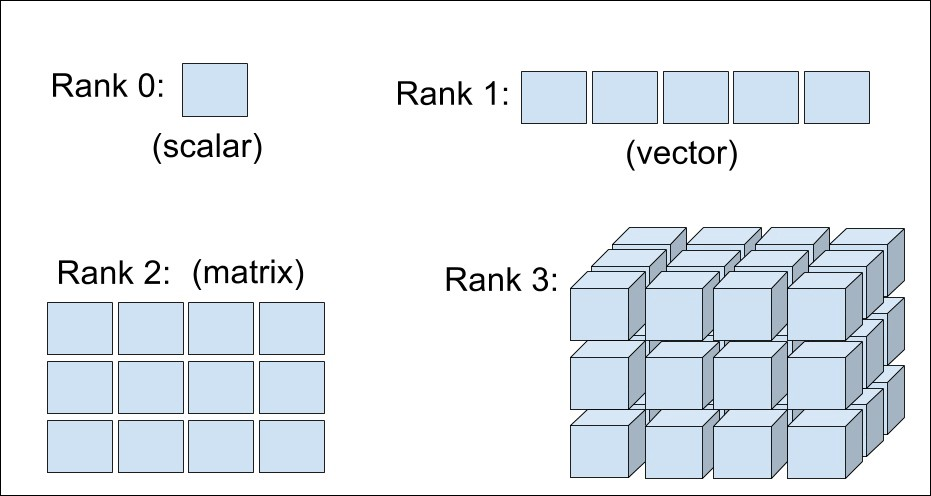

<div class="watermark"></div>

# Introducción a R

*R* (R Core Team) es un entorno y lenguaje de programación que permite el análisis estadístico de información y reportes gráficos. Es ampliamente usado en investigación por la comunidad estadística en campos como la biomedicina, minería de datos, finanzas, seguros, entre otros. Ha ganado mucha popularidad en los últimos años al ser un **software libre** que está en constante crecimiento por las aportaciones de otros usuarios y que permite la interacción con software estadísticos como STATA, SAS, SPSS, etc. *R* permite la incorporación de librerías y paqueterías con funcionalidades específicas, por lo que es un lenguaje de programación muy completo y fácil de usar.

## ¿Cómo obtener *R*?

R puede ser fácilmente descargado de forma gratuita desde el sitio oficial <http://www.r-project.org/>. R está disponible para las plataformas Windows, Mac y Linux.

## ¿Qué es RStudio?

*RStudio* es un Entorno de Desarrollo Integrado (IDE, por sus siglas en inglés) para R. Este permite y facilita el desarrollo y ejecución de sintaxis para código en *R*, incluye una consola y proporciona herramientas para la gestión del espacio de trabajo. *RStudio* está disponible para Windows, Mac y Linux o para navegadores conectados a *RStudio Server o RStudio Server Pro*.

Algunas de las principales características de Rstudio que lo hacen una gran herramienta para trabajar en *R*, son:

-   Auto completado de código
-   Sangría inteligente
-   Resaltado de sintaxis
-   Facilidad para definir funciones
-   Soporte integrado
-   Documentación integrada
-   Administración de directorios y proyectos
-   Visor de datos
-   Depurador interactivo para corregir errores
-   Conección con Rmarkwon y Sweave

La siguiente imagen muestra la forma en la que está estructurado RStudio. El orden de los páneles puede ser elegido por el usuario, así como las características de tipo de letra, tamaño y color de fondo, entre otras características.

```{r, echo=F, out.width="800pt", out.height="450pt", fig.align="center", fig.cap="Páneles de trabajo de Rstudio"}
knitr::include_graphics("img/02-intro2r/rstudio.png")
```

## *R* como lenguaje orientado a objetos

*R* es un lenguaje de programación orientado a objetos (POO). (López 2011, pag. 5) define a los objetos y sus características como "cualquier cosa con significado para el problema que se trata de resolver". A partir de esa definición, se puede decir que sirve para representar alguna entidad de la vida real, por lo general son componentes del problema que se pretende resolver y con los que podemos interactuar. A través de esta interacción y del estudio que se haga de ellos, es posible clasificarlos en grupos de acuerdo a sus caractrerísticas. A partir de los objetos con los que se trabaje, surgirán las clases adecuadas para encontrar la solución a un problema dado.

Los objetos tienen características fundamentales que permiten identificarlos, conocerlos y entender su comportamiento. De acuerdo con (Schildt 2009), estas características son:

1.  Identidad
2.  Comportamiento
3.  Estructura

-   **Identidad:** Esta es la propiedad que da nombre a cada uno de los objetos y que permite declararlos, distinguirlos de manera única, usarlos y llamarlos para la representación de su contenido.

-   **Comportamiento:** Esta es la propiedad que determina las operaciones que puede realizar el objeto, es decir, permite conocer las capacidades y alcances de la funcionalidad de cada objeto. El comportamiento permite conocer la interacción que puede existir con otros objetos y los resultrados que generarán.

-   **Estructura:** El estado se refiere a un conjunto de características o atributos específicos del objeto dados en un momento determinado, y que pueden cambiar en un instante de tiempo.

En la programación orientada a objetos, un programa recolecta muchos objetos para ser tratado como un conjunto dinámico de objetos interactuando entre sí. Los objetos están definidos por:

1.  **Atributos:** Son las propiedades o características de los datos contenidos en un objeto. Los valores asociados a un objeto en un momento determinado del tiempo determinan su estado.

2.  **Métodos:** Acceden a los atributos de los objetos y determinan el comportamiento de los datos contenidos.


## Estructuras de almacenamiento


En *R* existen varios tipos de objectos que permiten que el usuario pueda almacenar la información para realizar procedimientos estadísticos y gráficos. Los principales objetos en R son vectores, matrices, arreglos, marcos de datos y listas. A continuación se presentan las características de estos objetos y la forma para crearlos.

### Variables

Las variables sirven para almacenar un valor que luego vamos a utilizar en algún procedimiento.

Para hacer la asignación de un valor a alguna variable se utiliza el operador \<- entre el valor y el nombre de la variable. A continuación un ejemplo sencillo.

```{r}
x <- 5
(2 * x) + 3
```

En el siguiente ejemplo se crea la variable pais y se almacena el nombre Colombia, luego se averigua el número de caracteres de la variable pais.

```{r}
pais <- "México"
nchar(pais)
```

También existen variables lógicas y estas toman los valores verdadero (TRUE) o falso (FALSE) dependiendo del resultado lógico puesto a prueba. Ejemplo:

```{r}
y <- 10
y == (5 + 3 + 2)

y != 5 + 5
```


### Vectores

Los vectores vectores son arreglos ordenados en los cuales se puede almacenar información de tipo numérico (variable cuantitativa), alfanumérico (variable cualitativa) o lógico (TRUE o FALSE), pero no mezclas de éstos. La función de *R* para crear un vector es c() y que significa concatenar; dentro de los paréntesis de esta función se ubica la información a almacenar. Una vez construído el vector se acostumbra a etiquetarlo con un nombre corto y representativo de la información que almacena, la asignación se hace por medio del operador \<- entre el nombre y el vector.

A continuación se presenta un ejemplo de cómo crear tres vectores que contienen las respuestas de cinco personas a tres preguntas que se les realizaron.

```{r}

edad <- c(15, 19, 13, NA, 20)
deporte <- c(TRUE, TRUE, NA, FALSE, TRUE)
sexo <- c("Hombre", "Mujer", "Hombre", "Hombre", "Mujer")

```

El vector edad es un vector cuantitativo y contiene las edades de las 5 personas. En la cuarta posición del vector se colocó el símbolo NA que significa **Not Available** debido a que no se registró la edad para esa persona. Al hacer una asignación se acostumbra a dejar un espacio antes y después del operador \<- de asignación. 

El segundo vector es llamado deporte y es un vector lógico que almacena las respuestas a la pregunta de si la persona practica deporte, nuevamente aquí hay un NA para la tercera persona. El último vector sexo contiene la información del sexo de cada persona, como esta variable es cualitativa es necesario usar las comillas " " para encerrar las respuestas.

::: {.infobox .important data-latex="{important}"}
**¡¡ RECORDAR !!**

* Cuando se usa NA para representar una información Not Available no se deben usar comillas.

* Es posible usar comillas 'sencillas' o comillas "dobles" para ingresar valores de una variable cualitativa.
:::


Si se desea ver lo que está almacenado en cada uno de estos vectores, se debe escribir en la consola de R el nombre de uno de los objetos y luego se presiona la tecla enter o intro, al realizar esto lo que se obtiene se muestra a continuación.

```{r}
edad 
```

```{r}
deporte 
```

```{r}
sexo 
```

#### ¿Cómo extraer elementos de un vector?

Para extraer un elemento almacenado dentro un vector se usan los corchetes \[\] y dentro de ellos la posición o posiciones que interesan.

Ejemplo Si queremos extraer la edad de la tercera persona escribimos el nombre del vector y luego \[3\] para indicar la tercera posición de edad, a continuación el código.

```{r}
edad[3]

```

Si queremos conocer el sexo de la segunda y quinta persona, escribimos el nombre del vector y luego, dentro de los corchetes, escribimos otro vector con las posiciones 2 y 5 que nos interesan así: $c(2, 5)$, a continuación el código.

```{r}
sexo[c(2, 5)]
```

Si nos interesan las respuestas de la práctica de deporte, excepto la de la persona 3, usamos \[-3\] luego del nombre del vector para obtener todo, excepto la tercera posición.

```{r}
deporte[-3]

```

::: {.infobox .important data-latex="{important}"}
**¡¡ RECORDAR !!**

Si desea extraer varios posiciones de un vector NUNCA escriba esto: mi_vector[2, 5, 7]. Tiene que crear un vector con las posiciones y luego colocarlo dentro de los corchetes así: **$$mi\_vector[c(2, 5, 7)]$$**
:::


### Matrices

Las matrices son arreglos rectangulares de filas y columnas con información numérica, alfanumérica o lógica. Para construir una matriz se usa la función matrix( ). Por ejemplo, para crear una matriz de 4 filas y 5 columnas (de dimensión  4×5) con los primeros 20 números positivos se escribe el código siguiente en la consola.

``` {r}
mimatriz <- matrix(data = 1:20, nrow = 4, ncol = 5, byrow = FALSE)
```

El argumento data de la función sirve para indicar los datos que se van a almacenar en la matriz, los argumentos nrow y ncol sirven para definir la dimensión de la matriz y por último el argumento byrow sirve para indicar si la información contenida en data se debe ingresar por filas o no. Para observar lo que quedó almacenado en el objeto mimatriz se escribe en la consola el nombre del objeto seguido de la tecla enter o intro.

``` {r}
mimatriz
```

####  ¿Cómo extraer elementos de una matriz?

Al igual que en el caso de los vectores, para extraer elementos almacenados dentro de una matriz se usan los corchetes [ , ] y dentro, separado por una coma, el número de fila(s) y el número de columna(s) que nos interesan.

**Ejemplo**

Si queremos extraer el valor almacenado en la fila 3 y columna 4 usamos el siguiente código.

``` {r}
mimatriz[3, 4]
```

Si queremos recuperar *toda* la fila 2 usamos el siguiente código.

``` {r}
mimatriz[2, ]  # No se escribe nada luego de la coma
```


Si queremos recuperar *toda* la columna 5 usamos el siguiente código.

``` {r}
mimatriz[, 5]  # No se escribe nada antes de la coma
```

Si queremos recuperar la matriz original sin las columnas 2 y 4 usamos el siguiente código.

``` {r}
mimatriz[, -c(2, 4)]  # Las columnas como vector
```


Si queremos recuperar la matriz original sin la fila 1 ni columna 3 usamos el siguiente código.

``` {r}
mimatriz[-1, -3]  # Signo de menos para eliminar
```

###  Arreglos 

Un arreglo es una matriz de varias dimensiones con información numérica, alfanumérica o lógica. Para construir una arreglo se usa la función array( ). Por ejemplo, para crear un arreglo de  3 × 4 × 2 con las primeras 24 letras minúsculas del alfabeto se escribe el siguiente código.

``` {r}
miarray <- array(data = letters[1:24], dim=c(3, 4, 2))
```

```{r echo=FALSE,fig.align='center', out.width='600pt', out.height='300pt'}

```

El argumento data de la función sirve para indicar los datos que se van a almacenar en el arreglo y el argumento dim sirve para indicar las dimensiones del arreglo. Para observar lo que quedó almacenado en el objeto miarray se escribe en la consola lo siguiente.

``` {r}
miarray
```


#### ¿Cómo extraer elementos de un arreglo?
Para recuperar elementos almacenados en un arreglo se usan también corchetes, y dentro de los corchetes, las coordenadas del objeto de interés.


**Ejemplo**
Si queremos extraer la letra almacenada en la fila 1 y columna 3 de la segunda capa de miarray usamos el siguiente código.

``` {r}
miarray[1, 3, 2]  # El orden es importante
```


Si queremos extraer la segunda capa completa usamos el siguiente código.

``` {r}
miarray[,, 2]  # No se coloca nada en las primeras posiciones
```

Si queremos extraer la tercera columna de todas las capas usamos el siguiente código.

``` {r}
miarray[, 3,]  # No se coloca nada en las primeras posiciones
```

### Data Frames  

El marco de datos marco de datos o data frame es uno de los objetos más utilizados porque permite agrupar vectores con información de diferente tipo (numérica, alfanumérica o lógica) en un mismo objeto, la única restricción es que los vectores deben tener la misma longitud. Para crear un marco de datos se usa la función *data.frame( )*, como ejemplo vamos a crear un marco de datos con los vectores edad, deporte y sexo definidos anteriormente.


``` {r}
mi_data_frame <- data.frame(edad, deporte, sexo) 
```

Una vez creado el objeto mi_data_frame podemos ver el objeto escribiendo su nombre en la consola, a continuación se muestra lo que se obtiene.


``` {r}
mi_data_frame 
```

De la salida anterior vemos que el marco de datos tiene 3 variables (columnas) cuyos nombres coinciden con los nombres de los vectores creados anteriormente, los números consecutivos al lado izquierdo son sólo de referencia y permiten identificar la información para cada persona en el conjunto de datos.


**Ejercicios:**

Use funciones o procedimientos (varias líneas) de *R* para responder cada una de las siguientes preguntas.

1. Construya un vector con 5 nombres de personas.

2. Construya un vector con las edades de las 5 personas anteriores.

3. Construya un marco de datos o data frame con las respuestas de 5 personas a las preguntas: 

      a) ¿Cuál es su nombre? 
      b) Sexo de la persona 
      c) ¿Cuál es su edad en años? 
      d) ¿En qué alcaldía vive? 
      e) ¿En qué alcaldía trabaja?


### Listas

Las listas son otro tipo de objeto muy usado para **almacenar objetos de diferente tipo.** La instrucción para crear una lista es *list( )*. A continuación vamos a crear una lista que contiene tres objetos: un vector con 5 números aleatorios llamado *mivector*, una matriz de dimensión  6×2 con los primeros doce números enteros positivos llamada matriz2 y el tercer objeto será el marco de datos *mi_data_frame* creado en el apartado anterior. Las instrucciones para crear la lista requerida se muestran a continuación.


``` {r}
set.seed(12345)
mivector <- runif(n=5)
matriz2 <- matrix(data=1:12, ncol=6)
milista <- list(E1=mivector, E2=matriz2, E3=mi_data_frame)
```

La función *set.seed* de la línea número 1 sirve para fijar la semilla de tal manera que los números aleatorios generados en la segunda línea con la función *runif* sean siempre los mismos. En la última línea del código anterior se construye la lista, dentro de la función *list* se colocan los tres objetos *mivector*, *matriz2* y *mi_data_frame.* Es posible colocarle un nombre especial a cada uno de los elementos de la lista, en este ejemplo se colocaron los nombres E1, E2 y E3 para cada uno de los tres elementos. Para observar lo que quedó almacenado en la lista se escribe *milista* en la consola y el resultado se muestra a continuación.

``` {r}
milista
```

#### ¿Cómo extraer elementos de una lista?

Para recuperar los elementos almacenadas en una lista se usa el operador $, corchetes dobles [[]] o corchetes sencillos []. A continuación unos ejemplos para entender cómo extraer elementos de una lista.

**Ejemplos**
Si queremos la matriz almacenada con el nombre de E2 dentro del objeto *milista* se puede usar el siguiente código.

``` {r}
milista$E2
```

Es posible indicar la posición del objeto en lugar del nombre, para eso se usan los corchetes dobles.

``` {r}
milista[[2]]
```

El resultado obtenido con milista$E2 y milista[[2]] es exactamente el mismo. Vamos ahora a solicitar la posición 2 pero usando corchetes sencillos.

``` {r}
milista[2]
```

La apariencia de este último resultado es similar, no igual, al encontrado al usar $ y [[]]. Para ver la diferencia vamos a pedir la clase a la que pertenecen los tres últimos objetos usando la función class. A continuación el código usado.

``` {r}
class(milista$E2)
```

``` {r}
class(milista[[2]])
```

``` {r}
class(milista[2])
```

---
De lo anterior se observa claramente que cuando usamos $ o [[]] el resultado es el objeto almacenado, una matriz. Cuando usamos [] el resultado es una lista cuyo contenido es el objeto almacendado.
---


### Ejercicios


1. Use funciones o procedimientos (varias líneas) de *R* para responder cada una de las siguientes preguntas.

2. Construya un vector con la primeras 20 letras MAYÚSCULAS usando la función LETTERS.

3. Construya una matriz de  10×10 con los primeros 100 números positivos pares.

4. Construya una matriz identidad de dimension  3×3. Recuerde que una matriz identidad tiene sólo unos en la diagonal principal y los demás elementos son cero.

5. Construya una lista con los anteriores tres objetos creados.

6. Construya un marco de datos o data frame con las respuestas de 5 personas de su trabajo a las preguntas: 

   (a) ¿Cuál es su nombre? 
   (b) ¿Cuál es su antiguedad en la empresa? 
   (c) ¿Cuál es su puesto? 
   (d) ¿Tiene usted algún producto contratado con la empresa? (Sí / No)
   (e) ¿Cuál?
   

7. ¿Cuál es el error al correr el siguiente código? ¿A qué se debe? 


```{r, eval=FALSE}

edad <- c(15, 19, 13, NA, 20)
deporte <- c(TRUE, TRUE, NA, FALSE, TRUE)
sexo <- c(NA, 'Hombre', 'Hombre', NA, 'Mujer')

matrix(edad, deporte, sexo)
```


