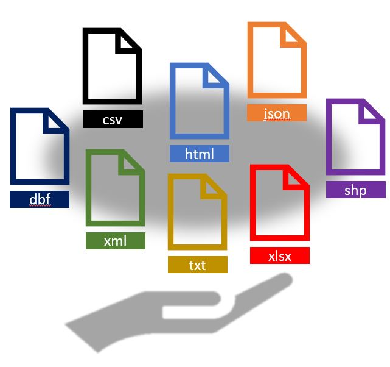
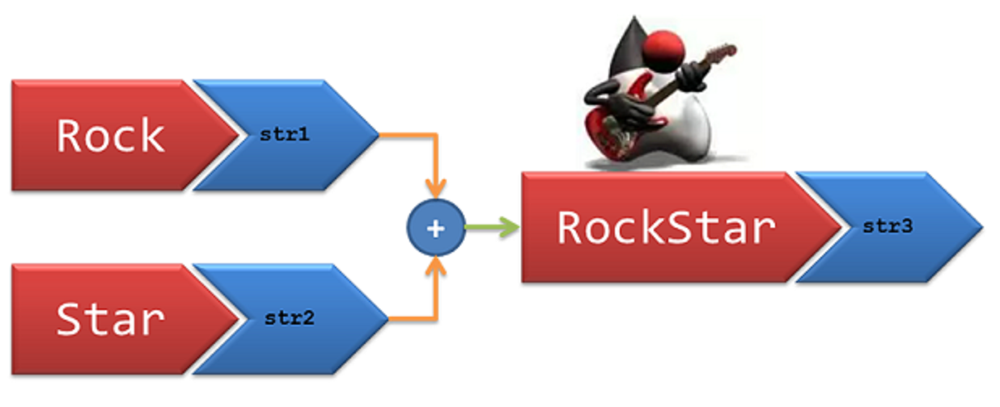

::: watermark

:::

# Tidyverse

La compañía Rstudio ha desarrollado un conjunto de librerías que revolucionó la programación en *R*. Este conjunto de librerías permite al usuario mayor orden, legibilidad e intuición a la hora de escribir y leer código. El conjunto de librerías lleva por nombre: **TIDYVERSE**.

En este capítulo se estudiarán las distintas librerías que componen este conjunto. Cada una de las librerías puede usarse de modo independiente. En caso de que el usuario lo prefiera, puede disponer de todas las librerías al mandar ejecutar la función:

```{r}
library(tidyverse)
```

## Lectura de archivos

Usualmente, no creamos los datos desde la sesión de *R*, sino que a través de un archivo externo o una base de datos se realiza la lectura de datos. Los más comunes son:

```{r, echo=F, fig.align='center',fig.width=6 }

```

### Archivos *csv*

A la hora de importar conjuntos de datos en *R*, uno de los formatos más habituales en los que hallamos información es en archivos separados por comas (comma separated values), cuya extensión suele ser *.csv*. En ellos encontramos múltiples líneas que recogen la tabla de interés, y en las cuales los valores aparecen, de manera consecutiva, separados por el carácter *,*.

Para importar este tipo de archivos en nuestra sesión de *R*, se utiliza la función `read_csv()`. Para acceder a su documentación utilizamos el comando `?read_csv`.

El único argumento que debemos de pasar a esta función de manera obligatoria, es `file`, el nombre o la ruta completa del archivo que pretendemos importar.

```{r, eval=TRUE, echo=FALSE}
library(readr)
```

```{r, eval=FALSE}
library(readr)

read_csv(
  file,
  col_names = TRUE,
  col_types = NULL,
  locale = default_locale(),
  na = c("", "NA"),
  quoted_na = TRUE,
  quote = "\"",
  comment = "")
```

La paquetería *readr* fue desarrollada recientemente para lidiar con la lectura de archivos grandes rápidamente. El paquete proporciona reemplazos para funciones como *read.table()*, *read.csv()* entre otras. Esta paquetería proporciona funciones que suelen ser mucho más rápidas que las funciones base que proporciona *R*.

```{r,  echo=F, fig.height=2, fig.width=2, fig.align='center' }
knitr::include_graphics("img/03-read-data/logo-readr.png")
```

**Ventajas de readr:**

-   Por lo general, son mucho más rápidos (\~ 10x) que sus funciones equivalentes.

-   Producen tibbles:

    -   No convierten vectores de caracteres en factores.
    -   No usan nombres de filas ni modifican los nombres de columnas.

-   Reproducibilidad

-   No convierte, automáticamente, las columnas con cadenas de caracteres a factores, como sí hacen por defecto las otras funciones base de *R*.

-   Reconoce ocho clases diferentes de datos (enteros, lógicos, etc.), dejando el resto como cadenas de caracteres.

Veamos un ejemplo:

La base de datos llamada [AmesHousing](https://drive.google.com/file/d/1pCHFeF8rtQiUcip9zf4Xtk0pAQ-5Om-r/view?usp=sharing) contiene un conjunto de datos con información de la Oficina del Tasador de Ames utilizada para calcular los valores tasados para las propiedades residenciales individuales vendidas en Ames, Iowa, de 2006 a 2010. FUENTES: Ames, Oficina del Tasador de Iowa.

Pueden descargar los datos para la clase [aquí](https://drive.google.com/drive/folders/1sNlUWIvKHOTt7qywhPIyl1X00do_Y6Zo?usp=sharing)

```{r, eval=TRUE}

base <- read.csv("data/ames.csv") 
head(base, 2)

tidy <- read_csv("data/ames.csv")
head(tidy, 2)
```

¿Y si el archivo que necesitamos leer esta en excel?

### Archivos txt

Uno de los archivos más comunes es el *.txt*. La librería *readr* también cuenta con funciones que permiten leer fácilmente los datos contenidos en formato tabular.

```{r}
ames_txt <- read_delim("data/ames.txt", delim = ";", col_names = TRUE)
head(ames_txt, 2)
```

La función *read_delim()* funciona para leer archivos con diferentes delimitadores posibles, es decir, es posible especificar si las columnas están separadas por espacios, comas, punto y coma, tabulador o algún otro delimitador ("",",",";","\t", "\@").

Adicionalmente, se puede especificar si el archivo contiene encabezado, si existen renglones a saltar, codificación, tipo de variable y muchas más opciones. Todos estos detalles pueden consultarse en la documentación de ayuda.

### Archivos *xls* y *xlsx*

La paquetería *readxl* facilita la obtención de datos tabulares de archivos de *Excel*. Admite tanto el formato *.xls* heredado como el formato *.xlsx* moderno basado en *XML*.

Esta paquetería pone a disposición las siguientes funciones:

-   `read_xlsx()` lee un archivo con extensión *xlsx*.

```{r, eval=FALSE}

read_xlsx(
 path,
 sheet = NULL,
 range = NULL,
 col_names = TRUE,
 col_types = NULL,
 na = "", 
 trim_ws = TRUE,
 skip = 0,
 n_max = Inf,
 guess_max = min(1000, n_max),
 progress = readxl_progress(),
 .name_repair = "unique"
 )
```

-   `read_xls()` lee un archivo con extensión *xls*.

```{r, eval=FALSE}
read_xls(
 path,
 sheet = NULL,
 range = NULL,
 col_names = TRUE,
 col_types = NULL,
 na = "", 
 trim_ws = TRUE,
 skip = 0,
 n_max = Inf, 
 guess_max = min(1000, n_max),
 progress = readxl_progress(),
 .name_repair = "unique"
 )
```

-   `read_excel()` determina si el archivo es de tipo *xls* o *xlsx* para después llamar a una de las funciones mencionadas anteriormente.

```{r, eval=FALSE}
read_excel(
 path,
 sheet = NULL,
 range = NULL,
 col_names = TRUE,
 col_types = NULL, 
 na = "",
 trim_ws = TRUE, 
 skip = 0,
 n_max = Inf,
 guess_max = min(1000, n_max),
 progress = readxl_progress(),
 .name_repair = "unique"
 )
```

**EJERCICIO:** Leer archivo excel de la carpeta del curso

### Archivos json

Se utiliza la función `fromJSON` de la paquetería *jsonlite*

```{r, eval=TRUE}

library(jsonlite)

base_json <- jsonlite::fromJSON("data/ames.json")
head(base_json, 2)
```

### Archivos rds

Un tipo de archivo que resulta de particular interés, es el *.RDS*. Este archivo comprime cualquier objeto o resultado que sea usado o producido en *R*. Uno puede almacenar el objeto de interés de la siguiente manera:

```{r, eval=FALSE}
saveRDS(base_json, "data/ames.rds")
```

Puede observarse que en el explorador de archivos se encuentra ahora el nuevo archivo con extensión *.rds*, el cual puede ser posteriormente incorporado a una sesión de *R* para seguir trabajando con él.

```{r}
base_rds <- readRDS("data/ames.rds")
```

Algunas de las grandes ventajas que tiene almacenar los archivos en formato rds, son las siguientes:

-   No es necesario volver a ejecutar procesos largos cuando ya se ha logrado realizar una vez.

-   El tiempo de lectura de la información es considerablemente más rápido.

### Bases de Datos

En muchos de los casos la información estará dentro de un Sistema Manejador de Bases de Datos, existen bibliotecas que nos permiten establecer las conexiones con ellas, algunos ejemplos son:

-   ODBC
-   DBI
-   JDBC

Un ejemplo con un SMBD como Oracle:

### Oracle Database

[Referencias](https://cran.r-project.org/web/packages/ROracle/ROracle.pdf)

**Configuración de conexión:**

Se necesitan seis configuraciones para realizar una conexión:

-   Controlador : consulte la sección Controladores para obtener más información
-   Url : una ruta de red al servidor de la base de datos.
-   Base de datos : el nombre de la base de datos.
-   Usuario : el ID de red del usuario o la cuenta local del servidor
-   Contraseña : la contraseña de la cuenta
-   Puerto : debe establecerse en 1526 o 1521

Para establecer la conexión con la base de datos:

```{r, eval= F}
library(DBI)
library(RJDBC)

jdbcDriver = JDBC(driverClass = "oracle.jdbc.OracleDriver","c:/Drivers/Oracle/ojdbc8.jar")

con <- dbConnect(
 jdbcDriver, 
 url      = "jdbc:oracle:thin:@//Hostname:Port/Service_Name"
 user     = rstudioapi::askForPassword("Database user"),
 password = rstudioapi::askForPassword("Database password"),
 dbname   = "Data Base Name"
)

sql_translation.JDBCConnection <- dbplyr:::sql_translation.Oracle
sql_select.JDBCConnection      <- dbplyr:::sql_query_select.Oracle
sql_subquery.JDBCConnection    <- dbplyr:::sql_query_wrap.Oracle

dbExistsTable(jdbcConnection, "nombre_tabla") # Probar si hay conexión con la tabla

```

**Información sobre la base de datos:**

El paquete odbc le brinda herramientas para explorar objetos y columnas en la base de datos.

```{r, eval= F}
# Top level objects
odbcListObjects(con)

# Tables in a schema
odbcListObjects(con, catalog = "mydb", schema = "dbo")

# Columns in a table
odbcListColumns(con, catalog = "mydb", schema = "dbo", table = "cars")

# Database structure
odbcListObjectTypes(con)
```

**Consultas con SQL:** Para consultas interactivas, utilice *dbGetQuery()* para enviar una consulta y obtener los resultados. Para obtener los resultados por separado, utilice *dbSendQuery()* y *dbFetch()*. El argumento *n* en *dbFetch()* se puede utilizar para obtener resultados parciales.

```{r, eval= F}

# Return the results for an arbitrary query
dbGetQuery(con, "SELECT speed, dist FROM cars")

# Fetch the first 100 records
query <- dbSendQuery(con, "SELECT speed, dist FROM cars")
dbFetch(query, n = 10)
dbClearResult(query)

```

Puedes usar los ejemplos anteriores para probar con diferentes consultas y bases de datos.

Tengamos un ejemplo de manera local:

```{r, eval=F}
remotes::install_version("RSQLite")
```

```{r, eval=T, warning=FALSE, message=FALSE}
library(dplyr)
library(dbplyr)
library(RSQLite)

con <- src_memdb()

copy_to(con, storms, overwrite = T)
copy_to(con, mtcars, overwrite = T)

tbl_storms <- tbl(con, "storms")
tbl_storms

tbl_mtcars <- tbl(con, "mtcars")
tbl_mtcars
```

Existe otra metodología de conexión, la cual puede encontrarse en la siguiente [documentación](https://db.rstudio.com/databases/oracle/)

## Consultas de datos

Ahora que ya se ha estudiado la manera de cargar datos, aprenderemos como manipularlos con *dplyr.* El paquete *dplyr* proporciona un conjunto de funciones muy útiles para manipular data-frames y así reducir el número de repeticiones, la probabilidad de cometer errores y el número de caracteres que hay que escribir. Como valor extra, podemos encontrar que la gramática de *dplyr* es más fácil de entender.

Revisaremos algunas de sus funciones **más usadas** (*verbos*), así como el uso de **pipes** (%\>%) para combinarlas.

-   select()

-   filter()

-   arrange()

-   mutate()

-   summarise()

-   join()

-   group_by()

Primero tenemos que instalar y cargar la paquetería (parte de tidyverse):

```{r, message=FALSE, warning=FALSE}
# install.packages("dplyr")

library(dplyr)
library(readr)
```

Usaremos el dataset *AmesHousing* que se proporcionó en el capítulo anterior (el alumno puede hacer el ejercicio con datos propios)

```{r, warning=FALSE, message=FALSE}
ames_housing <- read_csv("data/ames.csv")

glimpse(ames_housing)
```

### Seleccionar columnas

Observamos que nuestros datos tienen 2,930 observaciones y 74 variables, con *select()* podemos seleccionar las variables que se indiquen.

```{r}
ames_housing %>% select(Lot_Area, Neighborhood, Year_Sold, Sale_Price)
```

::: {.infobox .tip data-latex="{tip}"}
**¡¡ RECORDAR !!**

El operador pipe (%\>%) se usa para conectar un elemento con una función o acción a realizar. En este caso solo se indica que en los datos de ames se seleccionan 4 variables.
:::

Con *select()* y *contains()* podemos seleccionar variables con alguna cadena de texto.

```{r}
ames_housing %>% select(contains("Area"))
```

De igual manera, con *select()*, *ends_with* y *start_with()* podemos seleccionar que inicien o terminen con alguna cadena de texto.

```{r}
ames_housing %>% select(starts_with("Garage"))
```

Funciones útiles para *select()*:

-   *contains()*: Selecciona variables cuyo nombre contiene la cadena de texto.

-   *ends_with()*: Selecciona variables cuyo nombre termina con la cadena de caracteres.

-   *everything()*: Selecciona todas las columnas.

-   *matches()*: Selecciona las variables cuyos nombres coinciden con una expresión regular.

-   *num_range()*: Selecciona las variables por posición.

-   *start_with()*: Selecciona variables cuyos nombres empiezan con la cadena de caracteres.

-   *any_of*: Selecciona cualquiera de estas variables, en caso de existir

**EJERCICIO:**

-   Crear con datos propios una consulta de columnas usando como variable auxiliar cada una de las listadas anteriormente. Será suficiente con realizar un ejemplo de cada una.

### Filtrar observaciones

La función *filter()* nos permite filtrar filas según una condición, primero notemos que la variable *Sale_Condition* tiene distintas categorías.

```{r}
table(ames_housing$Sale_Condition)
```

::: {.infobox .important data-latex="{important}"}
**¡¡ SPOILER !!**

En un modelo predictivo de Machine Learning, **no es correcto** agregar columnas cuyo valor es conocido hasta el momento de la observación. Es decir, no deben agregarse variables que no se conozca su valor al momento de la predicción, como es el caso de *condición de venta*.
:::

Ahora usaremos la función *filter* para quedarnos solo con las observaciones con condición de venta "normal".

```{r}
ames_housing %>% filter(Sale_Condition == "Normal")
```

También se puede usar para filtrar variables numéricas:

```{r}
ames_housing %>% filter(Lot_Area > 1000 & Sale_Price >= 150000)
```

Notemos que en el ejemplo anterior se usa *&*, que ayuda a filtrar por dos condiciones.

También puede usarse *\|* para filtrar por alguna de las dos condiciones.

```{r}
ames_housing %>% filter(Lot_Area < 1000 | Sale_Price <= 150000)
```

Las condiciones pueden ser expresiones lógicas construidas mediante los operadores relacionales y lógicos:

-   **\<** : Menor que

-   **\>** : Mayor que

-   **==** : Igual que

-   **\<=** : Menor o igual que

-   **\>=** : Mayor o igual que

-   **!=** : Diferente que

-   **%in%** : Pertenece al conjunto

-   **is.na** : Es NA

-   **!is.na** : No es NA

**EJERCICIO:**

-   Practicar la función de filtro de observaciones usando los operadores auxiliares.

-   Concatenar el resultado de seleccionar columnas y posteriormente filtrar columnas.

### Ordenar registros

La función *arrange()* se utiliza para ordenar las filas de un data frame de acuerdo a una o varias variables. Este ordenamiento puede ser ascendente o descendente.

Por defecto *arrange()* ordena las filas por orden ascendente:

```{r}
ames_housing %>% arrange(Sale_Price)
```

<br> <br>

Si las queremos ordenar de forma ascendente, lo haremos del siguiente modo:

```{r}
ames_housing %>% arrange(desc(Sale_Price))
```

Si se desea usar dos o más columnas para realizar el ordenamiento, deben separarse por comas cada una de las características

```{r}
ames_housing %>% 
 arrange(Sale_Condition, desc(Sale_Price), Lot_Area) %>% 
 select(Sale_Condition, Sale_Price, Lot_Area)
```

Notemos que en el ejemplo anterior usamos dos *pipes* (%\>%), como habíamos mencionado se pueden usar los necesarios para combinar funciones.

### Agregar / Modificar

Con la función *mutate()* podemos computar transformaciones de variables en un data frame. A menudo, tendremos la necesidad de crear nuevas variables que se calculan a partir de variables existentes. La función *mutate()* proporciona una interfaz clara para realizar este tipo de operaciones.

Por ejemplo, haremos el cálculo de la antigüedad del inmueble a partir de las variables *Year_Sold* y *Year_Remod_Add*:

```{r}
ejemplo_mutate <- ames_housing %>% 
 select(Year_Sold, Year_Remod_Add) %>%
 mutate(Antique = Year_Sold - Year_Remod_Add)

ejemplo_mutate
```

El ejemplo anterior crea una nueva variable. Ahora se presenta otro ejemplo en donde se modifica una variable ya creada.

```{r}
ejemplo_mutate %>% 
 mutate(Antique = Antique * 12)
```

En este segundo ejemplo, se modifica el número de años de antigüedad y se multiplica por un factor de 12 para modificar el tiempo en una escala de meses.

### Resumen estadístico

La función *summarise()* se comporta de forma análoga a la función *mutate()*, excepto que en lugar de añadir nuevas columnas crea un nuevo data frame.

Podemos usar el ejemplo anterior y calcular la media de la variable creada *Antique*:

```{r}
ames_housing %>% 
 select(Year_Sold, Year_Remod_Add) %>%
 mutate(Antique = Year_Sold - Year_Remod_Add) %>%
 summarise(Mean_Antique = mean(Antique))
```

Solo fue necesario agregar un *pipe*, especificar el nombre de la variable creada y la operación a realizar.

A continuación se muestran funciones que trabajando conjuntamente con la función summarise() facilitarán nuestro trabajo diario. Las primeras pertenecen al paquete base y las otras son del paquete dplyr. Todas ellas toman como argumento un vector y devuelven un único resultado:

-   *min(), max()* : Valores max y min.

-   *mean()* : Media.

-   *median()* : Mediana.

-   *sum()* : Suma de los valores.

-   *var(), sd()* : Varianza y desviación estándar.

-   *first()* : Primer valor en un vector.

-   *last()* : El último valor en un vector

-   *n()* : El número de valores en un vector.

-   *n_distinct()* : El número de valores distintos en un vector.

-   *nth()* : Extrae el valor que ocupa la posición n en un vector.

Mas adelante veremos como combinar esta función con la función *group_by()* para calcular estadísticos agrupados por alguna característica de interés.

**EJERCICIO:**

* Realizar una consulta usando *summarise()* y cada una de las funciones estadísticas listadas anteriormente.

### Agrupamiento

La función *group_by()* agrupa un conjunto de filas de acuerdo con los valores de una o más columnas o expresiones.

Usaremos el ejemplo anterior. Primero creamos nuestra nueva variable *Antique*, después agrupamos por vecindario y al final calculamos la media de la variable *Antique*. Gracias al agrupamiento, nos regresara una media por cada grupo creado, es decir, nos regresara el promedio de la antigüedad por vecindario.

```{r,warning=FALSE,message=FALSE}
ames_housing %>% 
 mutate(Antique = Year_Sold - Year_Remod_Add) %>% 
 group_by(Neighborhood) %>% 
 summarise(Mean_Antique = round(mean(Antique), 0))

```

### Cruces de tablas

Una operación fundamental por agregar al flujo de trabajo es el cruce de tablas, las cuales pueden proceder de la misma o de distinta fuente. Comúnmente **este proceso se realiza para enriquecer y unificar la información** proveniente de distintas tablas.

Para lograr esta tarea es indispensable que exista una variable **llave** en ambos conjuntos de datos que sirva como puente o identificador de cada caso o renglón. Si se cuenta con la columna llave entonces será posible cruzar las tablas y lograr su enriquecimiento.

En el siguiente ejemplo se muestra el uso de la variable llave a través de la columna "ID". Se puede apreciar que en la tabla final se cuenta con información de la variable "Weight" para los elementos que existen en las tablas "A" y "B".

```{r echo=FALSE,fig.align='center', out.width='700pt'}
knitr::include_graphics("img/04-tidyverse/left_join3.png")
```

La función que hace posible el complemento de la información es llamada *left_join()*. El primer argumento de la función corresponde al conjunto de datos que se desea complementar, mientras que en el segundo argumento se ingresa el conjunto de datos con la información que enriquecerá al primer conjunto. Es necesario especificar en el argumento *"by"* el nombre de la columna llave.

```{r}
conjuntoX <- tibble("Llave" = LETTERS[1:8], "C1" = 1:8)

conjuntoY <- tibble(
 "Llave" = sample(LETTERS[11:3], size = 9, replace = T), 
 "Ex1" = letters[2:10], 
 "Ex2" = 1002:1010,"Ex3" = paste0(letters[12:20], 2:10)
 )

conjuntoX

conjuntoY

left_join(x = conjuntoX, y = conjuntoY, by = "Llave")
```

Es posible que no todas las observaciones de un conjunto de datos estén en el otro conjunto. Cuando esto sucede, un aviso aparece indicando que los factores o categorías de la variable llave son diferentes. En caso de no encontrarse uno o más de los valores, el resultado para esos casos será NA (no disponible, por su traducción del inglés "Not Available"), y aparecerá siempre que no se cuente con información en un registro, como se muestra en el ejemplo anterior.

Existen diferentes maneras de conjuntar datos. La primera, como en el ejemplo mostrado anteriormente, se hace por lo izquierda y quiere decir que, **al primer conjunto de datos es al que se le agregará la información del segundo conjunto**. Esto se realizará exclusivamente para aquellos registros de la segunda tabla que existan también en la primera, los cuales se identifican mediante la llave definida.

Otra manera de realizar la conjunción de los datos es por la derecha. Funciona de manera análoga a la primera, con la diferencia de que son los datos del primer conjunto los que se agregan al segundo. De igual manera, esto sólo ocurre para los elemento del primer conjunto que se encuentran en el segundo y que son identificables a través de una llave. La función en *R* que permite realizar la conjunción por la derecha lleva por nombre *right_join()*.

```{r}
right_join(x = conjuntoX, y = conjuntoY, by = "Llave")
```

Una tercer forma de unir los datos es a través de la función *full_join()*, la cual es una combinación de las dos anteriores. Agrega todos los elementos llave tanto del primer conjunto como del segundo y posteriormente realiza el cruce de información de ambos conjuntos.

```{r}
full_join(x = conjuntoX, y = conjuntoY, by = "Llave")
```

Estos 3 primeros métodos pueden resumirse en la siguiente imagen:

```{r echo=FALSE,fig.align='center', out.width='700pt'}
knitr::include_graphics("img/04-tidyverse/left_right_full_join.png")
```

Adicionalmente, existen otras funciones que ayudan con gestionar las operaciones entre conjuntos de datos. Tal es el caso de la función *inner_join()*, la cuál no es otra cosa que el filtro de aquellos elementos que se tengan en común en ambas tablas y la combinación de un *join*. Internamente, la función primero filtra el ID de aquellos elementos que tienen presencia en ambas tablas y finalmente hace el cruce de los datos.

```{r echo=FALSE,fig.align='center', out.width='700pt'}
knitr::include_graphics("img/04-tidyverse/inner_join.png")
```

```{r}
inner_join(x = conjuntoX, y = conjuntoY, by = "Llave")
```

Existen otras dos operaciones interesantes que agilizan la extracción de subconjuntos de tablas sin cruzar información. Se trata de las funciones *semi_join()* y *anti_join()*, las cuales funcionan de la siguiente manera:

La función *semi_join()* detecta y filtra los elementos del primer conjunto que se encuentran en un segundo conjunto, mientras que la función *anti_join()* es su complemento, pues regresa los elementos del primer conjunto que no se encuentran en el segundo. En ambos casos, la información contenida en el segundo conjunto no es trasmitida al resultado.

```{r echo=FALSE,fig.align='center', out.width='700pt'}
knitr::include_graphics("img/04-tidyverse/semi_join.png")
```

A continuación se presenta un ejemplo:

```{r}
semi_join(x = conjuntoX, y = conjuntoY, by = "Llave")
```

Ahora revisemos el caso de la función *anti_join()*

```{r echo=FALSE,fig.align='center', out.width='700pt'}
knitr::include_graphics("img/04-tidyverse/anti_join.png")
```

```{r}
anti_join(x = conjuntoX, y = conjuntoY, by = "Llave")
```

::: {.infobox .important data-latex="{important}"}
**WARNING: llaves duplicadas**

La mayoría de los ejemplos anteriores suponen que las llaves son únicas en cada conjunto de datos, sin embargo, esto no es cierto en una gran cantidad de ocasiones. Existen dos casos importantes por analizar:

-   Llaves duplicadas en 1 conjunto de datos

-   Llaves duplicadas en ambos conjuntos
:::

El caso más sencillo es cuando solo uno de los conjuntos contiene llaves duplicadas. En este caso se creará un renglón por cada duplicado.

```{r echo=FALSE,fig.align='center', out.width='700pt'}
knitr::include_graphics("img/04-tidyverse/duplicado1.png")
```

En el segundo caso, por cada elemento duplicado en el primer conjunto habrá como resultado un elemento por cada duplicado en el segundo conjunto. A continuación se ejemplifica este escenario.

```{r echo=FALSE,fig.align='center', out.width='700pt'}
knitr::include_graphics("img/04-tidyverse/duplicado2.png")
```

## Orden y estructura

```{=tex}
\begin{center}
"Las familias felices son todas iguales, cada familia infeliz es infeliz  a su propio modo."
\end{center}
```
```{=tex}
\begin{flushright}
\text{- Leo Tolstoy}
\end{flushright}
```
Un conjunto de datos puede ser representado de muchas maneras distintas y contener en todos los casos la misma información. Sin embargo, no todos los modos en que se presenta la información resulta óptimo para su procesamiento y análisis. Los conjuntos de datos ordenados serán más fáciles de trabajar y analizar.

Algunas de las características principales que presentan los conjuntos de datos ordenados son las siguientes:

1.  Cada variable debe tener su propia columna.

2.  Cada observación debe tener su propio renglón.

3.  Cada valor debe tener su propia celda.

```{r echo=FALSE,fig.align='center', out.width='700pt'}
knitr::include_graphics("img/04-tidyverse/tidy-1.png")
```

La figura anterior muestra la estructura de orden que debe tener un conjunto de datos. A pesar de que pueda parecer intuitivo y sencillo, en la práctica es considerable el número de conjuntos de datos desordenados. La limpieza y ordenamiento debe ser trabajado de forma impecable a fin de que puedan realizarse buenas prácticas. El tiempo de limpieza y ordenamiento varía mucho dependiendo de la dimensión del conjunto de datos.

Algunos de los principales problemas que pueden tener los conjuntos de datos no ordenados son:

-   Una variable puede estar dispersa en múltiples columnas
-   Una observación puede estar esparcida en múltiples renglones

La paquetería *tidyr* cuenta con funciones para resolver dichos problemas. Entre las principales funciones que tiene la paquetería, se encuentran *pivot_longer()*, *pivot_wider()*, *separate()* y *unite()*, mismas que se analizarán a continuación.

### Pivote horizontal

La función *pivot_wider()* resulta muy útil a la hora de organizar los datos. Su función consiste en **dispersar una variable clave en múltiples columnas**.

Lo primero que se debe hacer para poder hacer uso de dicha función es instalar y cargar la librería.

El siguiente conjunto de datos contiene el número de localidades rurales y urbanas por municipio de la Ciudad de México. Como es posible observar, algunos municipios aparecen más de una vez en el marco de datos, esto se debe a que cada municipio puede tener ambos ámbitos, rural y urbano. Para hacer que el conjunto de datos sea ordenado, es necesario que cada observación aparezca una sola vez por renglón y cada una de las categorías (rural y urbano) de la variable "Ámbito" deberá ocupar el lugar de una columna.

El siguiente código muestra cómo convertir los datos no ordenados en un conjunto ordenado.

```{r}
library(tidyr)

Resumen <- readRDS("data/loc_mun_cdmx.rds")

Resumen %>% pivot_wider(
  names_from = Ambito, 
  values_from =  Total_localidades
  )
```

En la tabla actual existe ahora un y solo un registro por cada observación (nombre de municipio en este caso). El valor que le corresponde a cada una de las columnas creadas es la frecuencia absoluta de localidades que tienen la característica "Rural" y "Urbano" respectivamente.

Pero... ¿qué pasa cuando no existen todos los valores en ambas columnas? Si no se especifica la manera de llenar los datos faltantes, estos contendrán NAs. Siempre se puede elegir el caracter o número con el cual se imputan los datos faltantes.

```{r}
fish_encounters %>%
  pivot_wider(names_from = station, values_from = seen)
```

```{r}
fish_encounters %>%
  pivot_wider(names_from = station, values_from = seen, values_fill = 0)
```

En caso de que existan múltiples columnas que se desean dispersar mediante el pivote de una columna con múltiples categorías, es posible especificar tal re estructuración a través del siguiente código.

```{r}
us_rent_income %>% arrange(NAME)
us_rent_income %>%
  pivot_wider(names_from = variable, values_from = c(estimate, moe))
```

Adicionalmente, se puede especificar una función de agregación que operara antes de acomodar los datos en las respectivas columnas indicadas. Un ejemplo de funciones agregadas en la re estructuración de tabla se muestra a continuación, donde se muestra la media de los valores en las categorías *tension* y *breaks*.

```{r}
warpbreaks <- warpbreaks[c("wool", "tension", "breaks")] %>% as_tibble()
warpbreaks

warpbreaks %>%
  pivot_wider(
    names_from = wool,
    values_from = breaks,
    values_fn = mean
  )
```

### Pivote vertical

*pivot_longer()* es podría ser la función inversa de la anterior, se necesita comúnmente para ordenar los conjuntos de datos capturados en crudo, ya que a menudo no son capturados acorde a las mejores estructuras para facilitar el análisis.

El conjunto de datos *relig_income* almacena recuentos basados en una encuesta que (entre otras cosas) preguntó a las personas sobre su religión e ingresos anuales:

```{r}
relig_income
```

¿Crees que ésta es la mejor estructura para la tabla? ¿Cómo imaginas que podría modificarse?

Este conjunto de datos contiene tres variables:

1)  religión, almacenada en las filas

2)  income repartidos entre los nombres de columna

3)  count almacenado en los valores de las celdas.

Para ordenarlo usamos *pivot_longer()*:

```{r}
relig_income %>% 
  pivot_longer(cols = -religion, names_to = "income", values_to = "count")
```

-   El primer argumento es el conjunto de datos para remodelar, relig_income.

-   El segundo argumento describe qué columnas necesitan ser reformadas. En este caso, es cada columna aparte de religion.

-   El **names_to** da el nombre de la variable que se creará a partir de los datos almacenados en los nombres de columna, es decir, ingresos.

-   Los **values_to** dan el nombre de la variable que se creará a partir de los datos almacenados en el valor de la celda, es decir, count. Ni la columna names_to ni la values_to existen en relig_income, por lo que las proporcionamos como cadenas de caracteres entre comillas.

### Unión de columnas

Es común que en los conjuntos de datos exista información esparcida en distintas columnas que sería deseable **(en muy pocas ocasiones)** tenerlas en una sola columna. Algunos ejemplos de esta situación deseable son las fechas y claves geoestadísticas. La función *unite()* sirve para **concatenar el contenido de columnas** mediante un separador elegible.

Se usará la variable de la clave geoestadística de localidades del país como ejemplo.

El formato para las claves geoestadísticas para estado, municipio y localidad son claves alfanuméricas que contienen 2, 3 y 4 caracteres respectivamente. Es indispensable que al trabajar con claves geoestadísticas, las claves estén en su formato original. A continuación se hará la homologación de las claves para usar la función *unite()*.

```{R message=FALSE, warning=FALSE}
library(magrittr)
library(readxl)
library(stringr)

Datos <- read_excel("data/Margin CONAPO.xlsx", sheet = "Margin CONAPO")
Datos
```

Como puede apreciarse en la tabla anterior, las claves de los campos *Ent*, *Mun* y *Loc* aparecen como numéricos. La estructura deseada para estos campos es de tipo alfanumérico y de longitud 2, 3 y 4 respectivamente. Para lograr esta estructura de datos, es necesario concatenar tantos ceros como sean necesarios antes del valor actual hasta lograr la longitud deseada.

```{R}
Datos2 <- Datos %>% select(ENT, MUN, LOC)
Datos2$ENT %<>% str_pad(width = 2, side = "left", pad = "0")
Datos2$MUN %<>% str_pad(width = 3, side = "left", pad = "0")
Datos2$LOC %<>% str_pad(width = 4, side = "left", pad = "0")

Datos2 %>% head(5)

Datos2 %>% 
 unite("CVE_GEO", c("ENT","MUN","LOC"), sep="", remove = F) %>% 
 head(5)

Datos2 %>% 
 unite("CVE_GEO", c("ENT","MUN","LOC"), sep="/",remove = T) %>% 
 head(5)
```

En el código anterior se carga la librería *magrittr* para poder hacer uso del operador pipe doble "%\<\>%", que permite al igual que el operador pipe simple "%\>%", usar como argumento al primer elemento y mandarlo hacia la función definida, además de guardar el resultado final de la cadena de pipes en el argumento original que fue usado como insumo para la función. Es importante tener en cuenta que el dato será reescrito y no se podrá tener acceso a su información almacenada antes de ser usado el operador.

Es opción del programador poder eliminar las variables originales que crearon la nueva variable o mantenerlas en el conjunto de datos. Esta opción está disponible en el parámetro *remove* de la función *unite()*.

### Separador de columnas

Los procesos que se han visto hasta ahora han tenido cada uno una función inversa, este es también el caso de la función *unite* que tiene por objetivo unir dos o más columnas en una. La función *separate()* separará una columna en dos o más dependiendo de la longitud que tenga y de las especificaciones de separación.

```{R}
Datos_unite1 <- Datos2 %>% unite("CVE_GEO", c("ENT","MUN","LOC"), sep = "", remove = T) 
Datos_unite1 %>% head(5) 

Datos_unite1 %>% 
  separate("CVE_GEO", c("EDO","MUNI","LOC"), sep = c(2, 5), remove=F) %>% 
  head(5)
```

Ya sea que se le especifique el número de caracteres que debe de contar para hacer un corte o que se le indique qué caracter debe identificar para hacer la separación, la función *separate()* puede dividir la columna indicada y crear nuevas a partir de la original.

## Manipulación de texto

Anteriormente se mencionaron algunas paqueterías que están incluidas dentro del conjunto Tidyverse. La paquetería stringr no forma parte del núcleo de Tidyverse, no obstante, sí pertenece a dicho conjunto y es ampliamente usada junto a las paqueterías nucleares debido a la facilidad que tiene para trabajar con cadenas, textos y expresiones regulares en general. 

```{r echo=FALSE,fig.align='center', out.width='700pt'}

```


Las expresiones regulares, también conocidas como *regex* o *regexp*, **son patrones de texto repetidos en los datos y que son usados para operar con otras cadenas de texto**. El resultado de dichas operaciones es obtener o resumir información, además de manipular y ordenar los conjuntos de datos. Entre las principales operaciones se encuentran los conteos, concatenaciones, separaciones, búsquedas, extracciones, imputaciones y sustituciones.

### Caracteres especiales

Debido a que la paquetería *stringr* trabaja principalmente con cadenas de texto, es importante tener en cuenta que **los objetos de caracteres se definen a través de comillas**, ya sea simples o dobles. La única diferencia está en el caso en que se pretendan usar comillas como parte del texto. En estos casos, la comilla simple es preferible para ser la que defina el texto.

```{R}
library(stringr)

Cadena1 <- "Se definen cadenas a través de comillas dobles"
print(Cadena1)

Cadena2 <- 'También es posible con comillas simples y el resultado es el mismo'
print(Cadena2)

Cadena3 <- 'Se pueden implementar "comillas" dentro de la cadena'
print(Cadena3)

Cadena4 <- 'Esta es otra forma de incluir \"comillas\" dentro de un texto'
print(Cadena4)
```

Como es posible apreciar en los ejemplos anteriores, la cadena 3 y 4 no se imprimen exactamente como se definieron. Podría parecer que existe un error, ya que aparecen diagonales antes de los caracteres deseados. Para resolver este problema, únicamente es necesario mandar llamar a la función *cat()* . Esta función sirve como intérprete de los caracteres que se definen en una cadena.

La función *cat()* **sirve como sustituto** de la función *print()* (cuya función es imprimir de forma literal lo que existe dentro de las comillas), con la diferencia de que *cat()* **interpreta las salidas** de caracteres especiales en el texto y concatena las salidas finales con el separador específico que se indique. Por default, el separador es un espacio vacío, sin embargo, es posible modificarlo. A continuación se ejemplifica su uso.

```{R}
cat(Cadena3)

cat(Cadena4)
```

A través del operador diagonal invertida "\\" también es posible definir comillas de manera literal. En caso de querer escribir textualmente una diagonal invertida, se necesitará escribir entre comillas dos diagonales invertidas "\\\\". Existen otros caracteres espaciales que ayudan a mejorar el formato de las cadenas. Algunos de los caracteres más comunes son "\\n" (nueva línea) y "\\t" (tabulador).

Todas las funciones que se presentarán a continuación, son posibles encontrarlas con otro nombre dentro de la paquetería básica. La ventaja que tienen las funciones de la paquetería *stringr* es que, los nombres son más intuitivos y comienzan con el mismo prefijo "str\_", haciendo que al escribir las primeras tres letras, la función de autocompletar de RStudio muestre una lista con sugerencias de los nombres de las posibles funciones a usarse.

### Tamaño de cadena

Es común que al procesar los conjuntos de datos, se requiera contar el número de caracteres que tiene una cadena. La paquetería básica cuenta con la función *nchar()* para realizar esta tarea. Con la ayuda de la paquetería *stringr*, es posible realizar esta misma tarea a través de la función *str_length()*

```{R}
str_length("Esta es una cadena de 35 caracteres")

str_length(c("Un","vector","con","diferente","cantidad","de","carecteres","por","cadena"))
```

Puede usarse la función tanto para objetos de cadenas individuales como para vectores.

Existen muchos conjuntos de datos que durante su manipulación podemos encontrar claves alfanuméricas, que pueden ser necesarias **unir información** relevante o para crear claves de identificación única, por ejemplo poder unir el nombre completo de las personas dentro de una base de datos. Uniendo Nombre + Segundo Nombre + Primer Apellido + Segundo Apellido.

Por otro lado de esto puede extraerse información sobre la CURP o en algunos otros ejemplos la unión de un ID + una matricula de carrera + el año pueden ser el registro para un estudiante o podrías querer replicar mensajes para alertas que dependan de una variable.

### Concatenar

Concatenar cadenas es una de las prácticas constantes en el manejo de conjuntos de datos. La función de la paquetería básica que se encarga de dicha tarea es la función *paste()*. A través de la paquetería *stringr* se logrará el **concatenado** mediante la función *str_c()*. Existe la opción de definir el caracter que hará la combinación de las cadenas mediante el argumento "sep", que por default no deja ni un espacio entre las cadenas a combinar. Varios ejemplos se mostrarán a continuación.

```{r echo=FALSE,fig.align='center', out.width='700pt'}

```


```{R}
str_c("Concatenado", "de","varias", "cadenas", "sin","espacios")

str_c("Concatenado","con","espacios", sep=" ")

str_c("separando","mediante","otro","caracter","definido", sep="-")

str_c("Valores",str_c("09","006"),"anidados también se pueden concatenar",sep=" ")
```

Es posible, al igual que con la función *paste()*, colapsar todas las cadenas de un vector en una sola cadena mediante el mismo parámetro: "collapse". El caracter que divide a los elementos del vector debe ser especificado entre comillas, de lo contrario el valor por default será " ".

```{R}
str_c(c("Colapsamiento", "de","un","vector","de", "cadenas", "en","una",
        "sola","cadena"), collapse = " ")

str_c(c("Colapsamiento", "de","un","vector","de", "cadenas",
        "separado","por","signos"), collapse = "+")
```

### Extraer y reemplazar

Cuando únicamente interesa un **subconjunto de alguna cadena** para continuar con el manejo de la información, suele recurrirse a la expresión regular *substr()* de la paquetería básica para extraer este subconjunto de interés. Con *stringr*, la función para usar esta expresión regular es *str_sub()*. Esta función recibe como parámetros el texto desde el cuál se desea extraer el subconjunto, el índice que marque el inicio de la subcadena y el índice del final de la subcadena.

```{R}
str_sub("subcadenas", start = 4, end = 9)

x <- "00000090060002"
str_sub(x, start = str_length(x) - 8, str_length(x))

str_sub(x, start = -9)
```

Con la misma función *str_sub()* es posible **sustituir parcial o totalmente** la cadena "X" que sea introducida como argumento. Ésto se logra asignando a la subcadena seleccionada el valor que se usará para sustituir. En los siguientes ejemplos se muestra cómo modificar la cadena "substring" y la cadena "090060002".

En el primer caso, a partir de la cadena de caracteres "substring" se procede a generar una nueva cadena al sustituir las letras 4 a la 9, reemplazando así la subcadena "string" por "cadena", dando lugar a "subcadena". En el segundo ejemplo, es la clave correspondiente a los dígitos 3 a 5 los que cambian para dar lugar a otra clave numérica.

```{R}
y <- "substring"
str_sub(y, start = 4, end = 9) <- "cadena"; y

x <- "090060002"
str_sub(x, start = str_length(x)-6,str_length(x)-4) <- "555"; x 
```

Lo anterior es ampliamente usado en el proceso de limpieza de los datos. A veces es posible encontrar errores ortográficos o los llamados errores "de dedo" (hacen referencia a errores accidentales al escribir) que se dan a la hora de capturar la información. Cuando una gran cantidad de datos presentan el mismo error, es buena idea recurrir a esta función.

### Expresiones regulares

En el estudio de las expresiones regulares se puede encontrar de manera sobresaliente la aplicación de los *patrones coincidentes*, los cuáles sirven para describir y descubrir coincidencias de interés en conjuntos específicos a partir de cadenas de caracteres.

Con el fin de comprender y visualizar de manera práctica el uso de los patrones coincidentes con las expresiones regulares, se hará uso de la función *str_view()*, que permite distinguir los elementos coincidentes de un vector con un patrón de caracteres descrito.

La paquetería *stringr* cuenta con tres conjuntos predefinidos de oraciones y palabras que sirven para ejemplificar el uso de las expresiones regulares. Estos conjuntos llevan el nombre de **sentences, words y fruit**, su contenido es de sentencias, palabras y nombres de frutas. En los tres casos, estos conjuntos han sido escritos en inglés. Los conjuntos sirven bien para ejemplificar el uso de las siguientes funciones y de las expresiones regulares.

```{R}
head(sentences, 10)

head(words, 20)

head(fruit, 20)

```

Para realizar una coincidencia de patrones, es necesario ingresar como argumento el vector de cadenas de caracteres en donde se desea hacer la búsqueda. Como segundo argumento, se ingresa el patrón con el cuál se desea buscar las coincidencias. Para que únicamente se muestren las coincidencias exitosas se debe agregar el argumento match = TRUE.

```{R}
str_view(sentences,"great", match = TRUE)
```

```{R}
str_view(sentences,"this", match = TRUE)
```

Como es posible apreciarse en los dos ejemplos anteriores, la función *str_view()* filtra los casos coincidentes con los patrones "great" y "this". Esta coincidencia no necesariamente es perfecta. Basta con que un subconjunto de la sentencia coincida con el patrón definido para que la función *str_view()* reconozca como coincidencia válida a toda la cadena.

En caso de no contar con todos los caracteres del patrón deseado o de querer ver todas las combinaciones que tengan un patrón adyacente común, es posible ingresar un "comodín" a través del caracter punto ".", el cuál coincidirá con cualquier caracter. Este caracter especial puede usarse al principio, al final o de manera intermedia dentro del patrón.

```{R}
str_view(sentences,"up.", match = TRUE)
```

Como se puede observar, esta es una manera de detectar subconjuntos de particular interés.

Si \\ es usado para escapar un caracter especial, ¿cómo hacemos para hacer match con el caracter \\ literalmente? Necesita ser escapado, creando la expresión regular \\\\. Para crear la expresión regular, se necesita usar un string, el cual también requiere ser escapado. Esto significa que para hacer match con  se necesita escribir "\\\\\\\\" cuatro diagonales invertidas para hacer match con una sola diagonal invertida \\.

Los primeros 2 diagonales son para crear la expresión regular, la tercera es para escapar el caracter especial siguiente, el cual corresponde a la cuarta diagonal.

**Anclajes**

Como se mencionó anteriormente, por default, la coincidencia de patrones se efectuará sobre cualquier subconjunto de la cadena de caracteres. Es posible definir el caracter inicial y/o el caracter final con el cuál se buscará la coincidencia de patrones. Esto se logra al hacer uso de los siguientes caracteres especiales.

-   \^ Para hacer coincidir el inicio de la cadena
-   \$ Para hacer coincidir el final de la cadena

```{R}
str_view(words,"^y", match = TRUE)
```

```{R}
str_view(words,"x$", match = TRUE)
```

En caso de desear hacer coincidir todo el contenido de la cadena, deben usarse ambos caracteres especiales para definir el inicio y el final del patrón coincidente como se muestra a continuación.

```{R}
vector <- c("nulo aprendizaje", "poco aprendizaje","aprendizaje moderado","aprendizaje", "aprendizaje total")
```

```{R}
str_view(vector,"^aprendizaje$")
```

Wickham menciona que, además del caracter especial punto ".", existen otros cuatro que resultan muy útiles para mostrar patrones particulares.

-   \\d Hace coincidir cualquier dígito.
-   \\s Hace coincidir cualquier espacio en blanco (espacio, tabulador, salto de línea).
-   [abc] Hace coincidir a, b ó c.
-   [\^abc] Coincide con cualquier cosa excepto a, b ó c.

Al momento de definir cualquiera de estos 4 patrones coincidentes será necesario usar doble diagonal invertida. Por ejemplo, "\\\\d" será el patrón para encontrar la coincidencia con cualquier dígito.

```{R}
cadena <- "El año 2022 será un año de mucho crecimiento."
```

```{R}
str_view(cadena,"\\d", match = T)
```

Wickham menciona que, "es posible usar alternancias para elegir entre uno o más patrones alternativos. Por ejemplo, abc\|d..f coincidirá con"abc" o con "deaf". Haciendo notar que la prioridad para el operador "\|" es baja, por lo que abc\|xyz coincide con abc o xyz, no con abcyz o abxyz. Al igual que en las matemáticas, si existe ambigüedad en la prioridad de las operaciones, usar paréntesis lo hará todo más claro."

```{R}
str_view(c("tamaño","tasa","tata","taza","tapa"),"ta(s|z)a")
```

**Repeticiones**

El siguiente paso en complejidad para las expresiones regulares es, controlar el número de veces que aparece un patrón coincidente.

-   ?: Se repite 0 o 1.
-   +: Se repite 1 o más veces.
-   \*: Se repite 0 a más veces.

```{R}
x <- "1888 es el año más largo en números romanos: MDCCCLXXXVIII"
```

```{R}
str_view(x,"XX?")
```

```{R}
str_view(x,"XX+")
```

```{R}
str_view(x,"C[LX]+")
```

Es posible especificar el número de repeticiones que se desea hacer coincidir un patrón. Ya sea de manera exacta o dentro de un intervalo. Esta repetición en el patrón se define de la siguiente manera.

-   {n}: exactamente n veces
-   {n,}: n o más veces
-   {,m}: a lo más m veces
-   {n,m}: entre n y m veces

```{R}
str_view(x,"X{3}")
```

```{R}
str_view(x,"X{1,2}")
```

**Match múltiple / nulo**

Es interesante el siguiente ejemplo. ¿Qué es lo que sucede?

```{r}
str_view(x,"M*")
```

Recordemos que los operadores \* o ? busca un patrón que puede o no encontrarse dentro de la cadena de interés. En el caso anterior, la letra "M" puede o no encontrarse en la cadena "x". En el ejemplo anterior, en cada posible caracter existe el hallazgo o no hallazgo de la letra "M", de forma que el primer match que hace se encuentra al principio de la cadena. Una limitante de la función *str_view()* es que **únicamente resalta la primer coincidencia** encontrada con el patrón regular, sin embargo, la función *str_view_all()* se encarga de resaltar todas las coincidencias en la cadena, como se muestra a continuación.

```{r}
str_view_all(x,"M*")
```

**Herramientas**

Una vez que se han visto los aspectos básicos de las expresiones regulares, es posible utilizar los patrones coincidentes y combinarlos para aplicarlos en problemas reales. Algunas de las aplicaciones más comunes son:

-   Determinar cuáles cadenas coinciden con un patrón.
-   Encontrar la posición de las coincidencias.
-   Extraer el contenido de las coincidencias.
-   Reemplazar coincidencias con nuevos valores.
-   Dividir una cadena basándose en una coincidencia.

A continuación se analizarán las funciones que permitirán realizar las acciones anteriores.

### Detectar coincidencias

Para determinar las cadenas de caracteres dentro de un vector que coinciden con un patrón, es posible utilizar la función *str_detect()*. La función regresará un vector booleano una vez que se introduzcan como argumentos el vector con cadenas y el patrón con el que se desea hacer la coincidencia.

Aplicando esta función a un marco de muestreo es posible apreciar si los elementos coinciden o no con algún patrón indicado.

En el siguiente ejemplo se puede apreciar cuáles frutas tienen entre sus letras una "a" o una "u".

```{R}
str_detect(fruit, "[au]")
```

A continuación se puede apreciar una aplicación de la función *str_detect()*. Se usará el vector booleano para seleccionar el subconjunto del objeto **fruit** que tiene entre su nombre una letra "l" o una letra "o".

```{R}
fruit[str_detect(fruit, "[lo]")]
```

De esta manera se va filtrando un marco muestral para quedarse únicamente con los elementos que coincidan con un patrón coincidente.

### Contabilizar coincidencias

Una variación de la función anterior, es la función *str_count()*. Esta función en lugar de devolver un vector lógico, devuelve un vector de conteos que corresponde al número de veces que detectó una coincidencia para cada cadena dentro de un vector.

La manera de usarse es análoga a la función str_detect().

```{R}
str_count(fruit, "[aeiou]")
```

En el ejemplo anterior se puede apreciar el número de vocales que existen dentro de cada una de los nombres de las frutas.

Una de las aplicaciones más comunes para esta función, se encuentra en los estudios de análisis de textos. A continuación, se puede apreciar el promedio de vocales que son usadas dentro de los nombres de frutas en el objeto **fruit**.

```{R}
mean(str_count(fruit, "[aeiou]"))
```

Otro ejemplo más complejo de esta función y sus aplicaciones es el siguiente:

```{R}
tabla <- tibble(
  "Vocal" = c("a","e","i","o","u"),
  "Conteos" = c(sum(str_count(fruit, "a")),sum(str_count(fruit, "e")),
                sum(str_count(fruit, "i")),sum(str_count(fruit, "o")),
                sum(str_count(fruit, "u")))) %>% 
  mutate(Porcentaje = Conteos/sum(Conteos))

tabla
```

De esta manera es posible visualizar los conteos totales que tuvo cada vocal. Se calculó el porcentaje de aparición que tiene cada vocal con respecto al total de vocales en el conjunto.

Un dato curioso que es posible concluir con este ejemplo, es que, las vocales "a" y "e" aparecen casi dos veces más que el resto de las vocales en el conjunto **fruit**.

El anterior es un ejemplo sencillo que tiene por objetivo ilustrar el aprovechamiento de las funciones, sin embargo, una aplicación más robusta podría permitir que a través de los tweets emitidos a candidatos políticos, se realice un análisis de sentimientos, en el cual cada tweet sea asociado a uno o más sentimientos tales como: alegría, enojo, miedo, tristeza, aversión, etc.

Posteriormente, de manera análoga a los conteos de vocales con porcentajes, se podría analizar la distribución de los sentimientos asociados a las opiniones de cada uno de los candidatos políticos. Adicionalmente, se podría realizar un análisis en donde se muestren las palabras que más se repiten al expresarse de un candidato.

### Extraer coincidencias

Cuando se desea identificar y extraer un subgrupo particular de elementos que cumplan con cierta condición definida a través de un patrón coincidente, la función *str_extract()* es la mejor opción para realizar esta tarea.

Si se desea extraer el subconjunto de sentencias conjuntivas o disyuntivas es necesario definir el patrón coincidente con el cuál se compararán las sentencias para ser extraídas.

```{R}
patron <- "( and )|( or )"
```

Por su traducción en inglés, "and" y "or" son los conectores "y" y "o" respectivamente. Primero se filtrarán las oraciones que cumplen con la condición de que las conjunciones "and" u "or" se encuentren dentro y posteriormente se extraerán los elementos coincidentes.

```{R}
coincidencias <- str_subset(sentences, patron)
head(coincidencias,10)
```

Apenas 123 sentencias cumplen con la condición. Éstas representan el 17.08% del total. Para extraer los elementos coincidentes, la función *str_extract()* se usa de la siguiente manera:

```{R}
str_extract(coincidencias, patron)
```

Con el código anterior se logra extraer el patrón coincidente de cada una de las sentencias, sin embargo, sólo se logra extraer la primer coincidencia de cada cadena en donde hubo al menos una coincidencia. Para extender este resultado a todos los patrones coincidentes dentro de la sentencia, se debe agregar el sufijo "\_all" a la función. La función *str_extract_all()* extraerá todas las coincidencias y las agrupará en un objeto cuya estructura será la de una "lista". Con la función *head()* se logrará visualizar los 5 primeros elementos de la lista que guarda el resultado generado por la función *str_extract_all()*.

```{R}
head(str_extract_all(coincidencias,patron), 5)
```

Un formato más compacto del resultado anterior se logra al agregar el parámetro "simplfy = TRUE" dentro de la función de extracción. Para visualizar aleatoriamente diez de los resultados generados, se puede hacer uso de la función *sample_n()* de la librería *dplyr*.

```{R, message = F, warning = F}
dplyr::sample_n(
  tbl = as_tibble(str_extract_all(coincidencias, patron, simplify = TRUE)), 
  size = 10
)
```

Si en alguna cadena existieran más de dos patrones coincidentes, aparecería en la segunda columna el patrón encontrado (e.g., elemento en el séptimo renglón), de lo contrario, el elemento de la segunda columna permanecerá vacío a través de dos comillas.

El resultado será un objeto de la clase *data.frame* que tendrá tantas columnas como coincidencias máximas hayan existido en una sentencia.

La siguientes línea de código permite hacer conteos del número de veces que el patrón coincidente fue detectado en el vector de oraciones. La función *str_count()* indicará el número de veces que el patrón fue detectado en cada oración. Finalmente, el vector numérico se suma.

```{R}
sum(str_count(coincidencias, pattern = patron))
```

Con este dato, se puede decir que a lo largo de 123 oraciones, se puede encontrar 126 veces el patrón indicado. Este tipo de análisis nos permite hacer reportes como el siguiente: En promedio, cada oración tiene incluido 1.02 veces el patrón coincidente.

A continuación, se revisará el modo de detectar y reemplazar patrones regulares.

### Reemplazar coincidencias

A menudo es necesario reemplazar algunos patrones. Ya sea derivado de un error en las cadenas de texto o por interés de presentar los resultados de una manera distinta, identificar y sustituir un subconjunto de caracteres es algo que la función *str_replace()* de la paquetería stringr puede hacer.

Como todas las funciones vistas hasta el momento provenientes de la paquetería stringr, la función *str_replace()* recibe el objeto con las cadenas de caracteres originales y a través de un patrón de texto se hace la búsqueda de las coincidencias. Es posible incluir más de 1 patrón y asignar el nuevo texto que sustituirá al anterior para cada uno de los patrones definidos. La función *str_replace()* hará la sustitución de un solo patrón coincidente y la función *str_replace_all()* lo hará para todos los patrones definidos.

```{R}
# Ejemplos de cambio de códigos a palabras o invertido  

x <- c("1","2","1","2","1","2","1","2","1","2")
x1 <- str_replace(x, "1","Hombre")
print(x1)

x2 <- str_replace(x1, "2","Mujer")
print(x2)

# Es posible replicar el resultado en un solo paso mediante str_replace_all

str_replace_all(x, c("1" = "Hombre", "2" = "Mujer"))
```

### Divisiones mediante patrones

La información se presenta en diferentes formatos todo el tiempo. A veces cada variable tiene su propia columna, pero a veces la información está mezclada y es necesario dividirla a fin de trabajar mejor con ella.

Un caso recurrente en donde se presenta esta operación es con las fechas. El formato de una fecha a menudo se presenta como dd/mm/aaaa. Bajo este formato se puede encontrar tres datos en uno solo (día, mes y año). Para dividirlo, se podría utilizar el caracter "/" como patrón de coincidencia que permita dividir los datos en tres columnas separadas. Se debe agregar el parámetro "*simplify = T*" para poder simplificar los resultados y visualizarlos en un objeto *data.frame()*. La manera de hacerlo es la siguiente:

Primero se genera un vector con fechas

```{R}
fechas <- c("15/11/1991","20/11/1981","04/02/1966","01/10/1958","23/04/1992");fechas
```

Ahora, se generan tres columnas, una para el campo "Día", otra para el campo "Mes" y otra para "Año"

```{R}
str_split(string = fechas,pattern = "/",n = 3, simplify = T) %>% 
  as_tibble() %>% 
  rename(day = V1, month = V2, year = V3)
```

### Localización de coincidencias

Para poder hacer operaciones con algunas cadenas de caracteres, en ocasiones es necesario proporcionar los índices que denotan el inicio y el término de algún patrón de caracteres. La función *str_locate()* devuelve dichos índices una vez que se le haya proporcionado como argumento el patrón coincidente y el vector de cadenas de texto.

```{R}
x <- c("090020001-123","090001-512","09002-1236","90020001-1237","09001-123811")
str_locate(x,"-\\d{2,}")

```

El ejemplo anterior muestra la manera en la que se localizan los índices iniciales y finales de los caracteres posteriores al símbolo "-", que cumplan con tener al menos 2 dígitos. Hay que tomar en cuenta que bajo esta forma de extraer los índices, la posición del caracter "-" está incluida y es ahí donde inicia el conteo.

Habiendo platicado de esto, podemos hablar de uno de los temas importantes en muchas ocasiones complejos de la manipulación de datos... las fechas.

```{r echo=FALSE,fig.align='center', out.width='700pt'}
knitr::include_graphics("img/04-tidyverse/regexp.jpeg")
```

## Manipulación de tiempo

```{r echo=FALSE,fig.align='center', out.width='400pt'}
knitr::include_graphics("img/04-tidyverse/build_time.png")
```

### Lectura y creación de datos temporales

Una de la tareas más comunes en el análisis de datos es la manipulación de fechas y horas. Existe una infinidad de situaciones en donde saber operar con esta clase de datos es vital para el análisis de datos general. El primer paso es lograr identificar una cadena de caracteres como un dato temporal. Veamos un primer ejemplo:

```{r, warning=FALSE, message=FALSE}
library(lubridate)

fechas <- c("2018/09/11", "1992/04/23", "1966/02/04", "1958/10/01", "1991/11/15")
class(fechas)

class(as_date(fechas))

```

Como puede apreciarse, los elementos del vector ahora son de la clase "Date". La función *as_date()* transforma caracteres a fechas. Otra forma de realizar la implementación de datos temporales es directamente la creación de datos temporales a través de las funciones *make_date()* y *make_datetime()*. Esta función recibe los parámetros de cada unidad temporal y crea el dato adecuado para representarlo, ya sea *date* o *datetime*.

```{r}
make_date(year = 1999, month = 06, day = 16)

make_datetime(year = 1999:2001, month = 06, day = 16, hour = 10:12, min = 37, sec = 15)
```

El segundo ejemplo muestra la capacidad de estas funciones para crear una secuencia de fechas a partir de vectores de cada posible unidad temporal (día, mes año, hora, etc)

Algo que puede apreciarse en los ejemplos anteriores y que es necesario mencionar, es que el formato universal de fecha se escribe: **yyyy/mm/dd**. En países como USA el formato es **mm/dd/yyyy** y en México y otras partes del mundo puede escribirse comúnmente **dd/mm/yyyy**. Este tipo de diferencia a veces puede llegar a generar confusión sobre la fecha exacta en cuestión, más aún si se abrevia el año a dos caracteres **yy**.

La librería **lubridate** ofrece funciones para lidiar con el formato de lectura. Estas funciones son:

-   dmy / dmy_h / dmy_hm / dmy_hms

-   mdy / mdy_h / mdy_hm / mdy_hms

-   ymd / ymd_h / ymd_hm / ymd_hms

-   hm / hms

Con todas las funciones mencionadas anteriormente se puede leer cualquier cadena de caracteres que contenga el formato especificado. A continuación, un ejemplo:

```{r}
mdy("11/25/1982")
```

Automáticamente cualquiera de las funciones antes mencionadas transforma el formato específico al formato universal.

### Extracción de datos temporales

Una vez que los datos temporales ya se encuentran creados, es importante saber la manera de extraer información particular de nuestro interés. En esta sección se revisará la manera de extraer cualquier unidad temporal a partir de una cadena completa de caracteres. a través de lubridate, las funciones para extracción de sub-unidades temporales son intuitivas.

```{r}
tiempo <- make_datetime(year = 2004, month = 9, day = 25, hour = 11, min = 30, sec = 1)

year(tiempo)
month(tiempo)
month(tiempo, label = T, abbr = F)
day(tiempo)
hour(tiempo)
minute(tiempo)
second(tiempo)
```

Después de las unidades temporales básicas, es posible también extraer día de la semana o día del mes, si es de interés.

```{r}
wday(tiempo)
wday(tiempo, label = T, abbr = F)
mday(tiempo)
yday(tiempo)
```

### Operaciones temporales

Las operaciones aritméticas entre datos temporales es cotidiano en todo momento cuando se analizan datos. Operaciones de sumas y restas de fechas y horas que permiten conocer la longitud de tiempo en dos momentos es una tarea que puede resolverse a través de los operadores aritméticos y lógicos.

Resta entre fechas

```{r}
as_date("1991/11/15") - as_date("1992/04/23")

as_date("1992/04/23") - as_date("1991/11/15")
```

Suma y resta de días

```{r}
as_date("1991/11/15") + 365
```

Operadores lógicos

```{r}
as_date("1992/04/23") > as_date("1991/11/15")

as_date("1992/04/23") < as_date("1991/11/15")
```

Cada una de las operaciones vistas en este capítulo son compatibles con dplyr y el resto de las librerías tidyverse.


## Iteraciones

Los procesos en *R* muchas veces son iterativos en distintas partes del desarrollo de una solución. Existe una librería que facilita el entendimiento, orden, legibilidad y limpieza a la orden de iterar. La librería lleva por nombre *purrr*. Purrr presenta funciones de mapeo, así como algunas funciones nuevas para manipular listas. 

Mientras que el caballo de batalla de *dplyr* es el marco de datos (data.frame / tibble), el caballo de batalla de purrr es la lista. 

* Recordemos que un vector es una forma de almacenar muchos elementos individuales (un solo número o un solo carácter o cadena) del mismo tipo en un solo objeto.

* Un marco de datos (data.frame / tibble) es una forma de almacenar muchos vectores de la misma longitud pero posiblemente de diferentes tipos juntos en un solo objeto.

* Una lista es una forma de almacenar muchos objetos de cualquier tipo (por ejemplo, marcos de datos, diagramas, vectores) juntos en un solo objeto.

Aquí hay un ejemplo de una lista que tiene tres elementos: un solo número, un vector y un marco de datos

```{r}
mi_2da_lista <- list(
 my_number = 5,
 my_vector = c("a", "b", "c"),
 my_dataframe = data.frame(
  a = 1:3, b = c("q", "b", "z"), 
  c = c("bananas", "are", "so very great"))
 )

mi_2da_lista
```


*Un marco de datos es en realidad un caso especial de una lista donde cada elemento de la lista es un vector de la misma longitud.*

Una función de mapeo es aquella que **aplica la misma acción/función a cada elemento** de un objeto (por ejemplo, cada entrada de una lista o un vector, o cada una de las columnas de un marco de datos).

::: {.infobox .tip data-latex="{tip}"}
**¡¡ RECORDAR !!**

La funciones que serán revisadas son súper útiles para realizar una acción de forma iterativa en las entradas de un vector o lista sin tener que escribir un bucle *for*. 
:::


La convención de nomenclatura de las funciones de mapeo es tal que el tipo de salida se especifica mediante el término que sigue al guión bajo en el nombre de la función.

* map(.x, .f) Es la función principal y regresa una lista

* map_df(.x, .f) regresa un data frame

* map_dbl(.x, .f) regresa un  vector numérico (double)

* map_chr(.x, .f) regresa un vector de caracter

* map_lgl(.x, .f) regresa un vector lógico

De acuerdo con la forma del tidyverse, el primer argumento de cada función de mapeo es siempre el objeto de datos sobre el que desea mapear, y **el segundo argumento es siempre la función que desea aplicar iterativamente a cada elemento del objeto de entrada.**

### Bucles 

Fundamentalmente, los mapeos son para iteraciones. En el ejemplo de abajo, se iterará sobre el vector `r c(1, 4, 7)` añadiendo el valor 10 a cada entrada del vector a través de una función llamada *addTen()*. Esta función será aplicada a cada número único, el cual llamaremos ".x".

```{r}
addTen <- function(.x) {
  return(.x + 10)
}
```

La función *map()* de abajo, itera sobre todos los enteros aplicando la función *addTen()* a los elementos del vector `r .x = c(1, 4, 7)` y regresa la salida como una lista.

```{r}
library(purrr)

map(
 .x = c(1, 4, 7), 
 .f = addTen
 )
```

Hay que notar en los siguientes ejemplos que el mecanismo es funcional independientemente de si se trata de una lista o un marco de datos:

```{r}
map(list(1, 4, 7), addTen)

map(data.frame(a = 1, b = 4, c = 7), addTen)
```

la estructura resultante por default es una lista, no obstante, es posible especificar el tipo de salida deseado. Por ejemplo, para mapear el resultado de una iteración en un vector '*double*', puede implementarse la función *map_dbl()*, la cual mapea a un vector double:

```{r}
map_dbl(c(1, 4, 7), addTen)
```
Para mapear a un vector de clase 'caracter', puede implementarse la función *map_chr()*:

```{r}
map_chr(c(1, 4, 7), addTen)
```

Incluso puede realizarse este mismo proceso iterativo en búsqueda de obtener como resultado un data frame:

```{r}
map_df(c(1, 4, 7), function(.x) {
  return(data.frame(old_number = .x, 
                    new_number = addTen(.x)))
})
```

### Bucles dobles

En caso de haber dominado el uso del bucle mediante la función *map()*, es posible proceder a intentar iterar sobre dos objetos. El código de abajo una las funciones de mapeo para crear una lista de gráficos para comparar la esperanza de vida y el ingreso per cápita en cada combinación  de continente y país.

La función de mapeo que itera sobre dos objetos en vez de uno, es llamada *map2()*. Los primeros dos argumentos son los dos objetos sobre los cuales se realiza la iteración y el tercero es la función con 2 argumentos (uno por cada objeto).

```{r}
x <- list(1, 5, 15)
y <- list(10, 20, 30)

map2(x, y, ~ .x + .y)

map2_dbl(x, y, ~ .x + .y)

map2_chr(x, y, ~ .x + .y)
```

Otro ejemplo:

```{r}
df <- data.frame(
  x = c(1, 2, 5),
  y = c(5, 4, 8)
)
df

map2_dbl(df$x, df$y, min)
```


