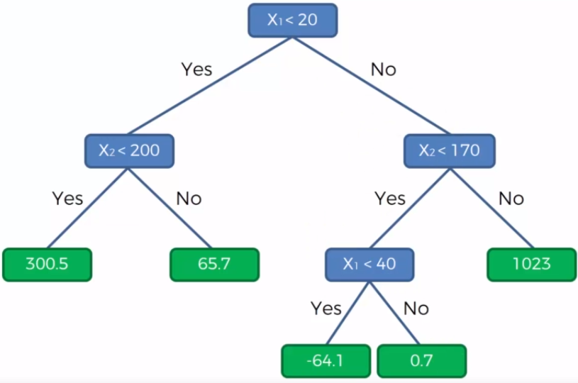
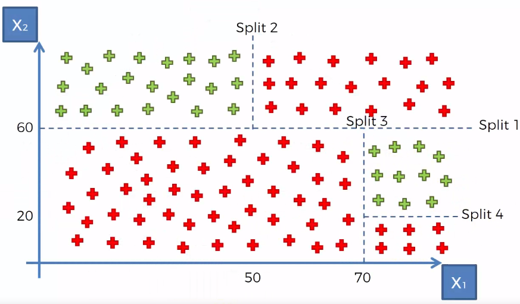

::: watermark

:::


# Árboles de decisión

```{r, fig.align='center', out.height='300pt', out.width='500pt', echo=F}
knitr::include_graphics("img/09-ml-tree/0-arboles.png")
```


Un árbol de decisiones es un algoritmo del aprendizaje supervisado que se puede utilizar tanto para problemas de **clasificación** como de **regresión**. Es un clasificador estructurado en árbol, donde los nodos internos representan las características de un conjunto de datos, las ramas representan las reglas de decisión y cada nodo hoja representa el resultado. La idea básica de los árboles es buscar puntos de cortes en las variables de entrada para hacer predicciones, ir dividiendo la muestra, y encontrar cortes sucesivos para refinar las predicciones.


En un árbol de decisión, hay dos tipos nodos, el nodo de decisión o nodos internos (*Decision Node*) y el nodo hoja o nodo terminal (Leaf node). Los nodos de decisión se utilizan para tomar cualquier decisión y tienen múltiples ramas, mientras que los nodos hoja son el resultado de esas decisiones y no contienen más ramas.

```{r, fig.align='center', out.height='300pt', out.width='500pt', echo=F}
knitr::include_graphics("img/09-ml-tree/1-arboles.png")
```

- **Regresión:** En el caso de la regresión de árboles de decisión, en los nodos finales se calcula el promedio de la variable de respuesta. El promedio será la estimación del modelo.

```{r, fig.align='center', out.height='300pt', out.width='500pt', echo=F}
knitr::include_graphics("img/09-ml-tree/2-arbol-reg-graph.png")
```

```{r, fig.align='center', out.height='300pt', out.width='500pt', echo=F}

```

```{r, fig.align='center', out.height='300pt', out.width='500pt', echo=F}
#
```

- **Clasificación:** Por otro lado, en los árboles de clasificación se calcula la proporción de elementos de cada categoría en los nodos finales. De esta manera se calcula la probabilidad de pertenencia a la categoría.

```{r, fig.align='center', out.height='300pt', out.width='500pt', echo=F}

```

```{r, fig.align='center', out.height='300pt', out.width='500pt', echo=F}
knitr::include_graphics("img/09-ml-tree/5-arbol-cla-diagram.png")
```


```{r, fig.align='center', out.height='300pt', out.width='500pt', echo=F, eval=F}
#knitr::include_graphics("img/09-ml-tree/ejemploreg.png")
```


## Ajuste del modelo

En un árbol de decisión, para predecir la clase del conjunto de datos, el algoritmo comienza desde el nodo raíz del árbol. Este algoritmo compara los valores de la variable raíz con la variable de registro y, según la comparación, sigue una rama y salta al siguiente nodo.

Para el siguiente nodo, el algoritmo vuelve a comparar el valor de la siguiente variable con los otros sub-nodos y avanza. Continúa el proceso hasta que se llega a un nodo hoja. El proceso completo se puede comprender mejor con los siguientes pasos: 

1) Comenzamos el árbol con el nodo raíz (llamado S), que contiene el conjunto de entrenamiento completo.

2) Encuentre la mejor variable en el conjunto de datos usando *Attribute Selective Measure* (ASM).

3) Divida la S en subconjuntos que contengan valores posibles para la mejor variable.

4) Genere el nodo del árbol de decisión, que contiene la mejor variable.

5) Cree de forma recursiva nuevos árboles de decisión utilizando los subconjuntos del conjunto de datos creado en el paso 3. Continúe este proceso hasta que se alcance una etapa en la que no pueda particionar más los nodos y este nodo final sera un nodo hoja.

6) Para clasificación nos quedaremos la moda de la variable respuesta del nodo hoja y para regresión usaremos la media de la variable respuesta.

### Attribute Selective Measure (ASM)

Al implementar un árbol de decisión, surge el problema principal de cómo seleccionar la mejor variable para el nodo raíz y para los sub-nodos. Para resolver este problemas existe una técnica que se llama medida de selección de atributos o *ASM*. Mediante esta medición, podemos seleccionar fácilmente la mejor variable para los nodos del árbol. Hay dos técnicas populares para *ASM*, que son:

- Índice de Gini

La medida del grado de probabilidad de que una variable en particular se clasifique incorrectamente cuando se elige al azar se llama índice de Gini o impureza de Gini. Los datos se distribuyen por igual según el índice de Gini.

$$Gini = \sum_{i=1}^{n}\hat{p_i}(1-\hat{p}_i)$$

Con $p_i$ como la probabilidad de que un objeto se clasifique en una clase particular.

Esta métrica puede analizarse como una métrica de impureza. Cuando todos o la mayoría de elementos dentro de un nodo pertenecen a una misma clase, el índice de Gini toma valores cercanos a cero.

Cuando se utiliza el índice de Gini como criterio seleccionar la variable para el nodo raíz, seleccionaremos la variable con el índice de Gini menor.


## Regularización de árboles

Para asegurarse de que no exista sobre-ajuste en el modelo, es importante considerar algunas regularizaciones a los hiper-parámetros implementados. Posteriormente, se determinará cuál de las posibles combinaciones produce mejores resultados.

### Nivel de profundidad de árbol

Podríamos preguntarnos cuándo dejar de crecer un árbol. Pueden existir problemas que tengan un gran conjunto de variables y esto da como resultado una gran cantidad de divisiones, lo que a su vez genera un árbol de decisión muy grande. Estos árboles son complejos y pueden provocar un sobre-ajuste. Entonces, necesitamos saber cuándo parar.

1) Una forma de hacer esto es establecer un número mínimo de entradas de entrenamiento para dividir un nodo. 

2) Otra forma es establecer la profundidad máxima de su modelo. La profundidad máxima se refiere a la longitud del camino más largo desde el nodo raíz hasta un nodo hoja.

### Poda de árbol

El rendimiento de un árbol se puede aumentar aún más mediante la poda del árbol. Esto se refiere a eliminar las ramas que hacen uso de variables de poca importancia. De esta manera, reducimos la complejidad del árbol y, por lo tanto, **aumentamos su poder predictivo al reducir el sobre-ajuste.**

```{r, fig.align='center', out.height='300pt', out.width='500pt', echo=F}

```

La poda puede comenzar en la raíz o en las hojas. El método más simple de poda comienza en las hojas y elimina cada nodo con la clase más popular en esa hoja, este cambio se mantiene si no deteriora la precisión.  Se pueden usar métodos de poda más sofisticados, como la poda de complejidad de costos, donde se usa un parámetro de aprendizaje (alfa) para observar si los nodos se pueden eliminar en función del tamaño del sub-árbol. 

## Implementación en R

Usaremos las recetas antes implementadas para ajustar tanto el modelo de regresión como el de clasificación. Exploraremos un conjunto de hiperparámetros para elegir el mejor modelo. En esta ocasión usamos la función *grid_random()* donde el parámetro *size* indica el número total de combinaciones a implementar. En caso de que haya duplicados, un número menor de combinaciones a las establecidas será devuelto como resultado.

### Regresión

**Paso 1: Separación inicial de datos ( test, train, KFCV)**
```{r}
library(tidymodels)

data(ames)

set.seed(4595)
ames_split <- initial_split(ames, prop = 0.75)
ames_train <- training(ames_split)
ames_test  <- testing(ames_split)

ames_folds <- vfold_cv(ames_train)
```

Contando con datos de entrenamiento, procedemos a realizar el feature engineering para extraer las mejores características que permitirán realizar las estimaciones en el modelo.

**Paso 2: Pre-procesamiento e ingeniería de variables**

```{r, warning=FALSE,message=FALSE}
receta_casas <- recipe(
 Sale_Price ~ Gr_Liv_Area + TotRms_AbvGrd + Exter_Cond + Bsmt_Cond +
  Year_Sold + Year_Remod_Add, 
 data = ames_train) %>%
  step_mutate(
    Age_House = Year_Sold - Year_Remod_Add,
    Exter_Cond = forcats::fct_collapse(Exter_Cond, Good = c("Typical", "Good", "Excellent"))) %>% 
  step_relevel(Exter_Cond, ref_level = "Good") %>% 
  step_normalize(all_numeric_predictors()) %>%
  step_dummy(all_nominal_predictors()) %>% 
  step_interact(~ matches("Bsmt_Cond"):TotRms_AbvGrd) %>% 
  prep()

receta_casas
```

Recordemos que la función **recipe()** solo son los pasos a seguir, necesitamos usar la función **prep()** que nos devuelve una receta actualizada con las estimaciones y la función **juice()** que nos devuelve la matriz de diseño.

Una vez que la receta de transformación de datos está lista, procedemos a implementar el pipeline del modelo de interés.

**Paso 3: Selección de tipo de modelo con hiperparámetros iniciales**

```{r, warning=FALSE,message=FALSE, eval=TRUE}
# install.packages("rpart")

tree_model <- decision_tree(
  mode = "regression",
  tree_depth = tune(),
  cost_complexity = tune(),
  min_n = tune()) %>% 
  set_engine("rpart")
```

**Paso 4: Inicialización de workflow o pipeline**

```{r, warning=FALSE,message=FALSE, eval=TRUE}
tree_workflow <- workflow() %>% 
  add_recipe(receta_casas) %>% 
  add_model(tree_model)
```

**Paso 5: Creación de grid search**

```{r, warning=FALSE,message=FALSE, eval=TRUE}
tree_parameters_set <- extract_parameter_set_dials(tree_workflow) %>% 
 update(
  min_n = min_n(range = c(2L, 40L)),
  tree_depth = tree_depth(range = c(1L, 15L)),
  cost_complexity = cost_complexity(range = c(-10, -1), trans = log10_trans())
  )

set.seed(123)
tree_grid <- tree_parameters_set %>% 
 grid_random(size = 100)

ctrl_grid <- control_grid(save_pred = T, verbose = T)

```

**Paso 6: Entrenamiento de modelos con hiperparámetros definidos**

```{r, warning=FALSE,message=FALSE, eval=FALSE}
library(doParallel)

UseCores <- detectCores() - 1
cluster <- makeCluster(UseCores)
registerDoParallel(cluster)

tree1 <- Sys.time()
tree_tune_result <- tune_grid(
  tree_workflow,
  resamples = ames_folds,
  grid = tree_grid,
  metrics = metric_set(rmse, mae, mape, rsq),
  control = ctrl_grid
)
tree2 <- Sys.time(); tree2 - tree1

stopCluster(cluster)

tree_tune_result %>% saveRDS("models/tree_model_reg.rds")

```

```{r}
tree_tune_result <- readRDS("models/tree_model_reg.rds")
```

**Paso 7: Análisis de métricas de error e hiperparámetros (Vuelve al paso 3, si es necesario)**

Podemos obtener las métricas de cada *fold* con el siguiente código:

```{r}
collect_metrics(tree_tune_result)
```

En la siguiente gráfica observamos las distintas métricas de error asociados a los hiperparámetros elegidos:

```{r}
tree_tune_result %>% autoplot()
```

En la siguiente gráfica observamos el error cuadrático medio de las distintas métricas con distintos números de vecinos.

```{r}
tree_tune_result %>% autoplot(metric = "rmse")
```

En la siguiente gráfica observamos el error absoluto promedio de las distintas métricas con distintos números de vecinos.


```{r}
tree_tune_result %>% autoplot(metric = "mae")
```


**Paso 8: Selección de modelo a usar**

Con el siguiente código obtenemos los mejores 10 modelos respecto al *rmse*.

```{r}
show_best(tree_tune_result, n = 10, metric = "rmse")
```


```{r}
tree_tune_result %>% show_best(n = 10, metric = "mape")
```

Ahora obtendremos el modelo que mejor desempeño tiene tomando en cuenta el *rmse* y haremos las predicciones del conjunto de prueba con este modelo.

```{r}
best_tree_model_reg <- tree_tune_result %>% select_best(metric = "rmse")

best_tree_model_reg
```

```{r}
tree_regression_best_1se_model <- tree_tune_result %>% 
  select_by_one_std_err(metric = "rmse", "rmse")

tree_regression_best_1se_model
```

**Paso 9: Ajuste de modelo final con todos los datos (Vuelve al paso 2, si es necesario)**

```{r}
final_tree_model_reg <- tree_workflow %>% 
  finalize_workflow(best_tree_model_reg) %>% 
  parsnip::fit(data = ames_train)
```

Este último objeto es el modelo final entrenado, el cual contiene toda la información del pre-procesamiento de datos, por lo que en caso de ponerse en producción el modelo, sólo se necesita de este último elemento para poder realizar nuevas predicciones. 

El árbol final se ve de la siguiente manera:

```{r, warning=FALSE, message=FALSE}
library(rpart.plot)

final_tree_model_reg %>%
  extract_fit_engine() %>%
  rpart.plot(roundint = FALSE)
```


Antes de pasar al siguiente paso, es importante validar que hayamos hecho un uso correcto de las variables predictivas. En este momento es posible detectar variables que no estén aportando valor o variables que no debiéramos estar usando debido a que cometeríamos [data leakage](https://towardsdatascience.com/data-leakage-in-machine-learning-6161c167e8ba). Para enfrentar esto, ayuda estimar y ordenar el valor de importancia de cada variable en el modelo.

Podemos obtener la importancia de las variables de manera gráfica:

```{r, message=F, warning=FALSE}
library(vip)

final_tree_model_reg %>% 
 extract_fit_parsnip() %>% 
 vip(geom = "col") + 
 ggtitle("Importancia de las variables")
```


**Paso 10: Validar poder predictivo con datos de prueba**

Imaginemos por un momento que pasa un mes de tiempo desde que hicimos nuestro modelo, es hora de ponerlo a prueba prediciendo valores de nuevos elementos:

```{r}
results_reg <- predict(final_tree_model_reg, ames_test) %>% 
  dplyr::bind_cols(Sale_Price = ames_test$Sale_Price, .) %>% 
  dplyr::rename(pred_tree_reg = .pred)

results_reg
```


**Métricas de desempeño**

Ahora para calcular las métricas de desempeño usaremos la paquetería *MLmetrics*. Es posible definir nuestro propio conjunto de métricas que deseamos reportar creando el objeto *metric_set*:

```{r, message=F, warning=FALSE}
library(MLmetrics)

multi_metric <- metric_set(mae, mape, rmse, rsq, ccc)
multi_metric(results_reg, truth = Sale_Price, estimate = pred_tree_reg) %>% 
  mutate(.estimate = round(.estimate, 2)) %>% 
  select(-.estimator)
```

```{r}
results_reg %>% 
  ggplot(aes(x = pred_tree_reg, y = Sale_Price)) +
  geom_point() +
  geom_abline(color = "red") +
  xlab("Prediction") +
  ylab("Observation") +
  ggtitle("Comparisson")
```


