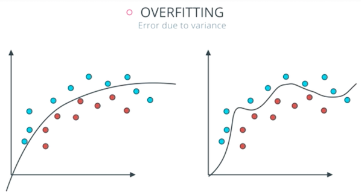
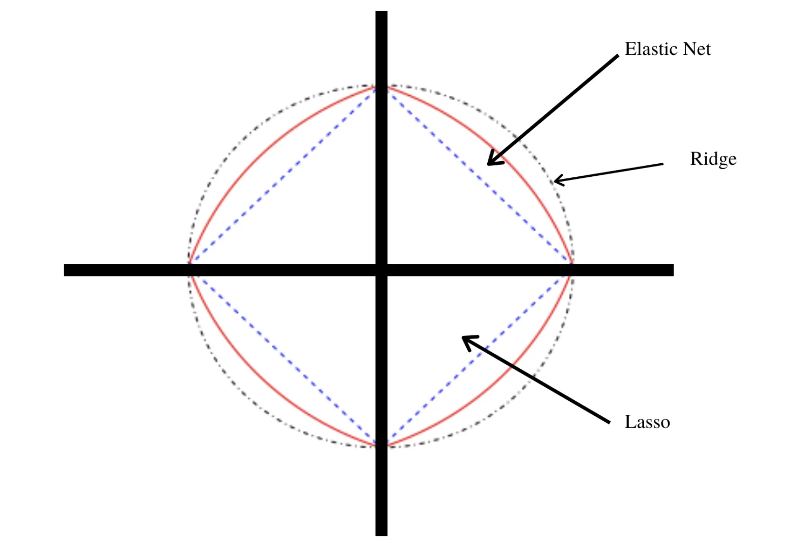

::: watermark

:::


# Regularización Elasticnet

En muchas técnicas de aprendizaje automático, **el aprendizaje consiste en encontrar los coeficientes que minimizan una función de costo**. Un modelo estándar de mínimos cuadrados tiende a tener alguna variación, es decir, este modelo no se generalizará bien para un conjunto de datos diferente a sus datos de entrenamiento.

La regularización consiste en **añadir una penalización a la función de costo. Esta penalización produce modelos más simples que generalizan mejor y evita el riesgo de sobreajuste**.

El procedimiento de ajuste implica una función de pérdida, conocida como suma de cuadrados residual o *RSS*. Los coeficientes $\beta$ se eligen de manera que minimicen esta función de pérdida.

$$RSS = \sum_{i=1}^n\left(y_i - \beta_0- \sum_{i=1}^p \beta_jx_{ij}\right)^2$$

Esto ajustará los coeficientes en función de sus datos de entrenamiento. Si hay ruido en los datos de entrenamiento, los coeficientes estimados no se generalizarán bien a los datos futuros. Aquí es donde entra la regularización y reduce o regulariza estas estimaciones aprendidas hacia cero.

En esta sección se verán las regularizaciones más usadas en machine learning: 

* Ridge (conocida también como L2) 
* Lasso (también conocida como L1)
* ElasticNet que combina tanto Lasso como Ridge.

Para cada una de estas regularizaciones ajustaremos un modelo  de regresión lineal al conjunto de datos de viviendas de *Ames* con ayuda del paquete de *tidymodels* llamado *parsnip*.

```{r, fig.align='center', out.height='250pt', out.width='500pt', echo=F, include=TRUE}

```


## Regularización Ridge


En este tipo de regularización *RSS* se modifica agregando una cantidad de **contracción a los coeficientes**, los cuales se estiman minimizando esta función. $\lambda$ es el parámetro de ajuste que decide cuánto queremos penalizar la flexibilidad de el modelo. 

$$\sum_{i=1}^n\left(y_i - \beta_0- \sum_{i=1}^p \beta_jx_{ij}\right)^2 + \lambda \sum_{j=1}^p \beta_j^2 = RSS + \lambda \sum_{j=1}^p \beta_j^2$$

El aumento de la flexibilidad de un modelo está representado por el aumento de sus coeficientes, si se desea minimizar la función anterior, los coeficientes  deben ser pequeños. 

Así es como la técnica de regresión de *Ridge* evita que los coeficientes aumenten demasiado. Además, reduce la asociación estimada de cada variable con la respuesta excepto la intersección $\beta_0$. Esta intersección es una medida del valor medio de la respuesta cuando $x_{i1} = x_{i2} =\dots= x_{ip} = 0$.

> Cuando $\lambda = 0$, el término de penalización no tiene efecto y las estimaciones  serán iguales a mínimos cuadrados. 

> A medida que $\lambda \rightarrow \infty$, el impacto de la penalización por contracción aumenta, y las estimaciones se acercarán a cero. 

La selección de un buen valor de $\lambda$ es fundamental. Las estimaciones de  coeficientes producidas por este método también se conocen como la **norma L2**.


**Nota:** Es necesario estandarizar los predictores o llevarlos a la misma escala antes de aplicar esta regularización. 


## Regularización Lasso

Lasso es otra variación, en la que se minimiza la función *RSS*. Utiliza $|\beta_j|$ en lugar de los cuadrados de $\beta$ como penalización. Las estimaciones de coeficientes producidas por este método también se conocen como la **norma L1**.

$$\sum_{i=1}^n\left(y_i - \beta_0- \sum_{i=1}^p \beta_jx_{ij}\right)^2 + \lambda \sum_{j=1}^p |\beta_j| = RSS + \lambda \sum_{j=1}^p |\beta_j|$$

> Cuando $\lambda = 0$, el término de penalización no tiene efecto y las estimaciones  serán iguales a mínimos cuadrados. 

> A medida que $\lambda \rightarrow \infty$, el impacto de la penalización por contracción aumenta, y las estimaciones se convierten en cero (eliminando variables). 

Este método de regularizacion permite eliminar coeficientes con alta variación, lo cual **ayuda a la selección de variables**.

## Comparación entre Ridge y Lasso

La regresión *Ridge* se puede considerar como la solución de una ecuación, donde la suma de los cuadrados de los coeficientes es menor o igual que $s$,  donde $s$ es una constante que existe para cada valor del factor de contracción $\lambda$

$$\beta_1^2 + \beta_2^2 \leq s$$

Esto implica que los coeficientes de la regresión *Ridge* tienen el *RSS* (función de pérdida) más pequeño para todos los puntos que se encuentran dentro del círculo dado por la función de restricción  $\beta_1^2 + \beta_2^2 \leq s$. 

Y en la regresión *Lasso* se puede considerar como una ecuación en la que la suma del módulo de coeficientes es menor o igual que $s$. 

$$|\beta_1| + |\beta_2| \leq s$$

Esto implica que los coeficientes de lasso tienen la *RSS* (función de pérdida) más pequeña para todos los puntos que se encuentran dentro del diamante dado por la función de restricción $|\beta_1| + |\beta_2| \leq s$

```{r, fig.align='center', out.height='300pt', out.width='600pt', echo=F, include=TRUE}
knitr::include_graphics("img/10-ml-elasticnet/ridge-lasso.png")
```

La imagen de arriba muestra las funciones de restricción (áreas verdes) para *Lasso* (izquierda) y *Ridge* (derecha), junto con contornos para *RSS* (elipse roja).

Para un valor muy grande de $s$, las regiones verdes contendrán el centro de la elipse, lo que hará que las estimaciones de los coeficientes de ambas técnicas de regresión sean iguales a las estimaciones de mínimos cuadrados. Pero este no es el caso en la imagen de arriba. 

En este caso, las estimaciones del coeficiente de regresión de *Lasso* y *Ridge* vienen dadas por el primer punto en el que una elipse contacta con la región de restricción. Dado que la regresión *Ridge* tiene una restricción circular sin puntos agudos, **esta intersección generalmente no ocurrirá en un eje, por lo que las estimaciones del coeficiente de regresión de _Ridge_ serán exclusivamente distintas de cero**.

Sin embargo, la restricción de *Lasso* **tiene esquinas en cada uno de los ejes**, por lo que la elipse a menudo intersectará la región de restricción en un eje. **Cuando esto ocurre, uno de los coeficientes será igual a cero**. En dimensiones más altas, muchas de las estimaciones de coeficientes pueden ser iguales a cero simultáneamente.

**Desventajas**

* Regresión *Ridge*: Reducirá los coeficientes de los predictores menos importantes, muy cerca de cero. Pero nunca los hará exactamente cero. En otras palabras, el modelo final incluirá todos los predictores. 

* Regresión *Lasso*: La penalización *L1* tiene el efecto de forzar algunas de las estimaciones de              coeficientes a ser exactamente iguales a cero cuando el parámetro de ajuste $\lambda$ es suficientemente grande. Por lo tanto, este método realiza una selección de variables.


## ElasticNet

*ElasticNet* surgió por primera vez como resultado de la crítica a *Lasso*, cuya selección de variables puede ser demasiado dependiente de los datos y, por lo tanto, inestable. La solución es **combinar las penalizaciones** de la regresión de *Ridge* y *Lasso* para obtener lo mejor de ambas regularizaciones.

*ElasticNet* tiene como objetivo minimizar la siguiente función de pérdida:

$$\frac{\sum_{i=1}^n\left(y_i - \beta_0- \sum_{i=1}^p \beta_jx_{ij}\right)^2}{2n} + 
\lambda\left( ({1-\alpha}) \sum_{j=1}^p|\beta_j| + \alpha \sum_{j=1}^p \beta_j ^2\right)$$

$$= \frac{RSS}{2n}+ \lambda\left( ({1-\alpha}) \sum_{j=1}^p|\beta_j| + \alpha \sum_{j=1}^p \beta_j ^2\right)$$

donde $\alpha \in [0,1]$ es el parámetro de mezcla entre la regularización *Ridge* $(\alpha = 0)$ y la regularización *Lasso* $(\alpha = 1)$. 

La combinación de ambas penalizaciones suele dar lugar a buenos resultados. Una estrategia frecuentemente utilizada es asignarle casi todo el peso a la penalización *L1* ( $\alpha \approx 1$) para conseguir seleccionar predictores y menos peso a la regularización $L2$ para dar cierta estabilidad en el caso de que algunos predictores estén correlacionados.

```{r, fig.align='center', out.height='400pt', out.width='550pt', echo=F, include=TRUE}

```


## Implementación en R

### Regresión

Utilizando el modelo `linear_reg()` del paquete *parsnip*. Hay varios mecanismos que pueden realizar la regularización/penalización, los paquetes *glmnet*, *sparklyr*, *keras* o *stan*.

Usemos el primero aquí. El paquete *glmnet* solo implementa un método que no es de fórmula, pero *parsnip* permitirá que se use cualquiera de ellos.

Cuando se utiliza la regularización, los predictores deben de centrarse y escalarse primero antes de pasar al modelo. El método de la fórmula no lo hará automáticamente, por lo que tendremos que hacerlo nosotros mismos como se hizo en la sección **4.6 Preparación de conjunto de datos** con la receta `receta_casas`. 

En *R* existen dos parámetros que nos permiten hacer la regularización:

* `penalty`: Es un número no negativo que representa la cantidad total de regularización (solo *glmnet*, *keras* y *spark*). 

* `mixture`: Es un número entre cero y uno (inclusivo) que es la proporción de regularización *L1* en el modelo. Cuando `mixture = 1`, es un modelo de *Lasso* puro, mientras que `mixture = 0` indica que se está utilizando un modelo *Ridge*.


**Paso 1: Separación inicial de datos ( test, train, KFCV )**
```{r, warning=FALSE, message=FALSE}
library(tidymodels)

data(ames)

set.seed(4595)
ames_split <- initial_split(ames, prop = 0.75)

ames_train <- training(ames_split)
ames_test  <- testing(ames_split)
ames_folds <- vfold_cv(ames_train)
```

Contando con datos de entrenamiento, procedemos a realizar el feature engineering para extraer las mejores características que permitirán realizar las estimaciones en el modelo.

**Paso 2: Pre-procesamiento e ingeniería de variables**

```{r, warning=FALSE,message=FALSE}

receta_casas <- recipe(
 Sale_Price ~ Gr_Liv_Area + TotRms_AbvGrd + Exter_Cond + Bsmt_Cond +
  Year_Sold + Year_Remod_Add, 
 data = ames_train) %>%
  step_mutate(
    Age_House = Year_Sold - Year_Remod_Add,
    Exter_Cond = forcats::fct_collapse(Exter_Cond, Good = c("Typical", "Good", "Excellent"))) %>% 
  step_relevel(Exter_Cond, ref_level = "Good") %>% 
  step_normalize(all_numeric_predictors()) %>%
  step_dummy(all_nominal_predictors()) %>% 
  step_interact(~ matches("Bsmt_Cond"):TotRms_AbvGrd) %>% 
  prep()

receta_casas
```

Recordemos que la función **recipe()** solo son los pasos a seguir, necesitamos usar la función **prep()** que nos devuelve una receta actualizada con las estimaciones y la función **juice()** que nos devuelve la matriz de diseño.

Una vez que la receta de transformación de datos está lista, procedemos a implementar el pipeline del modelo de interés.

**Paso 3: Selección de tipo de modelo con hiperparámetros iniciales**

```{r, warning=FALSE,message=FALSE, eval=TRUE}
# install.packages("glmnet")

elasticnet_regression_model <- linear_reg(
  mixture = tune(),
  penalty = tune()) %>% 
  set_mode("regression") %>% 
  set_engine("glmnet")
```

**Paso 4: Inicialización de workflow o pipeline**

```{r, warning=FALSE,message=FALSE, eval=TRUE}
elasticnet_workflow <- workflow() %>%
  add_model(elasticnet_regression_model) %>%
  add_recipe(receta_casas)
```

**Paso 5: Creación de grid search**

```{r, warning=FALSE,message=FALSE, eval=TRUE}

set.seed(195628)
elasticnet_param_grid <- grid_random(
  penalty(range = c(-15, 0), trans = log10_trans()),
  mixture(range = c(0,1)),
  size = 100
)

ctrl_grid <- control_grid(save_pred = T, verbose = T)
```

**Paso 6: Entrenamiento de modelos con hiperparámetros definidos**

```{r, warning=FALSE,message=FALSE, eval=FALSE}
library(doParallel)

UseCores <- detectCores() - 1
cluster <- makeCluster(UseCores)
registerDoParallel(cluster)

# Ajuste de parámetros
elt1 <- Sys.time()

elasticnet_tune_result <- tune_grid(
  elasticnet_workflow,
  resamples = ames_folds,
  grid = elasticnet_param_grid,
  metrics = metric_set(mae, mape, rmse, rsq),
  control = ctrl_grid
)
elt2 <- Sys.time(); elt2 - elt1

stopCluster(cluster)

elasticnet_tune_result %>% saveRDS("models/elasticnet_model_reg.rds")
```

```{r}
elasticnet_tune_result <- readRDS("models/elasticnet_model_reg.rds")
```

**Paso 7: Análisis de métricas de error e hiperparámetros (Vuelve al paso 3, si es necesario)**

Podemos obtener las métricas de cada *fold* con el siguiente código:

```{r}
collect_metrics(elasticnet_tune_result)
```

En la siguiente gráfica observamos las distintas métricas de error asociados a los hiperparámetros elegidos:

```{r}
elasticnet_tune_result %>% autoplot()
```

En la siguiente gráfica observamos el error cuadrático medio de las distintas métricas con distintos números de vecinos.

```{r}
elasticnet_tune_result %>% autoplot(metric = "rsq")
```


**Paso 8: Selección de modelo a usar**

Con el siguiente código obtenemos los mejores 10 modelos respecto al *rmse*.

```{r}
show_best(elasticnet_tune_result, n = 10, metric = "rmse")
```

Ahora obtendremos el modelo que mejor desempeño tiene tomando en cuenta el *rmse* y haremos las predicciones del conjunto de prueba con este modelo.

```{r}
best_elasticnet_regression_model <- select_best(elasticnet_tune_result, metric = "rmse")
best_elasticnet_regression_model
```

**Paso 9: Ajuste de modelo final con todos los datos (Vuelve al paso 2, si es necesario)**

```{r}
final_elasticnet_regression_model <- elasticnet_workflow %>%
  finalize_workflow(best_elasticnet_regression_model) %>%
  fit(data = ames_train)
```

Este último objeto es el modelo final entrenado, el cual contiene toda la información del pre-procesamiento de datos, por lo que en caso de ponerse en producción el modelo, sólo se necesita de este último elemento para poder realizar nuevas predicciones. 

Antes de pasar al siguiente paso, es importante validar que hayamos hecho un uso correcto de las variables predictivas. En este momento es posible detectar variables que no estén aportando valor o variables que no debiéramos estar usando debido a que cometeríamos [data leakage](https://towardsdatascience.com/data-leakage-in-machine-learning-6161c167e8ba). Para enfrentar esto, ayuda estimar y ordenar el valor de importancia de cada variable en el modelo.

```{r}

library(vip)

final_elasticnet_regression_model %>% 
 extract_fit_parsnip() %>% 
 vip(geom = "col") + 
 ggtitle("Importancia de las variables")

```


**Paso 10: Validar poder predictivo con datos de prueba**

Imaginemos por un momento que pasa un mes de tiempo desde que hicimos nuestro modelo, es hora de ponerlo a prueba prediciendo valores de nuevos elementos:

```{r}
results <- predict(final_elasticnet_regression_model, ames_test) %>%
  dplyr::bind_cols(Sale_Price = ames_test$Sale_Price) %>%
  dplyr::rename(pred_elasticnet_reg = .pred)

results
```

**Métricas de desempeño**

Ahora para calcular las métricas de desempeño usaremos la paquetería *MLmetrics*. Es posible definir nuestro propio conjunto de métricas que deseamos reportar creando el objeto *metric_set*:

```{r}
library(MLmetrics)

multi_metric <- metric_set(mae, mape, rmse, rsq, ccc)
multi_metric(results, truth = Sale_Price, estimate = pred_elasticnet_reg) %>% 
  mutate(.estimate = round(.estimate, 2)) %>% 
  select(-.estimator)
```

```{r}
results %>% 
  ggplot(aes(x = pred_elasticnet_reg, y = Sale_Price)) +
  geom_point() +
  geom_abline(color = "red") +
  xlab("Prediction") +
  ylab("Observation") +
  ggtitle("Comparisson")
```


