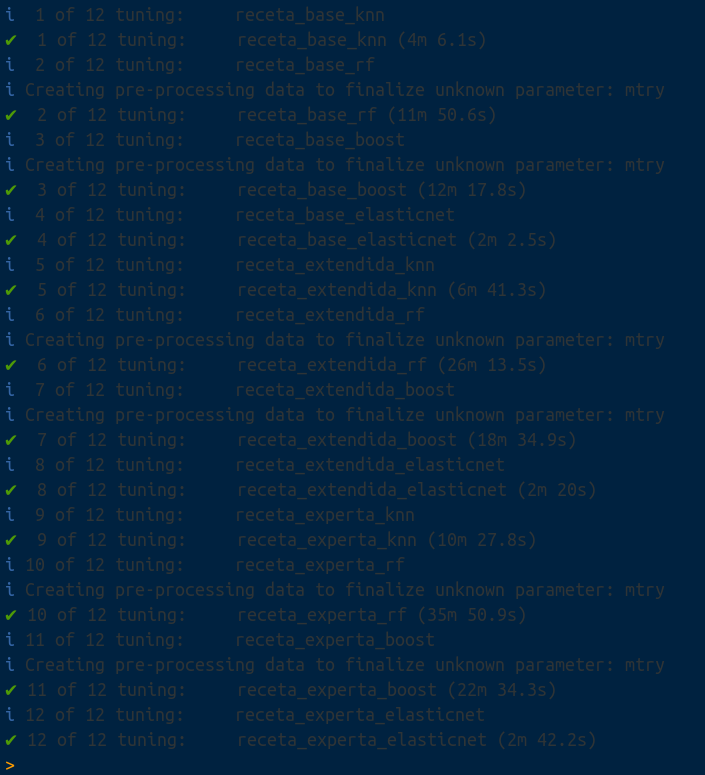

::: watermark

:::
# Workflowsets & Stacking

Es común no sepamos ni remotamente cuál es el mejor modelo que podríamos implementar al iniciar un proyecto con datos que nunca antes hemos visto. Es posible que un profesional de datos deba seleccionar muchas combinaciones de modelos y pre-procesadores. También es posible tener poco o ningún conocimiento a priori sobre qué método funcionará mejor con un nuevo conjunto de datos.

> Una buena estrategia es dedicar un esfuerzo inicial a probar una variedad de enfoques de modelado, determinar qué funciona mejor y luego invertir tiempo adicional ajustando / optimizando un pequeño conjunto de modelos.

## Múltiples recetas

Algunos modelos requieren predictores que se han centrado y escalado, por lo que algunos flujos de trabajo de modelos requerirán recetas con estos pasos de pre-procesamiento. Para otros modelos, crear interacciones cuadráticas y bi-direccionales. Para estos fines, creamos múltiples recetas:

```{r}
library(tidymodels)

data(ames)

set.seed(4595)
ames_split <- initial_split(ames, prop = 0.75)

ames_train <- training(ames_split)
ames_test  <- testing(ames_split)
ames_folds <- vfold_cv(ames_train)
```

* **Receta Original**

```{r}
receta_base <- recipe(
 Sale_Price ~ Gr_Liv_Area + TotRms_AbvGrd + Exter_Cond + Bsmt_Cond +
  Year_Sold + Year_Remod_Add, 
 data = ames_train) %>%
  step_mutate(
    Age_House = Year_Sold - Year_Remod_Add,
    Exter_Cond = forcats::fct_collapse(Exter_Cond, Good = c("Typical", "Good", "Excellent"))) %>% 
  step_relevel(Exter_Cond, ref_level = "Good") %>% 
  step_normalize(all_numeric_predictors()) %>%
  step_dummy(all_nominal_predictors()) %>% 
  step_interact(~ matches("Bsmt_Cond"):TotRms_AbvGrd)

receta_base_prep <- receta_base %>% prep()
```

* **Receta KNN:**

```{r}
receta_extendida <- recipe(
 Sale_Price ~ Gr_Liv_Area + TotRms_AbvGrd + Exter_Cond + Bsmt_Cond +
  Year_Sold + Year_Remod_Add + Year_Remod_Add + Bedroom_AbvGr +Total_Bsmt_SF +
  Pool_Area + Second_Flr_SF + First_Flr_SF, 
 data = ames_train) %>%
  step_ratio(Bedroom_AbvGr, denom = denom_vars(Gr_Liv_Area)) %>% 
  step_mutate(
    Age_House = Year_Sold - Year_Remod_Add,
    TotalSF   = Gr_Liv_Area + Total_Bsmt_SF,
    AvgRoomSF   = Gr_Liv_Area / TotRms_AbvGrd,
    Pool = ifelse(Pool_Area > 0, 1, 0),
    Exter_Cond = forcats::fct_collapse(Exter_Cond, Good = c("Typical", "Good", "Excellent"))) %>% 
  step_relevel(Exter_Cond, ref_level = "Good") %>% 
  step_normalize(all_numeric_predictors()) %>%
  step_dummy(all_nominal_predictors()) %>% 
  step_interact(~ Second_Flr_SF:First_Flr_SF) %>% 
  step_interact(~ matches("Bsmt_Cond"):TotRms_AbvGrd) 

receta_extendida_prep <- receta_extendida %>% prep()
```

* **Receta Experta:**

```{r}
receta_experta <- recipe(
 Sale_Price ~ Gr_Liv_Area + TotRms_AbvGrd + Exter_Cond + Bsmt_Cond + Condition_1 +
  Year_Sold + Year_Remod_Add + Year_Remod_Add + Bedroom_AbvGr +Total_Bsmt_SF +
  Pool_Area + Second_Flr_SF + First_Flr_SF + Full_Bath + Bsmt_Full_Bath + Neighborhood, 
 data = ames_train) %>%
  step_ratio(Bedroom_AbvGr, denom = denom_vars(Gr_Liv_Area)) %>% 
  step_ratio(Second_Flr_SF, denom = denom_vars(First_Flr_SF)) %>% 
  step_mutate(
    TotalBaths = Full_Bath + Bsmt_Full_Bath,
    Age_House = Year_Sold - Year_Remod_Add,
    Pool = ifelse(Pool_Area > 0,1,0),
    Exter_Cond = forcats::fct_collapse(Exter_Cond, Good = c("Typical", "Good", "Excellent")),
    Neighborhood = forcats::fct_collapse(Neighborhood, 
      NoRidge_GrnHill = c("Northridge", "Green_Hills"),
      ClearCr_Somerst = c("Clear_Creek", "Somerset"))) %>% 
  step_relevel(Condition_1, ref_level = "Norm") %>%
  step_normalize(all_numeric_predictors()) %>%
  step_dummy(all_nominal_predictors()) %>% 
  step_interact(~ Age_House:TotRms_AbvGrd) %>%
  step_interact(~ matches("Bsmt_Cond"):TotRms_AbvGrd) %>% 
  step_rm(
    First_Flr_SF, Second_Flr_SF, Year_Remod_Add, Bsmt_Full_Bath, 
    Total_Bsmt_SF, Pool_Area, Gr_Liv_Area
  )

receta_experta_prep <- receta_experta %>% prep()
```

## Múltiples modelos

Una vez que tenemos suficientes recetas, podemos experimentar con múltiples modelos para poner a prueba. Usaremos los modelos que hemos aprendido a implementar en todo el curso:

```{r}
pacman::p_load(
 rules,
 baguette,
 tune,
 stacks
 )

knn_model <- nearest_neighbor(
  mode = "regression",
  neighbors = tune("K"),
  dist_power = tune(),
  weight_func = tune()) %>%
  set_engine("kknn")

rforest_model <- rand_forest(
  mode = "regression",
  trees = 500,
  mtry = tune(),
  min_n = tune()) %>%
  set_engine(
    "ranger",
    importance = "impurity"
  )

xgboost_model <- boost_tree(
  mode = "regression",
  trees = 500,
  tree_depth = tune(),
  min_n = tune(),
  loss_reduction = tune(),
  sample_size = tune(),
  mtry = tune(),
  learn_rate = tune()) %>%
  set_engine(
    "xgboost",
    importance = "impurity"
  )

elasticnet_model <- linear_reg(
  mode = "regression",
  penalty = tune(),
  mixture = tune()) %>%
  set_engine("glmnet") 

```

**¿Cómo podemos hacer coincidir estos modelos con las recetas desarrolladas, ajustarlos y luego evaluar su rendimiento de manera eficiente? WORKFLOWSETS ofrece una solución.**


## Creación de workflowset

Los conjuntos de flujo de trabajo toman listas nombradas de pre-procesadores y especificaciones de modelos y las combinan en un objeto que contiene múltiples flujos de trabajo. 

Como primer ejemplo de conjunto de flujo de trabajo, combinemos las recetas creadas en la sección anterior.

```{r}
workflow_set_models <- workflow_set(
  preproc = list(
    receta_base = receta_base_prep, 
    receta_extendida = receta_extendida_prep,
    receta_experta = receta_experta_prep
    ),
  models = list(
    knn = knn_model,
    rf = rforest_model,
    boost = xgboost_model,
    elasticnet = elasticnet_model
    )
  )

```


## Ajuste y evaluación de modelos

Casi todos estos flujos de trabajo contienen parámetros de ajuste. Para evaluar su rendimiento, podemos utilizar las funciones estándar de ajuste o remuestreo (por ejemplo, `tune_grid()`).

La función `workflow_map()` aplicará la misma función a todos los flujos de trabajo del conjunto; el valor predeterminado es `tune_grid()`.

A continuación se declaran los parámetros para cada modelo y el grid:

```{r, warning=FALSE, message=FALSE}

elasticnet_params <- elasticnet_model %>%
  parameters() %>%
  update(
    penalty = penalty(
      range = c(-10, 1),
      trans = log10_trans()),
    mixture = dials::mixture(range = c(0, 1))
  )

knn_params <- knn_model %>%
  parameters() %>%
  update(
    K = dials::neighbors(c(5, 150)),
    dist_power = dist_power(range = c(1, 3)),
    weight_func = weight_func(values = c("rectangular", "inv", "gaussian", "cos"))
  )

rforest_params <- rforest_model %>%
  parameters() %>%
  update(
    mtry = finalize(mtry(range = c(15, 80))),
    min_n = min_n(range = c(3,15))
  )

xgboost_params <- xgboost_model %>%
  parameters() %>%
  update(
    min_n = min_n(range = c(5,15)),
    mtry = finalize(mtry(range = c(5, 80))),
    tree_depth = tree_depth(range = c(3, 50)),
    loss_reduction = loss_reduction(range = c(-10, 1.5), trans = log10_trans()),
    learn_rate = learn_rate(range = c(-6, -0.25), trans = log10_trans()),
    sample_size = sample_prop()
  )

# Declaración del grid
workflow_tunning_set_models <- workflow_set_models %>%
  option_add(param_info = knn_params, id = "knn") %>%
  option_add(param_info = rforest_params, id = "rf") %>%
  option_add(param_info = xgboost_params, id = "xgboost") %>% 
  option_add(param_info = elasticnet_params, id = "elasticnet")

workflow_tunning_set_models
```

Dado que el pre-procesador contiene más de una entrada, la función crea todas las combinaciones de pre-procesadores y modelos.

* **info:** Contiene un *tibble* con algunos identificadores y el objeto de flujo de trabajo. 

* **option:** Es un marcador de posición para cualquier argumento que se utilice cuando evaluamos el flujo de trabajo. 

* **result:** Es un marcador de posición para la salida de las funciones de ajuste o remuestreo.

Para este ejemplo, la búsqueda del *grid* se aplica al flujo de trabajo.

```{r, message=TRUE, eval=FALSE}
library(doParallel)

UseCores <- detectCores() - 1
cluster <- makeCluster(UseCores)
registerDoParallel(cluster)

grid_ctrl <- control_grid(
    save_pred = TRUE,
    save_workflow = TRUE,
    parallel_over = "everything"
)

set.seed(536)
tunning_models_result <- workflow_tunning_set_models %>%
  workflow_map(
    fn = "tune_grid",
    seed = 20221022,
    resamples = ames_folds,
    grid = 30,
    metrics =  metric_set(mae, mape, rmse, rsq),
    control = grid_ctrl,
    verbose = TRUE
  )

stopCluster(cluster)

tunning_models_result %>% saveRDS("models/ensemble_model.rds")

```

```{r, fig.align='center', out.height='400pt', out.width='550pt', echo=F, include=TRUE}

```

```{r}
tunning_models_result <- readRDS("models/ensemble_model.rds")

tunning_models_result %>%
  rank_results(select_best = T) %>%
  select(-c(.config, n, preprocessor, std_err)) %>%
  pivot_wider(names_from = .metric, values_from = mean) 
```


```{r}
autoplot(
  tunning_models_result,
  rank_metric = "rsq",
  metric = "rsq",   
  select_best = F) +   
  lims(y = c(0, 1)) +
  ggtitle("Model Comparisson")
```

```{r}
autoplot(
  tunning_models_result,
  rank_metric = "rsq",
  metric = "rsq",   
  select_best = T) +
  geom_text(aes(y = mean - 0.10 , label = wflow_id), angle = 90, hjust = 1) +
  lims(y = c(0, 1)) +
  ggtitle("Model Comparisson")
```


## Extracción de modelos

Una vez que hemos realizado una exploración sobre el desempeño de todas las combinaciones de pre-procesamientos con modelos, es posible tomar varios caminos hacia adelante. Algunas de las opciones más comunes son:

* Realizar múltiples iteraciones de modificaciones a las recetas para extraer lo mejor de cada una.

* Realizar mejoras a los hiperparámetros.

* Eliminar modelos y/o recetas que no tuvieron buen desempeño.

* Crear un modelo a partir de la combinación de los modelos más competentes.

Para empezar, se realiza una exploración del resultado del desempeño de los mejores modelos y los hiperparámetros usado en cada caso.

**Resultados de XGBoost**
```{r}
tunning_models_result %>% 
  extract_workflow_set_result("receta_experta_boost") %>%
  autoplot(metric = "rsq")

tunning_models_result %>% 
  extract_workflow_set_result("receta_experta_boost") %>%
  show_best(n = 10, metric = "rsq") %>% 
  select(-c(.estimator, .metric, .config, n))
```

**Resultados de Random Forest**
```{r}
tunning_models_result %>% 
  extract_workflow_set_result("receta_extendida_rf") %>%
  autoplot(metric = "rmse")

tunning_models_result %>% 
  extract_workflow_set_result("receta_extendida_rf") %>%
  show_best(n = 10, metric = "rmse") %>% 
  select(-c(.estimator, .metric, .config, n))

```

### Selección de modelo

Habiendo determinado los hiperparámetros adecuados para la configuración del modelo, procedemos a seleccionar la configuración adecuada para nosotros. Estos pasos son los mismos que corresponden a la selección del modelo con un único workflow.

**Mejor modelo XGBoost**
```{r}
best_xgb_model <- tunning_models_result %>%
 extract_workflow_set_result("receta_experta_boost") %>%
 select_best(metric = "rsq", "rsq")

best_xgb_model %>% 
  mutate_all(as.character) %>% 
  pivot_longer(everything(), names_to = "metric", values_to = "value")
```

**Mejor modelo XGBoost a menos de una desviación estándar**
```{r}
best_regularized_xgb_model_1se <- tunning_models_result %>%
  extract_workflow_set_result("receta_experta_boost") %>%
  select_by_one_std_err(metric = "rsq", "rsq")

best_regularized_xgb_model_1se %>% 
  mutate_all(as.character) %>% 
  pivot_longer(everything(), names_to = "metric", values_to = "value")
```


**Ajuste del modelo seleccionado**
```{r}
final_regularized_xgb_model <- tunning_models_result %>%
  extract_workflow("receta_experta_boost") %>%
  finalize_workflow(best_regularized_xgb_model_1se) %>%
  parsnip::fit(data = ames_train)

final_regularized_xgb_model
```

Como hemos hablado anteriormente, este último objeto es el modelo final entrenado, el cual contiene toda la información del pre-procesamiento de datos, por lo que en caso de ponerse en producción el modelo, sólo se necesita de este último elemento para poder realizar nuevas predicciones.

Es importante validar que hayamos hecho un uso correcto de las variables predictivas. En este momento es posible detectar variables que no estén aportando valor o variables que no debiéramos estar usando debido a que cometeríamos data leakage. Para enfrentar esto, ayuda estimar y ordenar el valor de importancia del modelo

```{r}
library(vip)

final_regularized_xgb_model %>%
  extract_fit_parsnip() %>%
  vip::vip(num_features = 20) + 
  ggtitle("Importancia de las variables")
```

Por último... Imaginemos por un momento que pasa un mes de tiempo desde que hicimos nuestro modelo, es hora de ponerlo a prueba prediciendo valores de nuevos elementos:

```{r}
results <- predict(final_regularized_xgb_model, ames_test) %>% 
  dplyr::bind_cols(truth = ames_test$Sale_Price) %>% 
  dplyr::rename(pred_xgb_reg = .pred, Sale_Price = truth)

results
```

```{r}
multi_metric <- metric_set(rmse, mae, mape, rsq, ccc)
multi_metric(results, truth = Sale_Price, estimate = pred_xgb_reg) %>% 
  mutate(.estimate = round(.estimate, 2))
```

```{r}
results %>% 
  ggplot(aes(x = pred_xgb_reg, y = Sale_Price)) +
  geom_point() +
  geom_abline(color = "red") +
  xlab("Prediction") +
  ylab("Observation") +
  ggtitle("Comparisson")
```


## Stacking 

**El ensamblaje de modelos es un proceso en el que se utilizan varios modelos base para predecir un resultado.**

* La motivación para usar modelos de conjunto es reducir el error de generalización de la predicción. 

* Siempre que los modelos base sean diversos e independientes, el error de predicción disminuye cuando se utiliza el enfoque de conjunto.

* Aunque el modelo de conjunto tiene varios modelos base dentro del modelo, actúa y funciona como un solo modelo. 


```{r echo=FALSE,fig.align='center', out.height='250pt', out.width='600pt'}
knitr::include_graphics("img/11-stacking/model_ensamble.png")
```

Un conjunto de modelos, donde las predicciones de varios modelos individuales se agregan para hacer una predicción, puede producir un modelo final de alto rendimiento. 

Los métodos más populares para crear modelos de conjuntos son:

* *Bagging*
* *Bosques aleatorios* 
* *Boosting*

Cada uno de estos métodos combina las predicciones de múltiples versiones del mismo tipo de modelo. Uno de los primeros métodos para crear conjuntos es el apilamiento de modelos (*stacking*).

***Stacking* combina las predicciones de múltiples modelos de cualquier tipo.**

Por ejemplo, una regresión logística, un árbol de clasificación y una máquina de vectores de soporte se pueden incluir en un conjunto de apilamiento, así como diferentes configuraciones de un mismo modelo.

El proceso de construcción de un conjunto apilado es:

1. Reunir el conjunto de entrenamiento de predicciones (producidas mediante remuestreo).

2. Crear un modelo para combinar estas predicciones.

3. Para cada modelo del conjunto, ajustar el modelo en el conjunto de entrenamiento original.


### Elección de modelos

Para cada observación en el conjunto de entrenamiento, el apilamiento (*stacking*) requiere una predicción fuera de la muestra de algún tipo. 

Para comenzar a ensamblar con el paquete *stacks*, se crea una pila de datos vacía usando la función `stacks()` y luego se agrega el flujo de trabajo para ajustar una amplia variedad de modelos a estos datos. 

```{r, warning=FALSE, message=FALSE}
library(tidymodels)
library(stacks)
tidymodels_prefer()
```

```{r, warning=FALSE, message=FALSE, eval=FALSE}
concrete_stack <- stacks() %>% 
  add_candidates(tunning_models_result)

concrete_stack
concrete_stack %>% saveRDS("models/concrete_stack.rds")
```

```{r}
concrete_stack <- readRDS("models/concrete_stack.rds")
```

La regularización mediante la penalización de lazo tiene varias ventajas:

* El uso de la penalización de lazo puede eliminar modelos (y, a veces, tipos de modelos completos) del conjunto.

* La correlación entre los candidatos del conjunto tiende a ser muy alta y la regularización ayuda a mitigar este problema.

Dado que nuestro resultado es numérico, se utiliza la regresión lineal para el meta-modelo. 

```{r, eval=FALSE}
library(doParallel)

UseCores <- detectCores() - 1
cluster <- makeCluster(UseCores)
registerDoParallel(cluster)

set.seed(20220612)
assembly <- concrete_stack %>% 
  blend_predictions(metric = metric_set(rmse, mae, mape, rsq))

stopCluster(cluster)

assembly %>% saveRDS("models/stack_predictions.rds")
```

```{r}
assembly <- readRDS("models/stack_predictions.rds")
```

```{r}
assembly
```

```{r}
autoplot(assembly, "weights") + theme_minimal()
```

Esto evalúa el modelo de meta aprendizaje sobre un grid predefinido de valores de penalización de lazo y utiliza un método de remuestreo interno para determinar el mejor valor. 

El método `autoplot()` nos ayuda a comprender si el método de penalización predeterminado fue suficiente:

```{r}
autoplot(assembly)
```

El panel de en medio muestra el número promedio de modelos del conjunto retenidos por el modelo de meta aprendizaje. 

Es posible que el rango predeterminado no nos haya servido bien aquí. Para evaluar el modelo de meta aprendizaje con penalizaciones mayores.

```{r, eval=FALSE, warning=FALSE, message=FALSE}
UseCores <- detectCores() - 1
cluster <- makeCluster(UseCores)
registerDoParallel(cluster)

set.seed(20220612)
assembly_v2 <- concrete_stack %>% 
  blend_predictions(
    metric = metric_set(rmse, mae, mape, rsq),
    penalty = 10^seq(-8, 4, length = 50)
  )

stopCluster(cluster)

assembly_v2 %>% saveRDS("models/stack_predictions_v2.rds")
```

```{r}
assembly_v2 <- readRDS("models/stack_predictions_v2.rds")

autoplot(assembly_v2)
```

El valor de penalización asociado a las curvas fue de 1456.34. La impresión del objeto muestra los detalles del modelo de meta aprendizaje:

```{r}
assembly_v2
```

El modelo de meta aprendizaje contenía cuatro coeficientes de combinación. El método `autoplot()` se puede usar nuevamente para mostrar las contribuciones de cada tipo de modelo:

```{r}
autoplot(assembly_v2, "weights") + theme_minimal()
```

El modelo de bosques aleatorios tiene la mayor contribución al conjunto. Para este conjunto, el resultado se predice con la ecuación:

```{r, echo=FALSE, eval=FALSE}
assembly_v2$equations$numeric$.pred
```


\begin{aligned}
\text{Predicción ensamblada} = &- 7172.1435 \\
&+ 0.0107 * \text{receta_base_boost_1_24} \\
&+ 0.0051 * \text{receta_extendida_boost_1_08} \\
&+ 0.1568 * \text{receta_extendida_boost_1_24} \\
&+ 0.0653 * \text{receta_extendida_boost_1_01} \\
&+ 0.1788 * \text{receta_extendida_boost_1_05} \\
&+ 0.0010 * \text{receta_experta_knn_1_14} \\
&+ 0.0301 * \text{receta_experta_knn_1_27} \\
&+ 0.0870 * \text{receta_experta_knn_1_15} \\
&+ 0.0034 * \text{receta_experta_knn_1_24} \\
&+ 0.0224 * \text{receta_experta_boost_1_04} \\
&+ 0.3143 * \text{receta_experta_boost_1_12} \\
&+ 0.1463 * \text{receta_experta_boost_1_24} \\
&+ 0.0279 * \text{receta_experta_boost_1_01} \\
&+ 0.0003 * \text{receta_experta_elasticnet_1_06} \\
&+ 3.74e-05 * \text{receta_experta_elasticnet_1_27} \\
&+ 4.06e-05 * \text{receta_experta_elasticnet_1_03} \\
&+ 0.0001 * \text{receta_experta_elasticnet_1_02} \\
&+ 0.0014 * \text{receta_experta_elasticnet_1_01}


\end{aligned}


Ahora sabemos cómo se pueden combinar sus predicciones en una predicción final para el conjunto. Sin embargo, estos ajustes de modelos individuales aún no se han creado. 

### Ajuste final

Para poder usar el modelo de *stacking*, se requieren los ajustes de todos los modelos candidatos. Estos utilizan todo el conjunto de entrenamiento con los predictores originales.

```{r}
library(tidyverse)
library(tidymodels)
library(stacks)

tidymodels_prefer()
```


```{r, eval=FALSE}
UseCores <- 1
cluster <- makeCluster(UseCores)
registerDoParallel(cluster)

fit_assembly <- fit_members(assembly_v2)

stopCluster(cluster)

fit_assembly %>%  saveRDS("models/stack_fit_members.rds")

```

```{r}
fit_assembly <- readRDS("models/stack_fit_members.rds")
```

```{r}
fit_assembly
```

Esto actualiza el objeto de apilamiento con los objetos de flujo de trabajo ajustados para cada miembro. En este punto, el modelo de *stacking* se puede utilizar para la predicción.

```{r}
regression_metrics <- metric_set(rmse, mae, mape, rsq, ccc)

fit_assembly_pred_test <- predict(fit_assembly, ames_test) %>% 
  bind_cols(ames_test)

stacking_metrics <- fit_assembly_pred_test %>% 
 regression_metrics(Sale_Price, .pred) %>% 
 select(-.estimator) %>% 
 rename(stacking = .estimate)

stacking_metrics
```

### Comparación de métricas

Para ver la efectividad del ensamblaje, realizamos una comparación con el mejor modelo entrenado anteriormente (XGBoost). Es importante que la comparación se realice utilizando los mismos datos de prueba.

```{r}
results %>% 
 regression_metrics(truth = Sale_Price, estimate = pred_xgb_reg) %>% 
 select(-.estimator) %>% 
 rename(xgboost = .estimate) %>% 
 left_join(stacking_metrics, by = ".metric") %>% 
 map_if(is.numeric, round, 3) %>% 
 as_tibble()

```

Este capítulo demuestra cómo combinar diferentes modelos en un conjunto para un mejor desempeño predictivo. El proceso de creación del conjunto puede eliminar automáticamente los modelos candidatos para encontrar un pequeño subconjunto que mejore el rendimiento. 

```{r echo=FALSE, fig.align='center', out.height='250pt', out.width='500pt'}

```
