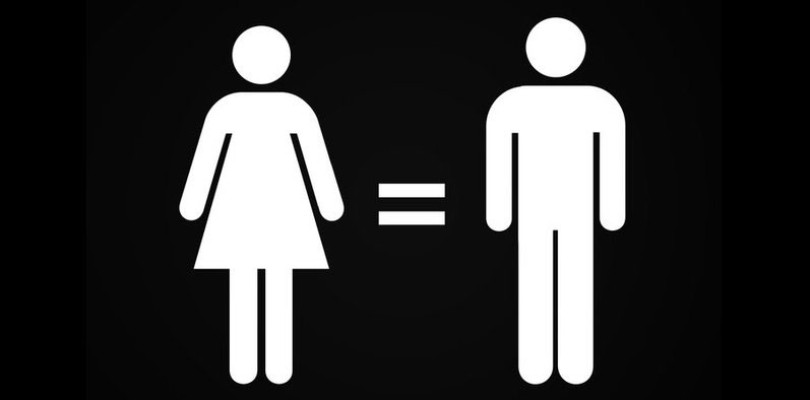
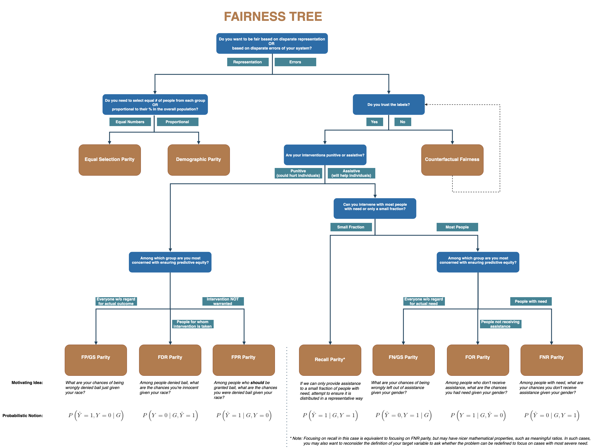
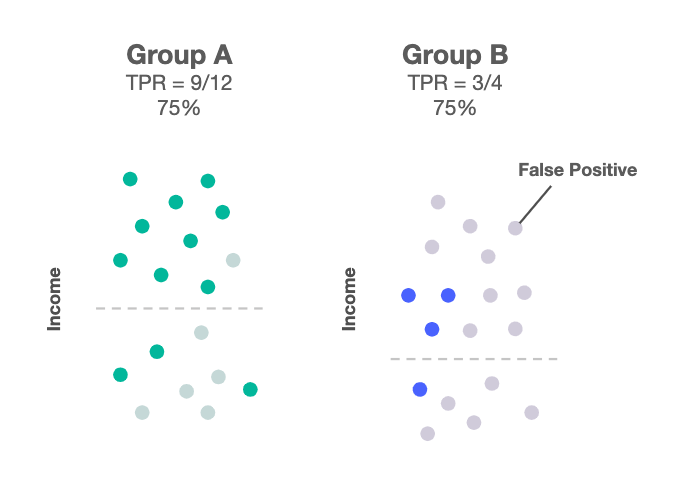

::: watermark

:::

# Sesgo e Inequidad

Machine Learning por naturaleza es discriminante, pues justo lo que hacemos es discriminar datos a través del uso de la estadística. Sin embargo, **esta discriminación puede ser un problema cuando brinda ventajas sistemáticas a grupos privilegiados y desventajas sistemáticas a grupos no privilegiados**. Por ejemplo: Privilegiar la atención médica a pacientes blancos sobre pacientes afroamericanos. 

Un sesgo en el conjunto de entrenamiento ya sea por prejuicio o por un sobre/sub muestreo lleva a tener modelos sesgados.

```{r echo=FALSE,fig.align='center', out.height='250pt', out.width='400pt'}

```

Un mal entendido común al hacer modelos de machine learning consiste en evitar utilizar características que pueden generar una inequidad por ejemplo: sexo, edad, etnia, etc. Sin embargo, no ocuparlos nos lleva a tener puntos ciegos en nuestros modelos para cuantificar si efectivamente tenemos un sesgo o inequidad en algunos grupos.

**Deberemos de ocupar estas características en los modelos, justo porque queremos evitar estos sesgos**. Para ello, identificaremos y cuantificaremos estos sesgos e inequidades en diferentes grupos para después mitigarlos y cuantificar la consecuencia en nuestras métricas de desempeño off line.


## Propósito Vs Error

El [siguiente árbol](https://drive.google.com/file/d/1g2e9BVEm8-OqzQ0wbAte3IF-A_Yj1D6c/view?usp=sharing) de decisión está desarrollado pensando desde el punto de vista del tomador de decisiones -operativas- al que ayudamos desarrollando un modelo de machine learning para identificar en qué métricas deberíamos de concentrarnos para cuantificar el sesgo y la inequidad (bias y fairness).

```{r echo=FALSE,fig.align='center', out.height='600pt', out.width='600pt'}

```

**Métricas**

* **FP/GS:** False Positive over Group Size. Es el riesgo de ser incorrectamente clasificado como positivo, dado el grupo de pertenencia

* **FDR:** False Discovery Rate. Es similar al error tipo 1 en pruebas de hipótesis estadísticas.

* **FPR:** False Positive Rate. 

* **Recall:** Cobertura del modelo respecto al total de positivos.

* **FN/GS:** False Negative over Group Size. Es el riesgo de ser incorrectamente clasificado como negativo, dado el grupo de pertenencia

* **FOR:** False Omission Rate. Similar al error tipo 2 en pruebas de hipótesis estadísticas.

* **FNR:** False Negative Rate

**Tipo de modelo | Aplicación**

* **Modelo Punitivo:** Corresponde a modelos en donde al menos una de las acciones asociadas a nuestro modelo de predicción está relacionada con un "castigo". Por ejemplo: Algoritmos donde se predice la probabilidad de reincidencia en algún delito y que es tomada como variable para     decidir si dan libertad provisional o no.

* **Modelo Asistivo:** Corresponde a modelos en donde la acción asociada al modelo son del estilo de preventivo. Por ejemplo: Priorización de inspecciones a realizar: médicas, a hogares, a estaciones de generación de energía, etc.

**RECORDATORIO**

|     | PREDICTED |REAL|
|-----|-----------|----|
| TP  |1          |1   |
| FP  |1          |0   |
| TN  |0          |0   |
| FN  |0          |1   |


$$(1-\tau) \leq \text{Medida de disparidad}_\text{grupo i} \leq \frac{1}{(1 - \tau)}, $$

donde $\tau$ es el fairness threshold definido por nosotros. En los siguientes
ejemplos utilizaremos $\tau=20%$ por lo que cualquier métrica de paridad que se encuentre entre $0.8$ y $1.25$ va a ser tratado como justo (sin sesgo).


## Métricas

El paquete *fairness* implementa $11$ métricas de equidad. Muchos de estos son mutuamente excluyentes: los resultados para un problema de clasificación, a menudo no pueden ser justos en términos de todas las métricas. Dependiendo del contexto, es importante seleccionar una métrica adecuada para evaluar la equidad.

A continuación, se describen las funciones utilizadas para calcular las métricas implementadas. Cada función tiene un conjunto similar de argumentos:

* `data`: `data.frame` que contiene los datos de entrada y las predicciones del modelo

* `grupo`: nombre de la columna que indica el grupo base (variable de factor)

* `base`: nivel base del grupo base para el cálculo de métricas de equidad

* `resultado`: nombre de la columna que indica la variable de resultado binaria

* `result_base`: nivel base de la variable de resultado (es decir, clase negativa) para el cálculo de métricas de equidad

También necesitamos proporcionar predicciones de modelos, estas predicciones se pueden agregar al `data.frame` original o se pueden proporcionar como un vector. Cuando se trabaja con predicciones probabilísticas, algunas métricas requieren un valor de corte para convertir probabilidades en predicciones de clase proporcionadas como límite.


### Equal Parity or Demographic or Statistical Parity 

Cuando nos interesa que cada grupo de la variable "protegida" tenga la misma proporción de etiquetas positivas predichas (TP). Por ejemplo: En un modelo que predice si darte o no un crédito, nos gustaría que sin importar el género de la persona tuvieran la misma oportunidad.

La paridad demográfica se calcula en base a la comparación del número absoluto de todos los individuos clasificados positivamente en todos los subgrupos de datos. En el resultado del vector con nombres, al grupo de referencia se le asignará 1, mientras que a todos los demás grupos se les asignarán valores según si su proporción de observaciones pronosticadas positivamente es menor o mayor en comparación con el grupo de referencia. Las proporciones más bajas se reflejarán en números inferiores a 1 en el vector con resultado de nombre.

Fórmula: $TP + FP$

Se utiliza esta métrica cuando:

> a) Queremos cambiar el estado actual para "mejorarlo". Por ejemplo: Ver más personas de grupos desfavorecidos con mayor oportunidad de tener un préstamo.

> b) Conocemos que ha habido una ventaja histórica que afecta los datos con los que construiremos el modelo.

Al querer eliminar las desventajas podríamos poner en más desventaja al grupo que históricamente ha tenido desventaja, ya que no está preparado (literalmente) para recibir esa ventaja. Por ejemplo, si damos créditos a grupos a los que antes de hacer fairness no lo hacíamos, sin ninguna educación financiera o apoyo de educación financiera de nuestra parte, muy probablemente esas personas caerán en default aumentando el sesgo que ya teníamos inicialmente.

```{r, warning=FALSE, message=FALSE}
pacman::p_load(
 tidymodels,
 fairness,
 magrittr
)

data(compas)

compas %<>% 
 mutate(Two_yr_Recidivism_01 = if_else(Two_yr_Recidivism == 'yes', 1, 0))

glimpse(compas)
```


```{r, warning=FALSE}
dem_parity(
 data = compas, 
 outcome = 'Two_yr_Recidivism_01', 
 group = 'ethnicity',
 probs = 'probability', 
 cutoff = 0.4, 
 base = 'Caucasian'
 )
```

### Proportional Parity o Impact Parity o Minimizing Disparate Impact 

Cuando nos interesa que cada grupo de la variable "protegida" tenga el mismo impacto. La paridad proporcional se logra si la proporción de predicciones positivas en los subgrupos es cercana entre sí. Similar a la paridad demográfica, esta medida tampoco depende de las etiquetas verdaderas.

Fórmula: $\frac{TP + FP}{TP + FP + TN + FN}$

```{r, warning=FALSE}
prop_parity(
 data = compas, 
 outcome = 'Two_yr_Recidivism_01', 
 group = 'ethnicity',
 probs = 'probability', 
 cutoff = 0.4, 
 base = 'Caucasian'
 )
```


### Equalized odds 

Las probabilidades igualadas se logran si las sensibilidades en los subgrupos están cerca unas de otras. Las sensibilidades específicas del grupo indican el número de verdaderos positivos dividido por el número total de positivos en ese grupo.

Fórmula: $\frac{TP}{TP + FN}$

```{r, warning=FALSE}
equal_odds(
 data = compas, 
 outcome = 'Two_yr_Recidivism_01', 
 group = 'ethnicity',
 probs = 'probability', 
 cutoff = 0.4, 
 base = 'Caucasian'
 )
```


### Predictive rate parity

La paridad de tasa predictiva se logra si las precisiones (o valores predictivos positivos) en los subgrupos están cerca unas de otras. La precisión representa el número de verdaderos positivos dividido por el número total de ejemplos predichos positivos dentro de un grupo.

Fórmula: $\frac{TP}{TP + FP}$

```{r, warning=FALSE}
pred_rate_parity(
 data = compas, 
 outcome = 'Two_yr_Recidivism_01', 
 group = 'ethnicity',
 probs = 'probability', 
 cutoff = 0.4, 
 base = 'Caucasian'
 )
```


### Accuracy parity

La paridad de precisión se logra si las precisiones (todos los ejemplos clasificados con precisión divididos por el número total de ejemplos) en los subgrupos están cerca entre sí.

Fórmula: $\frac{TP + TN}{TP + FP + TN + FN}$

```{r, warning=FALSE}
acc_parity( 
 data = compas, 
 outcome = 'Two_yr_Recidivism_01', 
 group = 'ethnicity',
 probs = 'probability', 
 cutoff = 0.4, 
 base = 'Caucasian'
 )
```


### False Negative Parity o Equal Oppportunity

La paridad de tasas de falsos negativos se logra si las tasas de falsos negativos (la relación entre el número de falsos negativos y el número total de positivos) en los subgrupos están cerca entre sí.

Fórmula:  $\frac{FN}{TP + FN}$

```{r echo=FALSE,fig.align='center', out.height='300pt', out.width='300pt'}

```

Se utiliza esta métrica cuando:

> a) El modelo necesita ser muy bueno en detectar la etiqueta positiva.

> b) No hay -mucho- costo en introducir falsos negativos al sistema -tanto al usuario como a la empresa-. Por ejemplo: Generar FPs en tarjeta de crédito.

> c) La definición de la variable target no es subjetiva. Por ejemplo: Fraude o No Fraude no es algo subjetivo, buen empleado o no, puede ser muy subjetivo.

Para poder cumplir con tener el mismo porcentaje de TPR en todos los grupos de la variable protegida, incurriremos en agregar más falsos positivos, lo que puede afectar más a ese grupo a largo plazo.


```{r, warning=FALSE}
fnr_parity( 
 data = compas, 
 outcome = 'Two_yr_Recidivism_01', 
 group = 'ethnicity',
 probs = 'probability', 
 cutoff = 0.4, 
 base = 'Caucasian'
 )
```


### False Positive Parity

Cuando queremos que todos los grupos de la variable protegida tengan la misma tasa de falsos positivos. Es decir, nos equivocamos en las mismas proporciones para etiquetas positivas que eran negativas.

Fórmula: $\frac{FP}{TN + FP}$

```{r, warning=FALSE}
fpr_parity( 
 data = compas, 
 outcome = 'Two_yr_Recidivism_01', 
 group = 'ethnicity',
 probs = 'probability', 
 cutoff = 0.4, 
 base = 'Caucasian'
 )
```


### Negative predictive value parity

La paridad de valor predictivo negativo se logra si los valores predictivos negativos en los subgrupos están cerca unos de otros. El valor predictivo negativo se calcula como una relación entre el número de negativos verdaderos y el número total de negativos previstos. Esta función puede considerarse la "inversa" de la paridad de tasa predictiva (predictive rate parity).

Fórmula: $\frac{TN}{TN + FN}$

```{r, warning=FALSE}
npv_parity( 
 data = compas, 
 outcome = 'Two_yr_Recidivism_01', 
 group = 'ethnicity',
 probs = 'probability', 
 cutoff = 0.4, 
 base = 'Caucasian'
 )
```


### Specificity parity

La paridad de especificidad se logra si las especificidades (la relación entre el número de verdaderos negativos y el número total de negativos) en los subgrupos están próximas entre sí. Esta función puede considerarse la "inversa" de las probabilidades igualadas (equalized odds).

Fórmula: $\frac{TN}{TN + FP}$

```{r, warning=FALSE}
spec_parity(
 data = compas, 
 outcome = 'Two_yr_Recidivism_01', 
 group = 'ethnicity',
 probs = 'probability', 
 cutoff = 0.4, 
 base = 'Caucasian'
 )
```


