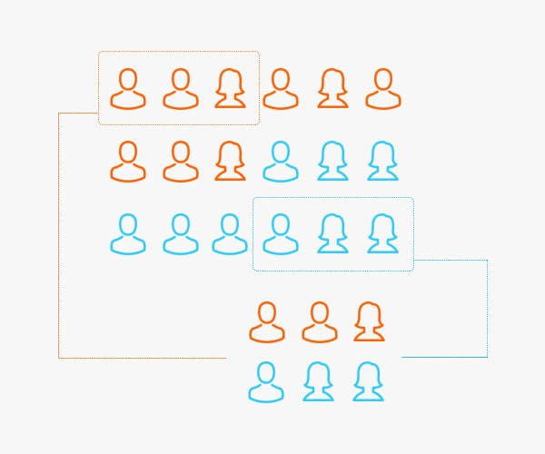

<div class="watermark"></div>

# A / B - testing

Los modelos de machine learning en la gran mayoría de las ocasiones tienen un propósito comercial. Como científicos de datos, es nuestra responsabilidad ayudar al negocio a tomar mejores decisiones que beneficien a la empresa en donde se ha desarrollado el modelo predictivo. Particularmente, una de las aplicaciones de mayor impacto en los últimos años es la **reducción del CHURN**

El churn rate o tasa de cancelación, es el **porcentaje de clientes o suscriptores que dejan de utilizar los servicios que ofrece una empresa.**

```{r echo=FALSE,fig.align='center', out.height='250', out.width='600pt'}
knitr::include_graphics("img/14-ab-testing/churn.png")
```

Es bastante conocido en el mundo del marketing que es mucho más caro adquirir nuevos clientes que retener a aquellos con los que ya cuenta la empresa. Es por esta razón que adicional a los esfuerzos de captar nuevos clientes se realizan esfuerzos por retener a los clientes con alta probabilidad de abandonar la empresa.

A partir de los modelos de machine learning que han sido estudiados en el curso para detectar la posible inclusión a una categoría (cancelación de clientes) es que se realizará en este capítulo el estudio de técnicas para cuantificar el impacto de los modelos predictivos y de las estrategias de retención.

Existen múltiples estrategias que surgen en las áreas de marketing para retener a los clientes. Hay una inversión muy grande de dinero que busca encontrar las mejores ideas que contribuyan a la retención. Sin embargo, **poner todas estas ideas y estrategias a trabajar puede ser bastante costoso y riesgoso.** 

* ¿Qué pasa si la empresa gasta grandes cantidades de dinero en campañas publicitarias y estas no ayudan a alcanzar la meta?

* ¿Qué sucede si se le invierte mucho tiempo en refinar la estrategia y esta nunca atrae a los clientes esperados?

Este capítulo está destinado a discutir métodos de evaluación de esas ideas, de modo que antes de comprometernos completamente con una campaña e implementarla con todos los clientes, podamos hacer pequeñas pruebas con significancia estadística para determinar cuál de ellas tiene el mejor impacto sobre los objetivos planteados.


## Elementos en riesgo

El primer paso es detectar a los posibles canceladores de servicios para la empresa. Esta tarea ha sido ampliamente estudiada en el curso mediante múltiples modelos predictivos, entre los que se encuentran:

* Regresión bernoulli (logística)
* Regresión Ridge
* Regresión Lasso
* KNN
* Árbol de decisión
* Bagging
* Bosque aleatorio
* Boosting
* Stacking

Recordemos que anteriormente ya se ha realizado la partición de los datos y se cuenta con varias configuraciones de cada modelo.

```{r, warning=FALSE, message=FALSE}

library(tidyverse)
library(tidymodels)
library(readr)
library(patchwork)

telco <- read_csv("data/Churn.csv")

set.seed(1234)
telco_split <- initial_split(telco, prop = .70)
telco_train  <- training(telco_split)
telco_test  <- testing(telco_split)

knn_tune_class_result <- readRDS("models/knn_model_cla.rds")
```


```{r, warning=FALSE, message=FALSE, echo=FALSE}

telco_rec <- recipe(
  Churn ~ customerID + TotalCharges + MonthlyCharges + SeniorCitizen + Contract, 
  data = telco_train) %>% 
  update_role(customerID, new_role = "id variable") %>% 
  step_mutate(Contract = as.factor(Contract)) %>% 
  step_impute_median(all_numeric_predictors()) %>% 
  step_normalize(all_numeric_predictors()) %>% 
  step_dummy(all_nominal_predictors()) %>% 
  prep()

knn_model <- nearest_neighbor(
  mode = "classification",
  neighbors = tune("K"),
  weight_func = tune()) %>% 
  set_engine("kknn")

knn_workflow <- workflow() %>% 
  add_recipe(telco_rec) %>% 
  add_model(knn_model)
```

A partir de los resultados de los modelos, se realizó una priorización para determinar cuál de ellos eran los más valiosos en términos de predicción.

```{r, warning=FALSE, message=FALSE}
show_best(knn_tune_class_result, n = 10, metric = "roc_auc")
```

Y mediante una elección de métrica y método, se seleccionó al más valioso para re-entrenarse usando todos los datos disponibles de entrenamiento.

```{r, warning=FALSE, message=FALSE}
knn_classification_best_model <- select_best(knn_tune_class_result, metric = "roc_auc")
knn_classification_best_model

knn_classification_final_model <- knn_workflow %>%
  finalize_workflow(knn_classification_best_model) %>%
  parsnip::fit(data = telco_train)
```

Mediante este modelo final, se realizaron las predicciones de cancelación de servicios a clientes de telecomunicaciones. Para estos clientes se cuenta con la respuesta correcta debido a que se trata de los datos de testing.

```{r}
class_results <- predict(knn_classification_final_model, telco_test, type = "prob") %>% 
  bind_cols(
    Churn = telco_test$Churn,
    customerID = telco_test$customerID) %>% 
  relocate(customerID, .before = .pred_No) %>% 
  mutate(Churn = factor(Churn, levels = c('Yes', 'No'), labels = c('Yes', 'No')))

class_results

```

Hasta este punto, únicamente se han calculado probabilidades y no se han tomado decisiones sobre la determinación de elementos a quienes se realizará alguna intervención de retención.


```{r, warning=FALSE, message=FALSE}
roc_auc_value <- roc_auc(
  class_results, truth = Churn, estimate = .pred_Yes
  )

pr_auc_value <- pr_auc(
  class_results, truth = Churn, estimate = .pred_Yes
  )

roc_curve_data <- roc_curve(
  class_results, 
  truth = Churn, 
  estimate = .pred_Yes
  )

roc_curve_plot <- roc_curve_data %>% 
  ggplot(aes(x = 1 - specificity, y = sensitivity)) +
  geom_path(size = 1, colour = 'lightblue') +
  geom_abline() +
  coord_equal() +
  ggtitle(paste0("ROC Curve ", "(", round(roc_auc_value$.estimate, 2),")")) +
  theme_minimal()


pr_curve_data <- pr_curve(
  class_results, 
  truth = Churn, 
  estimate = .pred_Yes
  )

pr_curve_plot <- pr_curve_data %>% 
  ggplot(aes(x = recall, y = precision)) +
  geom_path(size = 1, colour = 'lightblue') +
  coord_equal() +
  ggtitle(paste0("Precision vs Recall ", "(", round(pr_auc_value$.estimate, 2),")")) +
  theme_minimal()

roc_curve_plot + pr_curve_plot
```

## Costo de retención

Supongamos que existe un presupuesto designado a retener a los clientes de una compañía de telecomunicaciones que son áltamente probables de cancelar su servicio en los siguientes 3 meses. El presupuesto asignado es de $50,000.00 dólares y el equipo el marketing aún no se decide qué ofrecer:

a) 1 mes gratis de servicio

b) 1 celular gratis con valor de $100 dólares (para la empresa)


**¿Cuántos clientes podrían ser intervenidos con cada uno de los posibles métodos?** 

Considere los siguientes escenarios:

1) Todas las retenciones son mediante meses gratis de servicio.

2) Todas las retenciones son mediante el celular gratis.


**Costo de promoción de servicio**

El primer escenario considera que se obsequie un mes gratis de servicio al renovar un año completo. Para cada cliente se tiene en los datos el pago mensual que realizan, por lo que es posible priorizar de alguna manera a los clientes con mayor necesidad de retención

```{r}
promo_1 <- class_results %>% 
  mutate(
    MonthlyCharges = telco_test$MonthlyCharges,
    Expected_Loss = .pred_Yes * MonthlyCharges) %>% 
  arrange(desc(Expected_Loss)) %>% 
  mutate(Budget = cumsum(MonthlyCharges)) %>% 
  filter(Budget <= 50000)

promo_1 %>% select(-Churn, -.pred_No)
```

Sin acabarse el presupuesto de $50,000 dólares, el número de clientes a quienes es posible ofrecer la promoción es de 587/2113, lo que representa cerca del 28% de los clientes.

```{r}
promo_1 %>%
  summarise(
    min_prob = min(.pred_Yes),
    mean_monthly_charge = mean(MonthlyCharges),
    sum_monthly_charge = sum(MonthlyCharges),
    sum_yearly_charge = sum(MonthlyCharges)*11
    )
```
Al calcular el valor mínimo de probabilidad de cancelar el servicio, se observa que **el umbral se encuentra cercano a 0.20**, por lo que este es un buen candidato a usar en futuros meses si se usa este método y se cuenta con tal presupuesto.

El gasto mensual promedio de los clientes es de \$85 dólares. El costo total para la empresa es de \$49,959.75 y el beneficio de invertir esta cantidad es de \$549,557 dólares en un año. Este beneficio es el máximo a obtener si todos los clientes aceptaran renovar su suscripción. Será necesario realizar un experimento para comparar el beneficio neto cuando se implementa esta táctica de marketing u alguna otra estrategia.


**Costo de promoción de producto**

El segundo método es más sencillo de calcular, pues supone un costo constante para cualquier cliente. Al regalar un producto en donde la empresa paga \$100 dólares por celular, se logra ofrecer $50000/100 = 500$ productos.

```{r}
promo_2 <- class_results %>% 
  mutate(
    MonthlyCharges = telco_test$MonthlyCharges,
    Profit = 100,
    Expected_Loss = .pred_Yes * MonthlyCharges) %>% 
  arrange(desc(Expected_Loss)) %>% 
  mutate(Budget = cumsum(Profit)) %>% 
  filter(Budget <= 50000)

promo_2 %>% select(-Churn, -.pred_No)
```

```{r}
promo_2 %>%
  summarise(
    min_prob = min(.pred_Yes),
    mean_monthly_charge = mean(MonthlyCharges),
    sum_monthly_charge = sum(MonthlyCharges),
    sum_yearly_charge = sum(MonthlyCharges)*11
    )
```

A diferencia del primer método, el umbral de probabilidad con esta segunda campaña es cercano a 0.30, lo que implica mayor precisión a costa de menor cobertura. Adicionalmente, el beneficio total de renovación de contrato es menor que el beneficio alcanzado por el primer método en el escenario utópico en que todos los clientes renuevan.

Estos cálculos sirven exclusivamente para acotar los escenarios, pues no es de esperarse que realmente todos los clientes renueven sus contratos. En las siguientes secciones se procede a realizar experimentos para evaluar cuál de las campañas tiene una mayor tasa de retención de clientes.

```{r}
set.seed(13582)
results_promo_1 <- promo_1 %>% 
  rowwise() %>% 
  mutate(
    result = rbinom(1,1,0.40),
    cancell = if_else(result == 1, "Yes", "No")) %>% 
  select(-result)

results_promo_1
```


Primero, analicemos el siguiente resultado, el cual corresponde a la efectividad del método de retención por descuento de mensualidad gratis.

```{r}
results_promo_1 %>% 
    group_by(cancell) %>% 
    summarise(
    n = n(),
    mean_monthly_charge = mean(MonthlyCharges),
    sum_monthly_charge = sum(MonthlyCharges),
    sum_yearly_charge = sum(MonthlyCharges)*11
    ) %>% 
  mutate(prop = round(n/sum(n), 2)) %>% 
  relocate(prop, .after = n)
```


El contrafactual se refiere a una versión alternativa en la que la alteración (en este caso, método de retención) en la serie de sucesos conduce a un resultado distinto del que realmente ocurrió. En la siguiente tabla, aparecen los resultados del contrafactual (etiqueta original de Churn).

```{r}
promo_1 %>% 
  group_by(Churn) %>% 
    summarise(
    n = n(),
    mean_monthly_charge = mean(MonthlyCharges),
    sum_monthly_charge = sum(MonthlyCharges),
    sum_yearly_charge = sum(MonthlyCharges)*11
    ) %>% 
  mutate(prop = round(n/sum(n), 2)) %>% 
  relocate(prop, .after = n)
  
```

Hay que observar que se obtiene una mejora en la tasa de cancelación (Churn) cuando se aplica el método de retención basado en descuento de mensualidad. 

$$\text{diferencia} =  \$328,163 - \$246,546 = \$81,617$$

**Esta diferencia es el verdadero beneficio de haber implementado e invertido en ciencia de datos y machine learning**. 

Por supuesto, este resultado deberá ser mayor al esfuerzo de inversión de todo el proyecto. Quizá en la primera iteración se realiza una inversión mayor, no obstante, a lo largo del tiempo deberá ser rentable para el negocio.

Por supuesto, este resultado es teórico, pues es imposible conocer el contrafactual de la forma en que fue presentado anteriormente debido a que una vez que se implementa un método, se vuelve imposible conocer el resultado de haber hecho otra cosa. Este mismo problema se enfrenta en una gran cantidad de estudios médicos, sociales, de diseño de imagen corporativa, etc, por lo que las mismas técnicas estadísticas serán presentadas para dar solución a esta estimación.

::: {.infobox .note data-latex="{note}"}
**WHAT IF...**

* ¿Qué pasaría si la tasa de *churn* fuese mayor a la obtenida al no implementar ninguna campaña?

* ¿Cómo sabemos que estamos maximizando las ganancias a través de la elección de la mejor campaña de retención?
:::

## Diseño experimental

Sería formidable lograr conocer cuál es el mejor método de retención antes de aplicar el ejercicio de retención a todos los clientes. Esto definitivamente ayudaría a maximizar ganancias y evitar tener pérdidas con alguna mala decisión.

A través de la experimentación es posible estimar los resultados de diferentes escenarios. Para lograrlo, se requiere de la **creación de muestras representativas de la población** que simulen con cierto error tolerable el resultado de cada campaña de retención. Para realizar esta práctica es importante introducirnos al tema de: **muestreo**.

### ¿Qué es y para qué sirve muestreo?

El muestreo es el proceso de seleccionar un conjunto de individuos de una población con el fin de estudiarlos y poder caracterizar el total de la población. Nos ayuda a obtener información fiable de la población a partir de una muestra de la que extrae inferencias estadísticas con un margen de error medido en términos de probabilidades. En otras palabras, en una investigación por muestreo podremos estudiar el comportamiento y las opiniones de toda una población analizando únicamente una parte de esta, teniendo en cuenta que siempre existirá un margen de error a la hora de realizar dichos cálculos.

```{r, fig.align='center', out.height='450pt', out.width='450pt', echo=F}
knitr::include_graphics("img/14-ab-testing/1-1-1-muestreo.jpg")
```

**Ventajas**

* **Reducción de costos:** Los costos de un estudio serán menores si los datos de interés se pueden obtener a partir de una muestra de la población. Por ejemplo, cuando se realizan estudios de prevalencia de un evento de interés, es más económico medir una muestra representativa de 1500 sujetos de una población, que el total de individuos que la componen.

* **Eficiencia:** Al trabajar con un número reducido de sujetos de estudio, representativos de la población; el tiempo necesario para conducir el estudio y obtener resultados y conclusiones será notoriamente menor.

Una muestra puede ser obtenida de diferentes maneras:

* No probabilística.
  * Por cuotas
  * Conveniencia
  * Bola de nieve
  * Discrecional

* Probabilística
  * Aleatorio Simple
  * Sistemático
  * Estratificado
  * Conglomerados
  * Polietápico
  * Etc.

El temario de muestreo es largo, por lo que nuestro enfoque se centrará en el muestreo probabilístico aleatorio simple y el estratificado.

El muestreo probabilístico se define como aquél en que todos los individuos de la población tienen una probabilidad de entrar a formar parte de la muestra. Los diseños en que interviene el azar producen muestras representativas la mayoría de las veces.


### Muestreo estratificado

En este tipo de muestreo **la población de estudio se divide en subgrupos o estratos**, escogiendo posteriormente una muestra al azar de cada estrato. Esta división suele realizarse según una característica que pueda influir sobre los resultados del estudio.

Si la estratificación se realiza respecto una característica se denomina *muestreo estratificado simple*, y si se realiza respecto a dos o más características se denomina *muestreo estratificado compuesto*.

Ejemplo: Si existen 5 millones de hipertensos en una población y hay un $35\%$ de pacientes que fuman, podemos estratificar de manera que en nuestra muestra queden representados al igual que en el total de la población, la misma proporción de hipertensos fumadores ($35\%$) y de no fumadores ($65\%$).

```{r, fig.align='center', out.height='350pt', out.width='350pt', echo=F}

```


### Marco de muestreo

El primer paso consiste en crear un **marco de muestreo**, el cual es el **listado de los posibles elementos a ser seleccionados en la muestra.** Tiene la característica de que todos los elementos deben pertenecer a la población objetivo. Este marco de muestreo podría llegar a tener los siguientes 3 errores:

* **Duplicidad:** Existen elementos repetidos 

* **Sobre-representatividad:** Existen elementos en el marco que no pertenecen a la población objetivo

* **Sub-representatividad:** Existen elementos pertenecientes a la población objetivo que no se encuentran representados en el marco

Ante estos problemas, es necesario realizar una limpieza de los datos disponibles para obtener un conjunto lo más adecuado para extraer estos problemas. 


### Tamaño de muestra

Es imprescindible en una buena estimación conocer el tamaño de muestra adecuado que permitirá controlar o cuantificar el error de muestreo.

Se presenta a continuación la fórmula estadística que permite conocer el tamaño de muestra necesario para lograr con 95% de confianza ($\alpha$) un error de muestreo (e). Esta fórmula corresponde se calcula a partir de un diseño de muestreo aleatorio simple, donde la variable de respuesta es dicotómica (sí o no):

$$m=\frac{p(1-p)Z_{1-\alpha/2}^2}{e²};$$

$$n=\frac{m}{1+\frac{m}{N}} \frac{deff}{(1-TNR)}$$

**Donde:**

N = Es el tamaño de población.

n = Tamaño de muestra.

p = Proporción esperada (50% por default).

$Z_{1-\alpha/2}$ = Percentil $\alpha/2$ de la distribución Normal estándar.

e = Error de muestreo máximo a tolerar.

TNR = Tasa de no respuesta

deff = Efecto de diseño (aumento en la varianza por usar un diseño distinto al aleatorio simple)

Esta fórmula puede demostrarse a partir del siguiente planteamiento:

$$P[|\theta-\hat{\theta}| < error] = Z_{1-\alpha/2}$$

Para mayor teoría de muestreo, consultar el libro: [Model Assisted Survey Sampling](https://link.springer.com/book/9780387406206)

::: {.infobox .pin data-latex="{pin}"}
**¡¡ RECORDAR !!**

En la medida en que se desea disminuir el error de muestreo, es necesario incrementar de manera exponencial el tamaño de muestra.
:::

Se presenta a continuación la función creada con *R* para conocer el tamaño de muestra de una población. Es necesario indicar los parámetros e hipótesis bajo los cuales se realizará dicho cálculo. Posteriormente, se presenta una gráfica que permite conocer el tamaño de muestra de acuerdo con el error de muestreo a tolerar (suponiendo fijos otros parámetros).


#### Implementación en R

```{r}
n_muestra <- function(e = 0.04, p = 0.5, alpha = 0.95, N = 100000, deff = 1.5, tnr = 0.10){
  
  m = p*(1-p)*(qnorm(1- (1-alpha)/2)/e)^2
  n = ceiling( (m/(1 + m/N)) * deff/(1 - tnr ) ) 

  return(n)
}
```

**Ejemplo**

Suponiendo un tamaño poblacional de 4.5 millones de personas, y con 95% de confianza un error máximo a tolerar de 3.5%, el tamaño de muestra necesario para estimar una proporción es:

```{r}
n_muestra(e = 0.035, p = 0.5, alpha = 0.95, N = 4500000, deff = 1, tnr = 0.20)
```

En este ejemplo, por practicidad se redondea el tamaño de la muestra a 1,00 unidades. Veamos otro ejemplo:

```{r}
n_muestra(e = 0.04, p = 0.5, alpha = 0.95, N = 900, deff = 1, tnr = 0.20)
```
En este segundo caso, se redondea a 450 casos. Veamos ahora una gráfica que permita analizar la relación existente entre el tamaño de muestra y el error de muestreo.

```{r, warning=F, message=FALSE, echo=FALSE}
library(dplyr)
library(ggplot2)
library(sampling)

tam_muestra <- tibble(error = seq(0.02, 0.1, by = 0.001))

tam_muestra %>% 
  mutate(n = n_muestra(e = error, p = 0.5, alpha = 0.95, N = 100000, deff = 1.7, tnr = 0.1)) %>% 
  ggplot(aes(x = error, y = n)) +
  geom_line() +
  geom_point() +
  ggtitle("Relación entre error de muestreo y tamaño de muestra") +
  xlab("Error de muestreo") +
  ylab("Tamaño de muestra")

```

Ahora analizaremos la relación existente entre el tamaño de muestra y el tamaño poblacional cuando fijamos el error de muestreo en 3.5%.

```{r, warning=F, message=FALSE, echo=FALSE}
tam_muestra <- tibble(N = seq(1, 100000, by = 1000))

tam_muestra %>% 
  mutate(n = n_muestra(e = 0.035, N = N)) %>% 
  ggplot(aes(x = N, y = n)) +
  geom_line() +
  geom_point() +
  scale_y_continuous(limits = c(0, 1500), breaks = seq(0, 1500, by = 100)) +
  ggtitle("Relación entre tamaño de población y tamaño de muestra") +
  xlab("Tamaño de población") +
  ylab("Tamaño de muestra")

```

Se puede apreciar que a mayor tamaño de población es necesario una muestra más grande, sin embargo, no es un comportamiento lineal. Debido a que una de las condiciones de muestreo es que la selección es aleatoria, existe un punto de saturación de información, en donde no se necesita aumentar más el tamaño de muestra (aunque el tamaño de la población siga creciendo)


::: {.infobox .important data-latex="{important}"}
**¡¡ RECORDAR !!**

Para lograr estimaciones representativas de ALTA calidad sobre la población, es indispensable realizar un buen diseño de muestreo, de lo contrario los resultados pueden estar sesgados.
:::

::: {.infobox .note data-latex="{note}"}
**EJERCICIO**

Realizar el cálculo del tamaño de muestra necesario para los siguientes escenarios:

a) Muestra representativa de alumnos de esta clase

b) Muestra de clientes probables a cancelar su servicio de telecomunicaciones con los datos vistos en clase (Test)
:::


### Distribución muestral

Una vez que el tamaño de muestra ha sido calculado, es común que se proceda a distribuirla de una manera estratégica que permita recolectar de manera óptima la información necesaria. Existe distintos tipos de distribución (afijación), las cuales dependen de que existan estratos (grupos) de la población sobre los cuales se desea distribuir la muestra. Entre las más comunes, se encuentran:

1. **Afijación simple:** En este tipo de afijación, la muestra se distribuye de manera igualitaria entre los distintos grupos. La fórmula es la siguiente:

$$n_h=\frac{n}{L}$$
**Donde:**

$n_h=$ Es el tamaño de muestra en el h-ésimo estrato

$n=$ Es el tamaño de muestra total

$L=$ Es el número de estratos


2. **Afijación proporcional:** Posiblemente es el tipo de afijación más usado. Esta estrategia se usa para distribuir la muestra de manera proporcional a una característica. Por regla general, se distribuye de acuerdo con la distribución poblacional (viviendas o personas) en zonas geográficas. La fórmula es la siguiente:


$$n_h = \frac{P_h}{P} \cdot n$$

**Donde:**

* $n_h=$ Es el tamaño de muestra ajustado en el h-ésimo estrato

* $n=$ Es el tamaño de muestra global

* $P_h=$ Es la población en el h-ésimo estrato

* $P=$ Es la población total


#### Implementación en R

Suponga por un momento que contamos con una característica particular de interés en la que podemos clasificar a la población de clientes, puede ser el sexo, la edad, ingresos o alguna otra clasificación de interés (producto de contratación).

```{r}

marco <- telco_test %>% 
  select(customerID, gender, Contract) %>% 
  mutate(
    cod_gender = as.numeric(as.factor(gender)),
    cod_contract = as.numeric(as.factor(Contract)),
  ) %>% 
  unite(estrato, starts_with("cod_"), sep = "-") %>% 
  left_join(
    class_results %>% select(customerID, .pred_Yes)
    ) %>% 
  filter(.pred_Yes >= 0.20)

marco

marco %<>% 
  arrange(estrato) %>% 
  mutate(ID_unit = 1:nrow(marco))

pob_estrato <- marco %>% 
  group_by(gender, Contract, estrato) %>% 
  summarise(
    n = n(),
    mean_prob = mean(.pred_Yes, na.rm = T),
    .groups = "drop"
  ) %>% 
  arrange(desc(mean_prob))

pob_estrato
```

Suponiendo que el tamaño de muestra seleccionado es de 450 individuos y se desea hacer una afijación proporcional, el tamaño de muestra en cada estrato queda asignado de la siguiente forma:

```{r}
distribucion <- pob_estrato %>% 
  mutate(
    prop = n/sum(n),
    n_h = round(prop * 450)
  ) %>% 
  arrange(estrato)

distribucion
```

**De esta forma, el tamaño final de la muestra será de `r sum(distribucion$n_h)` unidades, repartidos en cada estrato como se muestra anteriormente.**

### Probabilidades y Factores

Dependiendo del diseño de muestreo implementado, a cada unidad se le deberá asignar una probabilidad de ser incluida en la muestra. Entre las más comunes se encuentran:

**Probabilidades**

* Muestreo Aleatorio Simple sin reemplazo: Ocurre cuando **NO** se realiza reemplazo de la muestra y un elemento es seleccionado una sola vez.

$$\pi_k=\frac{n}{N}$$

En el caso del muestreo estratificado, el muestreo se realiza de manera aleatoria simple dentro de cada estrato, por lo que la probabilidad interna a un estrato debe ser la misma.

**Factor de expansión**

El factor de expansión se refiere al número de individuos fuera de la muestra que son representados por cada uno de los individuos incluidos dentro de la muestra, Este factor es calculado para cada elemento muestral. Matemáticamente, este cálculo se realiza a través del inverso de probabilidad de selección:

$$F_k=\frac{1}{\pi_k}$$


En *R* realizaremos automáticamente el cálculo de la probabilidad de inclusión y posteriormente invertiremos esta probabilidad para extraer el factor de expansión.


## Extracción de muestra

Una vez definido el diseño de muestreo y tamaño de muestra, procedemos a extraer nuestra muestra de acuerdo con el diseño determinado. En esta sección probaremos 2 formas de extraer la muestra final.

### Muestreo estratificado

Este tipo de muestreo implica la creación previa de estratos y sus respectivas distribución por algunos de los métodos antes estudiados. Es importante mencionar que las funciones usadas para este tipo de muestreo implican que las unidades muestrales se encuentran ordenadas por estrato de modo que todos los elementos pertenecientes a un mismo estrato se encuentran juntos.

```{r}
set.seed(13258)
muestra_estratificada_1 <- strata(
  data = marco, 
  stratanames = "estrato",
  size = distribucion$n_h,
  method = "srswor", 
  description = TRUE
  )
```

```{r}
muestra_estratificada_1 <- marco %>% 
  filter(ID_unit %in% muestra_estratificada_1$ID_unit) %>% 
  left_join(muestra_estratificada_1, by = c("ID_unit", "estrato")) %>% 
  mutate(factor = 1/Prob)

glimpse(muestra_estratificada_1)
```


**Finalmente...** para extraer estos resultados en un archivo manipulable por nosotros u otras personas, hacemos uso de la función *write.csv()*, la cual nos permitirá almacenar nuestra muestra en formato de excel con extensión .csv:

```{r, eval=FALSE}
write.csv(muestra_estratificada_1, "data/muestra_estratificada_1.csv", row.names = F)
```

Para diseñar la muestra de otro método de marketing para incentivar  la re-contratación de servicios se realiza otra extracción independiente de datos

```{r}
set.seed(579315)
muestra_estratificada_2 <- strata(
  data = marco %>% filter(!ID_unit %in% muestra_estratificada_1$ID_unit), 
  stratanames = "estrato",
  size = distribucion$n_h,
  method = "srswor", 
  description = TRUE
  )
```

```{r}
muestra_estratificada_2 <- marco %>% 
  filter(ID_unit %in% muestra_estratificada_2$ID_unit) %>% 
  left_join(muestra_estratificada_2, by = c("ID_unit", "estrato")) %>% 
  left_join(muestra_estratificada_1 %>% distinct(estrato, factor), by = "estrato") %>% 
  mutate(Prob = 1/factor)

glimpse(muestra_estratificada_2)
```


```{r, eval=FALSE}
write.csv(muestra_estratificada_2, "data/muestra_estratificada_2.csv", row.names = F)
```

Estos dos conjuntos muestrales son compartidos con el área de marketing para que a cada uno de ellos les ofrezcan de manera independiente una promoción de retención. **Posteriormente, podremos realizar pruebas de hipótesis para muestras independientes** o implementar alguna otra metodología estadística.


## Estimación muestral

Es posible que al realizar la captura de forma manual, existan diversos errores, entre los cuales destacan:

* Errores de dedo

* Faltas de ortografía

* Ilegibilidad de respuestas

* Inconsistencias en las respuestas

Es posible disminuir estos errores cuando el levantamiento se realiza a través de un sistema en donde el capturista elija la opción de respuesta y no se preste a errores.

### Implementación de diseño muestral

Habiendo recibido los resultados, es importante crear el diseño de muestreo en *R* que permite iniciar el análisis de resultados de acuerdo con la ponderación que cada unidad de muestreo obtuvo en el diseño muestral.

```{r, warning=FALSE, message=FALSE}
resultados_promocion_1 <- read_csv("data/muestra_estratificada_1.csv") %>% 
  mutate(., Churn = sample(c("Yes", "No"), size = nrow(.), replace = T, prob = c(0.35, 0.65)),
         promotion = "descount")

resultados_promocion_2 <- read_csv("data/muestra_estratificada_2.csv") %>% 
  mutate(., Churn = sample(c("Yes", "No"), size = nrow(.), replace = T, prob = c(0.15, 0.85)),
         promotion = "cell phone")

resultados_promocion <- bind_rows(resultados_promocion_1, resultados_promocion_2)
```

Lo primero, es indicar el diseño muestral usado. En *R*, existe una librería de nombre *srvyr* que facilita los análisis de resultados muestrales:

```{r}
library(srvyr)

design <- resultados_promocion %>% 
  as_survey_design(
    ids = customerID,
    weights = factor,
    strata = estrato,
    pps = "brewer",
    variance = "HT") %>% 
  as_survey_rep(
    type = "bootstrap",
    replicates = 1000
  )

design
```

### Estimación de resultados

El diseño de muestreo ha sido creado. Por lo que a partir de este momento comenzaremos a hacer estimaciones estadísticas. Es importante mencionar que la técnica de estimación de resultados corresponde al estimador [Horvitz-Thompson](https://www150.statcan.gc.ca/n1/pub/12-001-x/2013001/article/11831/section2-eng.htm), el cual se calcula de la siguiente forma:

$$\hat{Y}=\sum_{i=1}^{n}{\frac{X_i}{\pi_i}}=\sum_{i=1}^{n}{X_i \cdot F_i}$$
**Donde:**

$\hat{Y}=$ Es la estimación de la variable de interés

$X_i=$ Es la variable de interés observada en la muestra

$\pi_i=$ Es la probabilidad de selección del i-ésimo individuo en la muestra

$F_i=$ Es el factor de expansión del i-ésimo individuo. Fue calculado como $\frac{1}{\pi_i}$

En el caso de proporciones o estimadores de razón, el cálculo se realiza a través de:

$$\hat{P} = \frac{\hat{Y}}{\hat{N}}; \quad \quad \hat{R} = \frac{\hat{Y}}{\hat{X}}$$

Ahora sí, procedemos a realizar estas estimaciones en *R* para conocer los resultados de interés. La variable **Churn** contiene la pregunta de interés: *¿El cliente canceló su servicio?* El resultado se muestra a continuación:

```{r}
design %>% 
  group_by(Churn) %>% 
  summarise(
    prop = survey_prop(
      na.rm = TRUE,
      vartype = c("ci", "cv"),
      level = 0.95,
      proportion = TRUE
    )
  )
```

Podemos observar que en los resultados obtenemos la proporción puntual y su intervalo de confianza al 95%. Obtenemos también la varianza estimada de nuestra estimación y el **coeficiente de variación**. Esta última métrica nos permite saber la precisión y confiabilidad de la estimación. En la literatura suelde decirse que de acuerdo al nivel obtenido en este valor, podemos determinar la calidad de estimación:

1. CV < 0.05 $--->$ Excelente

2. CV < 0.10 $--->$ Muy bueno

3. CV < 0.15 $--->$ Bueno

4. CV < 0.25 $--->$ Regular

5. CV > 0.25 $--->$ Malo

La clasificación usada anteriormente es una guía. Deberá entenderse únicamente como una sugerencia y no como una regla absoluta. Este criterio suele variar de investigador a investigador.

#### Estimación cruzada

Es muy común querer analizar los resultados de manera cruzada con alguna variable de interés. A continuación, se presentará el ejemplo de cómo estimar resultados de la tasa de cancelación de acuerdo con el método promocional ofertado.

```{r, warning=FALSE, message=FALSE}
estimation_1 <- design %>% 
  group_by(promotion, Churn) %>% 
  summarise(
    prop = survey_prop(
      na.rm = TRUE,
      vartype = c("ci", "cv"),
      level = 0.95,
      proportion = TRUE
    )
  ) %>% 
  ungroup() %>% 
  mutate_at(vars(starts_with("prop_")), round, digits = 3)

estimation_1
```

```{r}
estimation_1 %>% 
  ggplot(aes(Churn, y = prop, ymin = prop_low, ymax = prop_upp, fill = Churn)) +
  geom_bar(stat = "identity", position = "dodge") +
  geom_errorbar(width = 0.2) +
  geom_text(aes(label = percent(prop)), y = 0.05,  position = position_dodge(width = 0.9),
            vjust = 1.5, size = 3, colour="black") +
  scale_fill_manual(aesthetics = "fill", values = c("No" = "lightblue", "Yes" = "red")) +
  facet_wrap(~promotion) +
  ylab("Percentage") +
  ggtitle("Churn rate by groups")
```

En caso de que se deseen analizar los resultados mediante una combinación de variables, solo es necesario agregarlas a la agrupación. A continuación, se muestra un ejemplo de agregación por resultado y sexo:

```{r, warning=FALSE, message=FALSE}
estimation_2 <- design %>% 
  group_by(promotion, gender, Churn) %>% 
  summarise(
    total = survey_total(
        na.rm = T,
        vartype = NULL
    ),
    prop = survey_prop(
      na.rm = TRUE,
      vartype = c("ci", "cv"),
      level = 0.95,
      proportion = TRUE
    )
  ) %>% 
  ungroup() %>% 
  mutate(total = round(total)) %>% 
  mutate_at(vars(starts_with("prop_")), round, digits = 3)
  
estimation_2
```


```{r}
estimation_2 %>% 
  ggplot(aes(Churn, y = prop, ymin = prop_low, ymax = prop_upp, fill = Churn)) +
  geom_bar(stat = "identity", position = "dodge") +
  geom_errorbar(width = 0.2) +
  geom_text(aes(label = percent(prop)), y = 0.15,  position = position_dodge(width = 0.9),
            vjust = 1.5, size = 3, colour="black") +
  scale_fill_manual(aesthetics = "fill", values = c("No" = "lightblue", "Yes" = "red")) +
  facet_wrap(~ promotion + gender, ncol = 2) +
  ylab("Percentage") +
  ggtitle("Churn rate by groups and gender")
```
Aparentemente con el método por descuento la polarización en la tasa de cancelación es más grande para hombres que para mujeres, no obstante, debieran realizarse pruebas de hipótesis de tomar una decisión en cuanto a la proposición mencionada.


