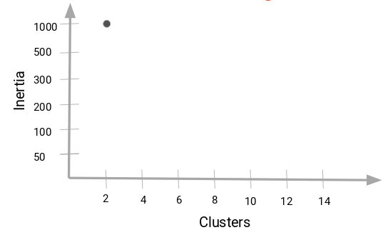
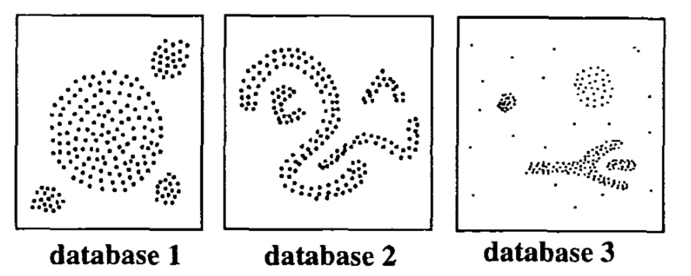

<div class="watermark"></div>

# Clustering No Jerárquico


## Cálculo de distancia

Otro parámetro que podemos ajustar para el modelo es la distancia usada, existen diferentes formas de medir qué tan "cerca" están dos puntos entre sí, y las diferencias entre estos métodos pueden volverse significativas en dimensiones superiores. 

- La más utilizada es la distancia **euclidiana**, el tipo estándar de distancia.

$$d(X,Y) = \sqrt{\sum_{i=1}^{n} (x_i-y_i)^2}$$

- Otra métrica es la llamada distancia de **Manhattan**, que mide la distancia tomada en cada dirección cardinal, en lugar de a lo largo de la diagonal.

$$d(X,Y) = \sum_{i=1}^{n} |x_i - y_i|$$

- De manera más general, las anteriores son casos particulares de la distancia de **Minkowski**, cuya fórmula es:

$$d(X,Y) = (\sum_{i=1}^{n} |x_i-y_i|^p)^{\frac{1}{p}}$$

- La distancia de **coseno** es ampliamente en análisis de texto, sistemas de recomendación.

$$d(X,Y)= 1 - \frac{\sum_{i=1}^{n}{X_iY_i}}{\sqrt{\sum_{i=1}^{n}{X_i^2}}\sqrt{\sum_{i=1}^{n}{Y_i^2}}}$$

- La distancia de **Jaccard** es ampliamente usada para medir similitud cuando se trata de variables categóricas. Es usado en análisis de texto y sistemas de recomendación.

$$d(X, Y) = \frac{X \cap Y}{X \cup Y}$$

- La distancia de **Gower´s** mide la similitud entre variables de forma distinta dependiendo del tipo de dato (numérica, nominal, ordinal).

$$D_{Gower}(X_1, X_2) = 1 - \frac{1}{p} \sum_{j=1}^{p}{s_j(X_1, X_2)} ; \quad \quad s_j(X_1, X_2)=1-\frac{|y_{1j}-y_{2j}|}{R_j} $$
Para mayor detalle sobre el funcionamiento de la métrica, revisar el siguiente [link](https://medium.com/analytics-vidhya/gowers-distance-899f9c4bd553)

```{r, fig.align='center', out.height='700pt', out.width='700pt', echo=F}
knitr::include_graphics("img/16-not-hclus/01-similitudes.png")
```


* [Un link interesante](https://towardsdatascience.com/17-types-of-similarity-and-dissimilarity-measures-used-in-data-science-3eb914d2681)

* [Otro link interesante](https://www.maartengrootendorst.com/blog/distances/)

### Distancias homogéneas

Las distancias basadas en la correlación son ampliamente usadas en múltiples análisis. La función *get_dist()* puede ser usada para calcular la distancia basada en correlación. Esta medida puede calcularse mediante *pearson*, *spearman* o *kendall*.

```{r, warning=FALSE, message=FALSE}
library(factoextra)

USArrests_scaled <- scale(USArrests)
dist.cor <- get_dist(USArrests_scaled, method = "pearson")

round(as.matrix(dist.cor)[1:7, 1:7], 1)
```

### Distancias mixtas

La naturaleza los datos es muy distinta. Existen datos numéricos, nominales y ordinales que requieren de un procesamiento distinto. Es de particular interés analizar la distancia entre observaciones cuando se trata de variables con diferente naturaleza:

* numérico - numérico

* numérico - nominal

* numérico - ordinal

* nominal - nominal

* nominal - ordinal

Existe una función en *R* que detecta la naturaleza de cada variable y calcula la asociación entre individuos.

```{r, warning=FALSE, message=FALSE}
library(cluster)
library(dplyr)

data(flower)
glimpse(flower)
```
Como puede observarse, cada una de las variables anteriores tiene una naturaleza distinta. La función *daisy()* calcula la matriz de disimilaridades de acuerdo con la metodología correspondiente a cada par de variables.

```{r}
dd <- daisy(flower)
round(as.matrix(dd)[1:10, 1:10], 2)
```

### Visualización de distancias

En cualquier análisis, es de gran valor contar con un gráfico que permita conocer de manera práctica y simple el resumen de distancias. Un mapa de calor es una solución bastante útil, el cual representará de en una escala de color a los elementos cerca y lejos. 


```{r}
fviz_dist(dist.cor)
```

El nivel del color es proporcional al valor de disimilaridad entre observaciones.
Cuando la distancia es cero, el color es rojo puro y cuando la distancia es amplia, el color es azul puro. Los elementos que pertenecen a un mismo cluster se muestran en orden consecutivo.


## K - means

La agrupación en grupos con *K-means* es uno de los algoritmos de aprendizaje de máquina no supervisados más simples y populares.

K-medias es un método de **agrupamiento**, que tiene como objetivo la partición de un conjunto de n observaciones en k grupos en el que **cada observación pertenece al grupo cuyo valor medio es más cercano**.

Un *cluster* se refiere a una colección de puntos de datos agregados a a un grupo debido a ciertas similitudes.

```{r, fig.align='center', out.height='300pt', out.width='500pt', echo=F}
knitr::include_graphics("img/16-not-hclus/3-12-1-kmeans.jpeg")
```

### Ajuste de modelo: ¿Cómo funciona el algortimo?

- **Paso 1:** Seleccionar el número de *clusters* K

El primer paso en *k-means* es elegir el número de conglomerados, K. Como estamos en un problema de análisis no supervisado, no hay K correcto, existen métodos para seleccionar algún K pero no hay respuesta correcta.

- **Paso 2:** Seleccionar K puntos aleatorios de los datos como centroides.

A continuación, seleccionamos aleatoriamente el centroide para cada grupo. Supongamos que queremos tener 2 grupos, por lo que K es igual a 2, seleccionamos aleatoriamente los centroides:

```{r, fig.align='center', out.height='250pt', out.width='350pt', echo=F}
knitr::include_graphics("img/16-not-hclus/3-12-1-paso2.png")
```

- **Paso 3:** Asignamos todos los puntos al centroide del cluster más cercano.

Una vez que hemos inicializado los centroides, asignamos cada punto al centroide del cluster más cercano:

```{r, fig.align='center', out.height='250pt', out.width='350pt', echo=F}
knitr::include_graphics("img/16-not-hclus/3-12-1-paso3.png")
```

- **Paso 4:** Volvemos a calcular los centroides de los *clusters* recién formados.

Ahora, una vez que hayamos asignado todos los puntos a cualquiera de los grupos, el siguiente paso es calcular los centroides de los grupos recién formados:

```{r, fig.align='center', out.height='250pt', out.width='350pt', echo=F}
knitr::include_graphics("img/16-not-hclus/3-12-1-paso4.png")
```

- **Paso 5:** Repetir los pasos 3 y 4.

```{r, fig.align='center', out.height='250pt', out.width='350pt', echo=F}
knitr::include_graphics("img/16-not-hclus/3-12-1-paso5.png")
```

```{r, fig.align='center', out.height='450pt', out.width='550pt', echo=F}
knitr::include_graphics("img/16-not-hclus/kmeans step.png")
```


- **Criterios de paro:**

Existen tres criterios de paro  para detener el algoritmo:

1) Los centroides de los grupos recién formados no cambian:

Podemos detener el algoritmo si **los centroides no cambian**. Incluso después de múltiples iteraciones, si obtenemos los mismos centroides para todos los clusters, podemos decir que el algoritmo no está aprendiendo ningún patrón nuevo y es una señal para detener el entrenamiento.

2) Los puntos permanecen en el mismo grupo:

Otra señal clara de que debemos detener el proceso de entrenamiento si **los puntos permanecen en el mismo cluster** incluso después de entrenar el algoritmo para múltiples iteraciones.

3) Se alcanza el número máximo de iteraciones:

Finalmente, podemos detener el entrenamiento si se alcanza el número **máximo de iteraciones**. Supongamos que hemos establecido el número de iteraciones en 100. El proceso se repetirá durante 100 iteraciones antes de detenerse.

### Calidad de ajuste

#### Inercia

La idea detrás de la agrupación de k-medias consiste en definir agrupaciones de modo que se minimice la variación total dentro de la agrupación (conocida como *within cluster variation* o *inertia*).

Existen distintos algoritmos de k-medias, el algoritmo estándar es el algoritmo de Hartigan-Wong, que define *within cluster variation* como la suma de las distancias euclidianas entre los elementos y el centroide correspondiente al cuadrado:

$$W(C_k)=\sum_{x_i \in C_k}(x_i-\mu_k)²$$

donde $x_i$ es una observación que pertenece al *cluster* $C_k$ y $\mu_k$ es la media del *cluster* $C_k$

Cada observación $x_i$ se asigna a un grupo de modo que la suma de cuadrados de la distancia de la observación a sus centroide del grupo asignado $\mu_k$ es mínima.

Definimos la *total within cluster variation* total  de la siguiente manera:

$$total \quad within = \sum_{k=1}^{K}W(C_k) = \sum_{k=1}^{K}\sum_{x_i \in C_k}(x_i-\mu_k)²$$

### ¿Cómo seleccionamos K?

Una de las dudas más comunes que se tienen al trabajar con K-Means es seleccionar el número correcto de clusters.

El número máximo posible de conglomerados será igual al número de observaciones en el conjunto de datos.

Pero entonces, ¿cómo podemos decidir el número óptimo de agrupaciones? Una cosa que podemos hacer es trazar un gráfico, también conocido como gráfica de codo, donde el eje x representará el **número de conglomerados** y el eje y será una métrica de evaluación, en este caso usaremos **inertia**.

Comenzaremos con un valor de K pequeño, digamos 2. Entrenaremos el modelo usando 2 grupos, calculamos la inercia para ese modelo y, finalmente, agregamos el punto en el gráfico mencionado. Digamos que tenemos un valor de inercia de alrededor de 1000:

```{r, fig.align='center', out.height='400pt', out.width='500pt', echo=F}

```

Ahora, aumentaremos el número de conglomerados, entrenaremos el modelo nuevamente y agregaremos  el valor de inercia en la gráfica con distintos números de K:

```{r, fig.align='center', out.height='400pt', out.width='500pt', echo=F}
knitr::include_graphics("img/16-not-hclus/3-12-1-inertia2.png")
```

Cuando cambiamos el valor de K de 2 a 4, el valor de inercia se redujo de forma muy pronunciada. Esta disminución en el valor de inercia se reduce y eventualmente se vuelve constante a medida que aumentamos más el número de grupos.

Entonces, el valor de K donde esta disminución en **el valor de inercia se vuelve constante** se puede elegir como el valor de grupo correcto para nuestros datos.

```{r, fig.align='center', out.height='400pt', out.width='500pt', echo=F}
knitr::include_graphics("img/16-not-hclus/3-12-1-inertia3.png")
```

Aquí, podemos elegir cualquier número de conglomerados entre 6 y 10. Podemos tener 7, 8 o incluso 9 conglomerados. También debe tener en cuenta el costo de cálculo al decidir la cantidad de clusters. Si aumentamos el número de clusters, el costo de cálculo también aumentará. Entonces, si no tiene recursos computacionales altos, deberíamos un número menor de clusters.


### Implementación en R

Usaremos los datos *USArrests*, que contiene estadísticas, en arrestos por cada 100,000 residentes por asalto, asesinato y violación en cada uno de los 50 estados de EE. UU. En 1973. También se da el porcentaje de la población que vive en áreas urbanas.

```{r}
data("USArrests") 
head(USArrests)

df <-scale(USArrests, center = T, scale = T)
df <- na.omit(df)

head(df, n = 5)
```

Usaremos la función *kmeans()*, los siguientes parámetros son los más usados:

- **X**: matriz numérica de datos, o un objeto que puede ser forzado a tal matriz (como un vector numérico o un marco de datos con todas las columnas numéricas).

- **centers**: ya sea el número de conglomerados(K), o un conjunto de centros de conglomerados iniciales (distintos). Si es un número, se elige un conjunto aleatorio de observaciones (distintas) en x como centros iniciales.

- **iter.max**: el número máximo de iteraciones permitido.

- **nstart**: si centers es un número, ¿cuántos conjuntos aleatorios deben elegirse?

- **algorithm**: Algoritmo a usar

En el siguiente ejemplo se agruparán los datos en seis grupos (*centers* = 6). Como se había mencionado, la función kmeans también tiene una opción *nstart* que intenta múltiples configuraciones iniciales y regresa la mejor, agregar nstart = 25 generará 25 configuraciones iniciales. 

```{r}
k6 <- kmeans(df, centers = 6, nstart = 25)
```

La salida de kmeans es una lista con distinta información. La más importante:

- **cluster**: Un vector de números enteros (de 1:K) que indica el grupo al que se asigna cada punto.

- **centers**: una matriz de centros.

- **totss**: La suma total de cuadrados.

- **withinss**: Vector de suma de cuadrados dentro del grupo, un componente por grupo.

- **tot.withinss**: Suma total de cuadrados dentro del conglomerado, es decir, sum(withinss)

- **betweenss**: La suma de cuadrados entre grupos, es decir, $totss-tot.withinss$.

- **size**: el número de observaciones en cada grupo.

También podemos ver nuestros resultados usando la función *fviz_cluster()*. Esto proporciona una  ilustración de los grupos. Si hay más de dos dimensiones (variables), *fviz_cluster()* realizará un análisis de componentes principales (PCA) y trazará los puntos de datos de acuerdo con los dos primeros componentes principales que explican la mayor parte de la varianza.


```{r, message=FALSE, warning=FALSE}
library(factoextra)

fviz_cluster(k6, data = df, ellipse.type = "t", repel = TRUE)
```

Debido a que el número de conglomerados (K) debe establecerse antes de iniciar el algoritmo, a menudo es recomendado utilizar varios valores diferentes de K y examinar las diferencias en los resultados. Podemos ejecutar el mismo proceso para 3, 4 y 5 clusters, y los resultados se muestran en la siguiente figura:

```{r, message=FALSE, warning=FALSE}
library(patchwork)
library(gridExtra)

k2 <- kmeans(df, centers = 2, nstart = 25)
k3 <- kmeans(df, centers = 3, nstart = 25)
k4 <- kmeans(df, centers = 4, nstart = 25)
k5 <- kmeans(df, centers = 5, nstart = 25)

p2 <- fviz_cluster(k2, geom = "point", ellipse.type = "t",  data = df) + ggtitle("K = 2")
p3 <- fviz_cluster(k3, geom = "point", ellipse.type = "t",  data = df) + ggtitle("K = 3")
p4 <- fviz_cluster(k4, geom = "point", ellipse.type = "t",  data = df) + ggtitle("K = 4")
p5 <- fviz_cluster(k5, geom = "point", ellipse.type = "t",  data = df) + ggtitle("K = 5")

grid.arrange(p2, p3, p4, p5, nrow = 2)
```

Recordemos que podemos usar la gráfica de codo para obtener el número óptimo de K, usaremos la función *fviz_nbclust()* para esto.

```{r}
set.seed(123)
wss_plot <- fviz_nbclust(df, kmeans, method = "wss")

wss_plot
```


```{r}
set.seed(123)
final <- kmeans(df, 2, nstart = 25)
```

```{r}
kmeans_plot <- fviz_cluster(
  final, 
  data = df, 
  ellipse.type = "t", 
  repel = TRUE) + 
  ggtitle("K-Means Plot") +
  theme_minimal() +
  theme(legend.position = "bottom")

kmeans_plot
```

### Warnings 

Dado que este algoritmo está basado en promedios, debe de ser considerada su sensibilidad a valores atípicos, esto es, si un valor esta lejos del resto, el centroide de un cluster puede cambiar drásticamente y eso significa que también puede incluir dentro del mismo grupo a puntos diferentes de los que de otra manera no serían incluidos en ese conglomerado.  


```{r echo=FALSE,fig.align='center'}
knitr::include_graphics("img/16-not-hclus/kmeans-outliers.png")
```

## Partitioning Around Medoids (PAM)


El algoritmo *k-medoides* es un enfoque de agrupamiento para particionar un conjunto de datos en *k* grupos o clusters. En *k-medoides*, cada grupo está representado por uno de los puntos de datos pertenecientes a un grupo. Estos puntos son nombrados **medoides**.

El término **medoide** se refiere a un objeto dentro de un grupo para el cual la disimilitud promedio entre él y todos los demás miembros del cluster son mínimos. Corresponde a el punto más céntrico del grupo. 

Este algoritmo es una alternativa sólida de *k-medias*. Debido a que **este algoritmo es menos sensible al ruido y los valores atípicos**, en comparación con *k-medias*, pues usa medoides como centros de conglomerados en lugar de medias. El uso de medias implica que la agrupación de *k-medias* es muy sensible a los valores atípicos, lo cual puede afectar gravemente la asignación de observaciones a los conglomerados.

```{r echo=FALSE,fig.align='center', out.width='600pt', out.height='200pt'}
knitr::include_graphics("img/16-not-hclus/kmeans-kmedoids.png")
```


El método de agrupamiento de *k-medoides* más común es el algoritmo *PAM (Partitioning Around Medoids, Kaufman & Rousseeuw, 1990)*.


### Algoritmo PAM

El algoritmo *PAM* se basa en la búsqueda de *k* objetos representativos o medoides entre las observaciones del conjunto de datos. Después de encontrar un conjunto de *k* medoides, los grupos se construyen asignando cada observación al medoide más cercano. Posteriormente, cada medoide *m* y cada punto de datos no medoide seleccionado se intercambian y se calcula la función objetivo.

**La función objetivo corresponde a la suma de las disimilitudes de todos los objetos a su medoide más cercano.**

El objetivo es encontrar *k* objetos representativos que minimicen la suma de disimilitudes de las observaciones con su objeto representativo más cercano. Como se mencionó anteriormente, el algoritmo *PAM* funciona con una matriz de disimilitud y para calcular esta matriz, el algoritmo puede utilizar dos métricas:

* La distancia *euclidiana*, que es la raíz de la suma de cuadrados de  las diferencias;

* Y la distancia de *Manhattan*, que es la suma de distancias absolutas.

```{r echo=FALSE,fig.align='center'}
knitr::include_graphics("img/16-not-hclus/distancias.jpg")
```

**Nota:** En la práctica, se debería obtener resultados similares la mayor parte del tiempo, utilizando cualquiera de estas distancias mencionadas. Si lo datos contienen valores atípicos, distancia de *Manhattan* debería dar resultados más sólidos, mientras que la distancia *euclidiana* se vería influenciada por valores inusuales.

### Implementación en R

Para estimar el número óptimo de clusters, usaremos el método de silueta promedio. La idea es calcular el algoritmo *PAM* utilizando diferentes valores de los conglomerados *k*. Después, la silueta promedio de los conglomerados se dibuja de acuerdo con el número de conglomerados.

La silueta media mide la calidad de un agrupamiento. Una silueta media alta indica una buena agrupación. 

**El número óptimo de conglomerados *k* es el que maximiza la silueta promedio sobre un rango de valores posibles para *k* **

La función `fviz_nbclust()` del paquete *factoextra* proporciona una solución conveniente para estimar el número óptimo de conglomerados con diferentes métodos.

```{r, message=FALSE}

library(cluster)

# Elbow method
Elbow <- fviz_nbclust(df, pam, method = "wss") + 
geom_vline(xintercept = 4, linetype = 2)+
labs(subtitle = "Elbow method")

Elbow

```


**¿Qué se hace en estos casos?**

Es importante conocer las diferencias entre cada grupo y entender si este resultado tiene sentido desde un enfoque de negocio. Una vez entendiendo la razón por la cual 9 grupos es viable desde múltiples criterios, se deberá tomar la decisión del número adecuado de grupos.

Otro criterio importante, es entender los índices y su interpretación. Conocer el significado de cada índice será importante para conocer la validez de su uso y consideración.

A partir de la gráfica se observa que la cantidad sugerida de grupos es 2 o 9, por lo que en la siguiente sección se clasificarán las observaciones en 2 grupos.

La función `pam()` del paquete *Cluster* se puede utilizar para calcular
*PAM.*

```{r, message=FALSE}

k_mediods <- pam(df, 2)

print(k_mediods)

```


La salida impresa muestra:

*  Los medoides del grupo: una matriz, cuyas filas son los medoides y las    columnas son variables

* El vector de agrupación: un vector de números enteros (de $1:k$) que      indica la agrupación a que se asigna a cada punto


Para visualizar los resultados de la partición, usaremos la función `fviz_cluster()` del paquete *factoextra*.

Esta función dibuja un diagrama de dispersión de puntos de datos coloreados por números de grupo. Si los datos contienen más de *2* variables, se utiliza el algoritmo de análisis de componentes principales (PCA) para reducir la dimensionalidad de los datos. En este caso, los dos primeros componentes se utilizan para trazar los datos.

```{r}
pam_plot <- fviz_cluster(
  k_mediods,
  palette = c("#00AFBB", "#FC4E07"), 
  ellipse.type = "t", 
  repel = TRUE, 
  ggtheme = theme_minimal()) +
  ggtitle('K-Medoids Plot') +
  theme(legend.position = "bottom")

pam_plot
```

**Ejercicio:**

* Calcular los centroides de cada grupo realizando 2 segmentaciones

* Calcular los centroides de cada grupo realizando 9 segmentaciones

* Comparar los resultados anteriores y comentar


## DBSCAN 

*DBSCAN (agrupación espacial basada en densidad y aplicación con ruido)*,
es un algoritmo de agrupamiento basado en densidad, que puede
utilizarse para identificar agrupaciones de cualquier forma en un conjunto de datos que contenga ruido y valores atípicos.

La idea básica detrás del enfoque de agrupamiento basado en densidad se deriva de un método de agrupamiento intuitivo. Por ejemplo, mirando la  siguiente figura, uno puede identificar fácilmente cuatro grupos junto con varios puntos de ruido, debido a las diferencias
en la densidad de puntos.

```{r echo=FALSE,fig.align='center', out.height='300pt', out.width='650pt'}

```

Los clusters son regiones densas en el espacio de datos, separadas por regiones de menor densidad de puntos. El algoritmo *DBSCAN* se basa en esta noción intuitiva de "clusters" y "ruido". La idea clave es que para cada punto de un grupo, la vecindad de un determinado radio debe contener al menos un número mínimo de puntos.

Los métodos de particionamiento vistos anteriormente son adecuados para encontrar grupos de forma esférica o grupos convexos. En otras palabras, ellos funcionan bien solo para grupos compactos y bien separados. 
Además, también son severamente afectados por la presencia de ruido y valores atípicos en los datos.

Desafortunadamente, los datos de la vida real pueden contener: 

* Grupos de forma arbitraria como los como se muestra en la siguiente figura (grupos ovalados, lineales y en forma de “S”).

* Muchos valores atípicos y ruido.


```{r echo=FALSE,fig.align='center', out.height='300pt', out.width='350pt'}

```

El gráfico anterior contiene 5 grupos y valores atípicos, que incluyen:

* 2 clusters ovalados
* 2 clusters lineales
* 1 cluster compacto

Dados los datos "multishapes" del paquete *factoextra*, el algoritmo de *k-medias* tiene dificultades para identificar estos grupos con
formas arbitrarias.

Para ilustrar esta situación, el siguiente código calcula *k-medias*
en el conjunto de datos mencionado.

La función `fviz_cluster()` del paquete *factoextra* se utiliza para visualizar los clusters.

```{r, message=FALSE}

data("multishapes")

df <- multishapes[, 1:2]

set.seed(123)

kmeans <- kmeans(df, 5, nstart = 25)

fviz_cluster(
  kmeans,
  df,
  geom = "point",
  ellipse= FALSE,
  show.clust.cent = FALSE,
  palette = "jco",
  ggtheme = theme_minimal()
  )
```

Sabemos que hay *5* grupos de en los datos, pero se puede ver que el método de *k-medias* identifica incorrectamente estos 5 grupos.

### Algoritmo

El objetivo es identificar regiones densas, que se pueden medir por la cantidad de objetos cerca de un punto dado.

Se requieren dos parámetros importantes para *DBSCAN*:

* **epsilon ("eps"):** Define el radio de vecindad alrededor
un punto *x*.

* **puntos mínimos ("MinPts"):** Es el número mínimo de vecinos dentro del radio *"eps"*.


1) Cualquier punto *x* en el conjunto de datos, con un recuento de vecinos mayor o igual que *MinPts*, es marcado como un **punto central**.

2) Decimos que *x* es un **punto fronterizo**, si el número de sus vecinos es menos que *MinPts*, pero pertenece a la vecindad de algún punto central *z*.

3) Finalmente, si un punto no es ni un núcleo ni un punto fronterizo, entonces se denomina **punto de ruido o parte aislada**.

La siguiente figura muestra los diferentes tipos de puntos (puntos centrales, fronterizos y atípicos) usando *MinPts = 6*.

Aquí *x* es un punto central porque los vecinos $s_{\epsilon}(x) = 6$, *y* es un punto fronterizo ya que $s_{\epsilon}(y) < \text{ MinPts}$,
pero pertenece a la vecindad del punto central *x*. Finalmente, *z* es un punto de ruido.


```{r echo=FALSE,fig.align='center', out.height='300pt', out.width='600pt'}

```


Comenzamos definiendo $3$ términos, necesarios para comprender el algoritmo *DBSCAN*:

*  **Densidad directa alcanzable**: Un punto $A$ es directamente de
   densidad alcanzable desde otro punto $B$ si:
   
   * $A$ está en la vecindad de $B$ y
   * $B$ es un punto central.
   
* **Densidad alcanzable:** Un punto $A$ es la densidad alcanzable desde $B$ si hay un conjunto de los puntos centrales que van de $B$ a $A$.

* **Densidad conectada:** Dos puntos $A$ y $B$ están densamente conectados si hay un punto central $C$, de modo que tanto $A$ como $B$   tienen densidad alcanzable desde $C$.


Un cluster basado en densidad se define como un grupo de puntos conectados por densidad. El algoritmo de agrupamiento basado en densidad (*DBSCAN*) funciona de la siguiente manera:


> 1. Para cada punto $x_i$, calcular la distancia entre $x_i$ y los otros puntos. Hallar todos los puntos vecinos dentro de la distancia *eps* del punto de partida ($x_i$). Cada punto con número de vecinos mayor o igual a *MinPts*, se marca como punto central o visitado.

> 2. Para cada punto central, si aún no está asignado a un cluster, crear un nuevo cluster. Encuentrar recursivamente todos sus puntos densamente conectados y asignarlos a el mismo grupo que el punto central.

> 3. Iterar a través de los puntos no visitados restantes en el conjunto   de datos.

Los puntos que no pertenecen a ningún cluster se tratan como valores atípicos o ruido.

### Estimación de parámetros

* MinPts: Cuanto mayor sea el conjunto de datos, mayor será el valor de *minPts*. Deben elegirse al menos 3.

* $\epsilon$: El valor de $\epsilon$ se puede elegir mediante un gráfico de distancia $k$, trazando la distancia al vecino más cercano
$k = minPts$. Los buenos valores de $\epsilon$ son donde el gráfico muestra una fuerte curva.

#### Estimación el valor óptimo de $\epsilon$

El método consiste en calcular las $k$ distancias vecinas más cercanas en
una matriz de puntos.

La idea es calcular, el promedio de las distancias de cada punto a su $k$ vecino más cercano. El valor de *k* será especificado por el usuario y corresponde a *MinPts*.

A continuación, estas *k-distancias* se trazan en orden ascendente. El objetivo es determinar la "rodilla", que corresponde al parámetro óptimo de *eps*.

Una "rodilla" corresponde a un umbral donde se produce un cambio brusco a lo largo de la curva.

La función `kNNdistplot()` de el paquete *dbscan* se puede usar para dibujar la distancia-k.

```{r, message=FALSE}
library(dbscan)

dbscan::kNNdistplot(df, k =  5)
abline(h = 0.15, lty = 2)
```

Se puede ver que el valor óptimo de $\epsilon$ está alrededor de una distancia de $0.15$.

### Implementación en R

Utilizaremos el paquete *fpc* para calcular *DBSCAN*. También es posible utilizar el paquete *dbscan*, que proporciona una re-implementación más rápida del algoritmo en comparación con el paquete *fpc*.

```{r, message=FALSE}
library("fpc")

set.seed(123)

db <- fpc::dbscan(df, eps = 0.15, MinPts = 5)

```

```{r, message=FALSE}

fviz_cluster(
  db,
  data = df,
  stand = FALSE,
  ellipse = FALSE, 
  show.clust.cent = FALSE,
  geom = "point",
  palette = "jco",
  ggtheme = theme_minimal()
  )
```

**Nota:** La función `fviz_cluster()` usa diferentes símbolos de puntos para los puntos centrales (es decir, puntos semilla) y puntos fronterizos. Los puntos negros corresponden a valores atípicos. 


Puede verse que *DBSCAN* funciona mejor para estos conjuntos de datos y puede identificar el conjunto correcto de clusters en comparación con los algoritmos de *k-medias*.

Los resultados del algoritmo se pueden ver de la siguiente manera

```{r}
print(db)
```

En la tabla anterior, los nombres de las columnas son el número de grupo. El grupo $0$ corresponde a valores atípicos (puntos negros en el gráfico DBSCAN). 


### Ventajas de DBSCAN

* A diferencia de *K-medias*, *DBSCAN* no requiere que el usuario especifique el número de clusters que se generarán.

* *DBSCAN* puede encontrar cualquier forma de clusters. No es necesario que el grupo sea circular.

* *DBSCAN* puede identificar valores atípicos.


### Aplicación DBSCAN

Aplicaremos ahora el algoritmo *DBSCAN* a los datos *USArrests*.

Veamos primero el valor óptimo de $\epsilon$ para estos datos.

```{r}
data("USArrests") 

df <- scale(USArrests)

dbscan::kNNdistplot(df, k = 3)
abline(h = 1.175, lty = 1.5)
```

Se puede ver que el valor óptimo de $\epsilon$ está alrededor de una distancia de $1.175$.


```{r}
set.seed(114234)
db <- fpc::dbscan(df, eps = 1.175, MinPts = 2)

print(db)
```

```{r}
dbscan_plot <- fviz_cluster(
  db,
  data = df,
  stand = FALSE,
  axes = c(1,2),
  repel = TRUE, 
  show.clust.cent = FALSE,
  geom = "point",
  palette = "jco",
  ellipse.type = "t", 
  ggtheme = theme_minimal()) +
  ggtitle('DBSCAN Plot') +
  theme(legend.position = "bottom")

dbscan_plot
```

## Comparación de algoritmos 

Un buen análisis de clustering no sucede sin antes comparar los resultados producidos por los distintos algoritmos. A continuación, se presenta la comparación de las gráficas. Esta comparación visual sirve de apoyo para conocer las diferencias entre los distintos métodos, sin embargo, esto no sustituye al análisis numérico de *wss*, *silhouette* o algún otro.

```{r, warning=FALSE, message=FALSE}

kmeans_plot + pam_plot + dbscan_plot
```

**Ejercicio**

Comparar el grado de marginación original de CONAPO con los distintos algoritmos de clustering revisados hasta el momento.


