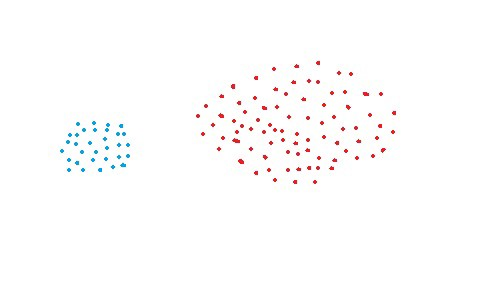
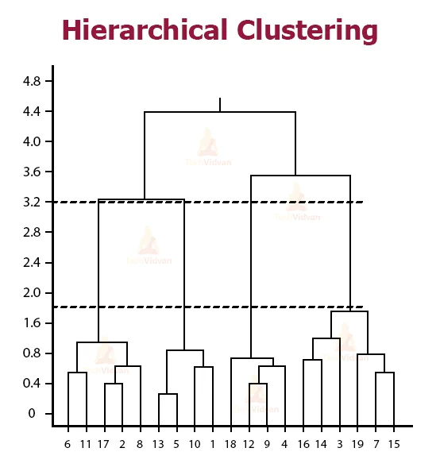

<div class="watermark"></div>

# Clustering Jerárquico

En esta sección se analizarán diferentes metodologías que tienen como propósito realizar segmentaciones de unidades de manera jerárquica, es decir, a partir de un único grupo se van agrupando o separando los individuos dependiendo de qué tan lejanos o cercanos se encuentran unos de otros. A diferencia del clustering por partición (no jerárquico), este no requiere de la pre-especificación del número de clusters a producir. 

El clustering jerárquico se divide en dos tipos:

 **1) Clustering aglomerativo.**

 **2) Clustering divisivo.**

Las principales metodologías a revisar serán:

* Liga simple o vecino más cercano

* Liga compleja o vecino más lejano

* Liga promedio

* Liga centroide

* Varianza mínima de Ward

```{r, echo=FALSE, out.width='350pt'}
knitr::include_graphics("img/17-hclus/01-clusters.jpeg")

knitr::include_graphics("img/17-hclus/03-clusters.jpeg")
knitr::include_graphics("img/17-hclus/04-clusters.jpeg")

```


A partir del concepto de distancia entre puntos en un espacio de *N* dimensiones (variables), se realiza la agrupación de elementos para posteriormente calcular cuántos **grupos** es conveniente usar. Este proceso puede ser graficado de múltiples formas, sin embargo, la visualización más usada corresponde al **dendograma**, el cual es un gráfico como el presentado a continuación:

```{r, echo=FALSE, fig.align='center', out.width='400pt'}
knitr::include_graphics("img/17-hclus/06-Hierarchical-Clustering.webp")
```


* El eje horizontal representa los **puntos de datos**. 

* La altura a lo largo del eje vertical representa la **distancia entre los grupos**. 

* Las líneas verticales en el gráfico representan grupos. 

* La altura de estas líneas representa la distancia desde el grupo más cercano. 

Podemos encontrar el número de conglomerados que mejor representan los grupos en los datos usando el dendrograma. 

```{r, echo=FALSE, fig.align='center', out.width='400pt'}


```

Las líneas verticales con las mayores distancias entre ellas, es decir, la mayor altura en el mismo nivel, dan el número de grupos que mejor representan los datos. 


## Agglomerative & Divise Clustering

El cluster aglomerativo es el tipo de clustering jerárquico más comúnmente usado para agrupar objetos en clusters basados en su similitud. También es conocido como **AGNES** (Agglomerative Nesting). El inverso del agrupamiento aglomerativo es el agrupamiento divisivo, en cual es conocido también como **DIANA** (*Divise Analysis*).

```{r, echo=FALSE, fig.align='center', out.width='600pt'}

knitr::include_graphics("img/17-hclus/08-agnes_diana_clustering.png")
```

### Algoritmo

Este algoritmo AGNES funciona de la manera **"bottom-up"**. Esto es:

1. cada objeto es **inicialmente considerado como un cluster de único elemento** (hoja). 

2. En cada paso del algoritmo, los 2 clusters que son más **similares** son combinados en uno nuevo más grande.

3. El paso anterior es repetido hasta que todos los puntos son miembros de un **único** y gran cluster.


Mientras que el algoritmo DIANA es del tipo **top-down**, funcionando de la siguiente manera: 

1. Comienza con una raíz, en la que todos los elementos están incluidos en el mismo grupo.

2. En cada paso del algoritmo, los 2 clusters que son más **disimilares** son divididos en dos nuevos grupos.

3. El paso anterior es repetido hasta que todos los puntos son un cluster de elemento único en sí mismos.

::: {.infobox .quicktip data-latex="{quicktip}"}
**¡¡ TIP !!**

* Clustering aglomerativo es bueno en identificar pequeños clusters

* Clustering divisivo es bueno para detectar los clusters grandes. 
:::

## Implementación en R

En esta sección se revisan las librerías y funciones que hacen posible estos algoritmos. Como metodología general, tenemos los siguientes pasos:

1. Preparación de datos

2. Cálculo de (di)similitudes entre pares de objetos en el conjunto de datos

3. Uso de **función liga** para agrupar los objetos en un árbol jerárquico basado en la distancia generada en los pasos anteriores.

4. Determinar el umbral de corte del árbol jerárquico para la creación de grupos.


### Preparación y estructuración de datos

Los datos deben ser presentados en un formato matricial, en donde  los renglones representan a las observaciones y las columnas a las variables.

```{r}
data("USArrests")

df <- scale(USArrests)

head(df)
```

### Medidas de (di)similaridad

Con el fin de decidir qué elementos deben ser combinados o divididos, se requieren métodos para medir la similaridad entre objetos. Existen muchos métodos para calcular la (di)similaridad de la información. Estas métricas ya se han considerados en capítulos anteriores.

En *R*, se puede usar la función *dist()* para calcular la distancia entre cada par de objetos en un conjunto de datos. El resultado de este cálculo es conocido como **matriz de distancia de similitud**.

```{r}
res_dist <- dist(df, method = "euclidian")
as.matrix(res_dist)[1:6, 1:6]

```

Esta función usa los métodos de distancia:

* Euclidiana

* Máxima

* Manhattan

* Canberra

* Binaria

* Minkowski

Es importante mencionar que existen otras distancias como la geodésica que pueden implementarse a partir de otras librerías. Para distancias cortas y en general, la distancia euclidiana funciona muy bien.

### Función Liga

La función liga toma la información de la distancia que regresa de la función *dist()* y agrupa pares de objetos en clusters basados en su similaridad. Posteriormente, estos clusters nuevos son ligados a otros para crear clusters más grandes. Este proceso es iterativo hasta que todos los objetos en el conjunto original de datos son ligados juntos en un árbol jerárquico. Este proceso se lleva a cabo con la función: *hclust()*.

```{r}
res_hc <- hclust(d = res_dist, method = "complete")
res_hc
```

**Donde:**

 > **d:** Es la estructura de disimilaridad producida por la función *dist()*
 >
 > **method:** El método de liga de aglomeración a ser usado para el cálculo de distancia entre clusters. Los siguientes valores están permitidos: "single", "complete", "average", "median", "centroid", "ward.D", "ward.D2".


Existen múltiples métodos de aglomeración (i.e. métodos liga). Los más comunes se describen a continuación:

* **Liga máxima o completa:** La distancia entre dos clusters es definida como el valor máximo de todos los pares de distancia entre los elementos dentro del cluster 1 y los elementos en el cluster 2. Tiende a producir clusters compactos.

```{r, echo=FALSE, fig.align='center', out.width='600pt'}
knitr::include_graphics("img/17-hclus/09-complete_linkage.png")
```


* **Liga mínima o simple:** La distancia entre dos clusters es definida como el valor mínimo de todas las parejas de distancias entre los elementos en el cluster 1 y los elementos en el cluster 2. Tiende a producir clusters largos o pobres.

```{r, echo=FALSE, fig.align='center', out.width='600pt'}
knitr::include_graphics("img/17-hclus/10-single_linkage.png")
```

* **Liga promedio o media:** La distancia entre dos clusters es definida como la distancia promedio entre los elementos en el cluster 1 y los elementos en el cluster 2.

$$Dist(C_1, C_2)= \frac{1}{n_1+n_2}\sum_{i=1}^{n_1}{\sum_{j=1}^{n_2}{D(i,j)}}$$

```{r, echo=FALSE, fig.align='center', out.width='600pt'}
knitr::include_graphics("img/17-hclus/11-average_linkage2.png")
```


* **Liga centroide:** La distancia entre dos clusters está definida como la distancia del centroide del cluster 1 (un vector de medias con tamaño de *p* variables) y el centroide del cluster 2.

```{r, echo=FALSE, fig.align='center', out.width='600pt'}
knitr::include_graphics("img/17-hclus/12-centroid_linkage.png")
```

* **Método de varianza mínima de Ward:** Este método en vez de analizar la distancia entre grupos, analiza la varianza, por lo que se encarga de minimizar el total de la varianza intra-cluster (inercia). En cada paso, el par de clusters con distancia mínima entre clusters son unidos. Este método dice que **la distancia entre dos clusters A y B, es qué tanto la varianza respecto del centroide incrementará cuando sean unidos.**


```{r, echo=FALSE, fig.align='center', out.width='600pt'}
knitr::include_graphics("img/17-hclus/13-wards_linkage.png")
```

Sin importar el método usado, en cada etapa del proceso de clustering, los 2 elementos con la distancia liga más corta son unidos en un solo cluster.

::: {.infobox .quicktip data-latex="{quicktip}"}
**¡¡ TIP !!**

Las ligas: completa y Ward´s son preferidas generalmente
:::


## Dendogramas

La manera gráfica de representar el proceso de clustering jerárquico es mediante un dendograma. Los dendogramas pueden ser creados en *R* a partir de la función genérica *plot()*, sin embargo, se mostrarán otras funciones más novedosas para crear gráficos de mayor calidad.

```{r, message=FALSE, warning=FALSE}
library(factoextra)

fviz_dend(res_hc, cex = 0.5)
```

En el dendograma superior cada hoja corresponde a un objeto. En la medida en que nos movemos hacia arriba en el árbol, los objetos que son similar a otros están combinados en ramas, las cuales se fusionan a mayor altura. 

La altura de la fusión, proveída en el eje vertical, indica la (di)similaridad/distancia entre dos objetos/clusters. Entre más alta sea la altura de la fusión, menos similares son los objetos/clusters. Esta altura es conocida como **la distancia de cophenetic** entre dos objetos.

A fin de identificar sub-grupos, se puede cortar el dendograma en cierta altura, como se describe en las siguientes secciones.

Para validar que las distancias en la altura reflejen las distancias originales de manera precisa, se hace uso de la correlación entre las distancias originales y la distancia de cophenetic:

```{r}
res_coph <- cophenetic(res_hc)
as.matrix(res_coph)[1:6, 1:6]

cor(res_coph, res_dist)
```

**Ejercicio**

* Usar las distintas ligas y determinar cuál de ellas funciona mejor (*Hint:* La que muestre correlación más alta entre las distancias originales y la distancia cophenetica)


### Selección de grupos

Uno de los problemas del clustering jerárquico es que, NO dice cuántos clusters hay o dónde cortar el dendograma para formar los clusters.

Es posible cortar el árbol jerárquico a una altura dada con el fin de particionar los datos en clusters. La función *cutree()* puede ser usada para cortar el árbol en varios grupos al especificar ya el número deseado de grupos o la altura a cortar. Esta función regresa un vector que contiene el número de cluster de cada observación.

```{r}
groups_1 <- cutree(res_hc, k = 4)
head(groups_1)

table(groups_1)
```

```{r, warning=FALSE}
fviz_dend(
 res_hc,
 k = 4,
 cex = 0.5,
 k_colors = c("red", "blue", "green", "purple"),
 color_labels_by_k = TRUE,
 rect = TRUE
)
```


Algunas variaciones estéticas sobre un dendograma se pueden realizar al cambiar determinados parámetros. Por ejemplo:

```{r, warning=FALSE}
fviz_dend(
 res_hc,
 k = 4,
 cex = 0.5,
 k_colors = "jco",
 type = "circular",
 show_labels = TRUE
)
```

```{r, warning=FALSE}
fviz_dend(
 res_hc,
 k = 4,
 cex = 0.5,
 k_colors = "jco",
 type = "phylogenic",
 phylo_layout = "layout.gem",
 repel = T,
 show_labels = TRUE
)
```

Usando la función *f_viz_cluster()* también es posible visualizar los clusters a través de un gráfico de dispersión. Las observaciones son presentadas en puntos usando el análisis de componentes principales.

```{r}
fviz_cluster(
 list(data = df, cluster = groups_1),
 palette = c("red", "blue", "green", "purple"),
 ellipse.type = "convex",
 repel = T,
 show.clust.cent = F
)
```

Finalmente, es importante mencionar que la librería *cluster* ofrece un par de funciones que resumen todo el proceso anterior (scale, dist y hclus). Las funciones se usan de la siguiente forma:

```{r, warning=FALSE, message=FALSE}
library(cluster)

res_agnes <- agnes(
 x = USArrests,
 stand = T,
 metric = "euclidian",
 method = "ward"
)

res_diana <- diana(
 x = USArrests,
 stand = T,
 metric = "euclidian"
)

fviz_dend(
 res_diana, 
 cex = 0.6, 
 k = 4,
 color_labels_by_k = TRUE,
 rect = TRUE
 )
```


## Heatmaps

Otro modo de visualizar el clustering jerárquico es a través de los mapas de color. Existen diversas alternativas para mostrar estas aglomeraciones. Los heatmaps, permiten visualizar clusters de individuos y de características. 

En las siguientes secciones se mostrarán diversas visualizaciones de clusters, las cuales podrán ser por individuos, por características o ambas. Como primer paso, se comienza con la preparación de datos.

```{r, warning=FALSE, message=FALSE}
library(readr)
library(dplyr)
library(gplots)
library(sf)

indice_marg <- st_read('data/IMEF_2010.dbf', quiet = TRUE)
indice_marg %>% glimpse()

df <- indice_marg %>% 
  select(ANALF:PO2SM) %>% 
  scale(center = TRUE, scale = TRUE)

row.names(df) <- indice_marg$NOM_ENT

heatmap.2(
  df,
  scale = "none",
  cexCol = 0.7,
  cexRow = 0.5,
  main = "Heatmap - Marginación",
  col = bluered(32),
  trace = "none",
  density.info = "none"
 )
```

El dendograma anterior tiene la ventaja de ser simple y limpio. Los parámetros son sencillos.

```{r}
library(pheatmap)

pheatmap(
  df,
  cutree_rows = 5,
  cutree_cols = 2,
  clustering_distance_rows = "euclidean",
  clustering_distance_cols = "euclidean",
  clustering_method = "ward.D",
  main = "Heatmap - Ward´s Clustering"
  )
```

Este segundo dendograma es uno de los más limpios y completos que hay. Se segmentan tanto renglones como columnas de acuerdo con la metodología especificada de clustering.


```{r, warning=FALSE, message=FALSE}
# devtools::install_github("jokergoo/ComplexHeatmap")

library(ComplexHeatmap)

Heatmap(
  df,
  split = indice_marg %>% 
     mutate(GM = case_when(
        GM == "Muy bajo" ~ "MB",
        GM == "Bajo" ~ "B",
        GM == "Medio" ~ "M",
        GM == "Alto" ~ "A",
        GM == "Muy alto" ~ "MA"
     )) %>% pull(GM),
  name = "Scale",
  clustering_distance_rows = "euclidean",
  clustering_method_rows = "ward.D",
  column_title = "Variables",
  row_title_gp = gpar(fontsize = 12),
  column_title_gp = gpar(fontsize = 12),
  row_names_gp = gpar(fontsize = 8)
)
```

El último de los dendogramas presentados permite separar los renglones o columnas de acuerdo con alguna variable auxiliar especificada, lo cual puede servir para otro tipo de análisis cruzados.

Será responsabilidad de cada usuario determinar cuál es el dendograma que aporta más valor al análisis o reporte que está siendo presentado.


## Tendencia de factibilidad

Este análisis es considerado como la evaluación de factibilidad de implementar análisis de clustering. Antes de aplicar cualquier técnica de clustering vale la pena **evaluar si el conjunto de datos contiene clusters naturales significativos** (i.e. estructuras no aleatorias) o no. En caso de que sí existan estructuras conglomeradas naturales, se deberá proceder a identificar el número de clusters a extraer. 

```{r, echo=FALSE, fig.align='center', out.width='600pt'}
knitr::include_graphics("img/17-hclus/14-blindly_analysis.jpg")
```

A diferencia de otros tipos de análisis, una desventaja que tiene el análisis de clustering es que en todo momento regresarán clusters incluso cuando los datos no contengan tal estructura, por lo que si **ciegamente** se implementa un método de clustering, este dividirá los datos en clusters debido a que es lo esperado a realizar. las librerías usadas en *R* serán *factoextra* y *hopkins*.

```{r}
head(iris, 5)

df <- iris %>% select_if(is.numeric)
random_df <- df %>% 
  apply(2, function(x){runif(length(x), min(x), max(x))}) %>% 
  as_tibble()

df_scaled <- scale(df)
random_df_scaled <- scale(random_df)
```

Se comienza con una evaluación visual sobre los datos para evaluar la significancia de los clusters. Debido a que los más probable es que los datos tengan más de dos dimensiones, se aprovecha el análisis de componentes principales para representar los datos en un espacio de dimensión menor.

```{r}
library(patchwork)

iris_plot <- fviz_pca_ind(
  prcomp(df_scaled), title = "PCA - Iris data",
  geom = "point", ggtheme = theme_classic(),
  legend = "bottom"
)

random_plot <- fviz_pca_ind(
  prcomp(random_df_scaled), title = "PCA - Random data",
  geom = "point", ggtheme = theme_classic(),
  legend = "bottom"
)

iris_plot + random_plot
```


Puede observarse en el primer gráfico que, al menos existen 2 clusters significativos, con posibilidad de que sean 3. A diferencia del gráfico de la derecha que no muestra una tendencia en la estructura conglomerativa.

Es sumamente importante realizar esta evaluación porque 

```{r, warning=FALSE, message=FALSE}
set.seed(12853)
km_res2 <- kmeans(random_df_scaled, 3)
cluster_plot <- fviz_cluster(
  list(data = random_df_scaled, cluster = km_res2$cluster),
  ellipse.type = "convex", geom = "point", stand = F,
  palette = "jco", ggtheme = theme_classic()
)

den_plot <- fviz_dend(
  hclust(dist(random_df_scaled), method = "ward.D"), k = 3, k_colors = "jco",
  as.gplot = T, show_labels = F
)

cluster_plot + den_plot
```

Puede observarse que ambos métodos imponen una segmentación a los datos que son **uniformemente aleatorios** y que no contienen ninguna segmentación natural. Por esta razón, **siempre** deberá realizarse este análisis previamente y elegir si se desea proceder con el análisis.

El método anterior fue totalmente gráfico. Se procede a continuación a mostrar una metodología estadística para determinar la factibilidad de implementar análisis de clustering.

**El estadístico Hopkins** es usado para evaluar la tendencia de clustering en un conjunto de datos. Mide la probabilidad de que un conjunto de datos dado sea generado por una distribución uniforme. En otras palabras, **prueba la aleatoriedad espacial de los datos**. Por ejemplo, Sea *D* un conjunto de datos real, el estadístico de Hopkins puede ser calculado de la siguiente forma:

:::{.infobox .note data-latex="{note}"}
**Proceso:**

1. Muestrear aleatoriamente *n* puntos $(p_1, p_2, p_3, ..., p_n)$ de D

2. Para cada punto $p_i \in D$, encontrar su vecino más cercano $p_j$; luego calcular la distancia entre $p_i$ y $p_j$ y denotarla como $x_i = dist(p_i, p_j)$

3. Generar un conjunto de datos simulado $(random_D)$ tomado de una distribución uniformemente aleatoria con *n* puntos $(q_1, q_2, q_3, ..., q_n)$ y de la misma variación que la original del conjunto *D*.

4. Para cada punto $q_i \in random_D$, encontrar su vecino más cercano $q_j$ en *D*; posteriormente, calcular la distancia entre $q_i$ y $q_j$ y denotarla como $y_i=dist(q_i, q_j)$.

5. Calcular el **estadístico de Hopkins** como la distancia media más cercana de vecinos en los datos aleatorios y dividirlos por la suma de las distancias medias de vecinos más cercanos de los datos reales y aleatorios:

$$H=\frac{\sum_{i=1}^{n}{y_i}}{\sum_{i=1}^{n}{x_i} + \sum_{i=1}^{n}{y_i}}$$
:::

Un valor cercano a 0.5 significa que $\sum_{i=1}^{n}{y_i}$ y $\sum_{i=1}^{n}{x_i}$ son similares uno del otro y por lo tanto, *D* es distribuida aleatoriamente.

Por lo tanto, las hipótesis nula y alternativa son definidas como sigue:

> * Hipótesis Nula: El conjunto de datos *D* es uniformemente distribuido (sin clusters significativos).
>
> * Hipótesis Alternativa: El conjunto de datos *D* no es distribuido uniformemente (contiene clusters significativos).

**Cuando el estadístico de Hopkins tiene valores cercanos a cero, entonces puede rechazarse la hipótesis nula y concluir que el conjunto de datos *D* tiene datos conglomerables significativos.**

```{r, message=FALSE, warning=FALSE}
library(hopkins)

set.seed(19735)
1 - hopkins::hopkins(df_scaled, nrow(df_scaled)-1, 4)
```

**Este valor sugiere rechazar la hipótesis nula en favor de la alternativa.**

Por último, se compararán otros 2 gráficos con la disimilitud de los dos conjuntos de datos. La metodología de este gráfico lleva por nombre "Visual Assessment of Cluster Tendency" (VAT). Este método consiste de 3 pasos:

1. Calcula la matriz de disimilaridad (DM) entre objetos usando la distancia Euclidiana.

2. Re-ordena la DM de forma que los elementos similares estén cercanos unos de otros. Este proceso crea una Matriz de Di-similaridad Ordenada (ODM).

3. La ODM es mostrada como una imagen de disimilaridad ordenada, la cual es la salida visual de VAT.

```{r}
dis_irirs_plot <- fviz_dist(
  dist(df_scaled),
  show_labels = FALSE) +
  labs(title = "Iris data")


dis_random_plot <- fviz_dist(
  dist(random_df_scaled),
  show_labels = FALSE) +
  labs(title = "Random data")

dis_irirs_plot + dis_random_plot
```

**Donde:**

* Rojo: Alta similaridad

* Azul: Baja similaridad

La matriz de disimilaridad anterior confirma que existe una estructura de cluster en el conjunto de datos Iris, pero no en el aleatorio. 

La técnica *VAT* detecta la tendencia de clustering de forma visual al contar el número de bloques cuadradas sobre la diagonal en la imagen VAT.


**Ejercicio**

* Realizar una evaluación de tendencia de conglomeración con los datos de clientes

* Realizar una evaluación de tendencia de conglomeración con los datos de entidades

