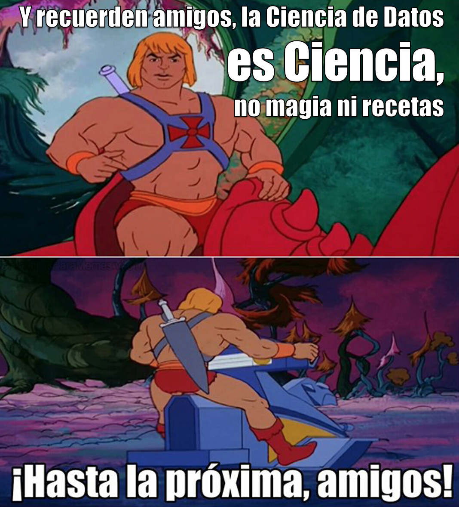

<div class="watermark"></div>

# ¡Actividad FINAL!

Estás a nada de terminar este curso de ciencia de datos. El esfuerzo ha sido grande y es hora de probar tus nuevos conocimientos. Deberás entregar los siguientes ejercicios y anexarlos al reporte semanal:

1.  Interpretabilidad: Deberás buscar una vivienda de bajo costo, una de mediano y otra de alto costo e interpretar su predicción del precio mediante la librería DaleExtra

2.  Stacking: Utiliza los modelos creados mediante *workflowsets* para crear un único módelo que sea un promedio ponderado de tus modelos previos.

3.  Una vez que se lleve a cabo la predicción mediante *stacking*, realiza una segmentación del precio de las viviendas. Crea 5 categorías a través del algoritmo de tu preferencia. Justifica tu elección y reporta los siguientes valores estadísticos para cada segmento: mínimo, media, mediana, máximo, desviación estándar.

4.  Agregar breve análisis del proyecto global y agregar conclusiones.

5.  Usar formato para entrega final. Deberás realizar dos entregas en html: (1) con código y (2) sin código.

```{r include=TRUE, eval=FALSE}
knitr::opts_chunk$set(
 echo = FALSE,
 warning = FALSE, 
 message = FALSE
 )
```


::: {.infobox .note data-latex="{note}"}
**"La gota abre la piedra, no por su fuerza sino por su constancia"**

\- Ovidio
:::


# DESPEDIDA

```{r echo=FALSE,fig.align='center'}

```